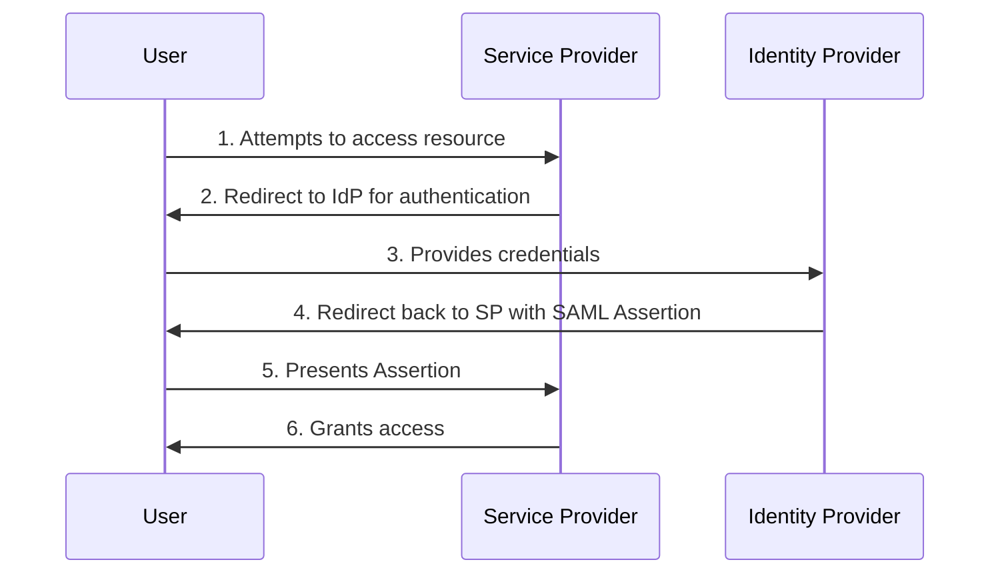
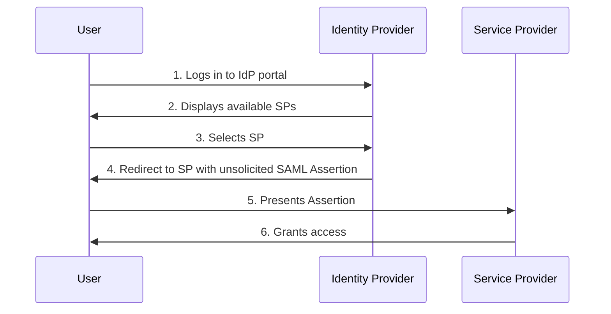
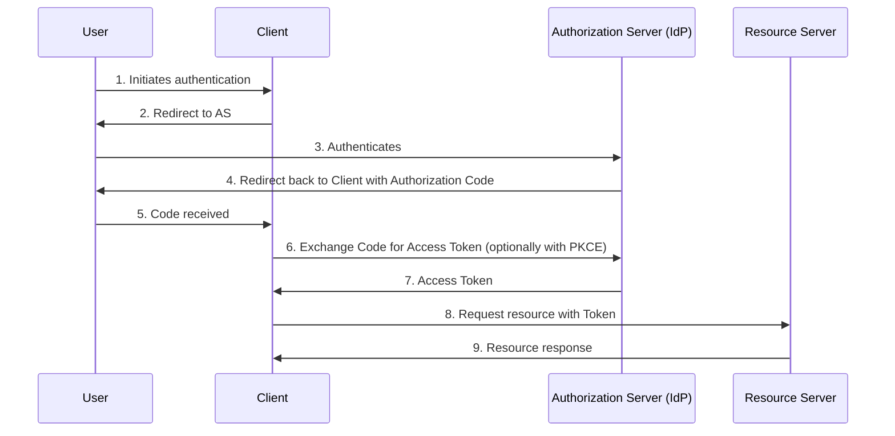
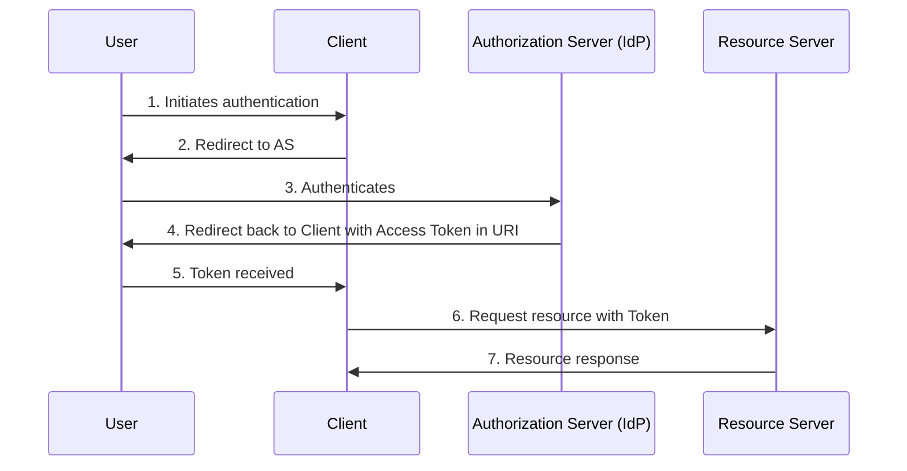
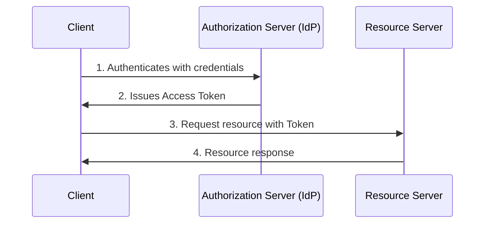
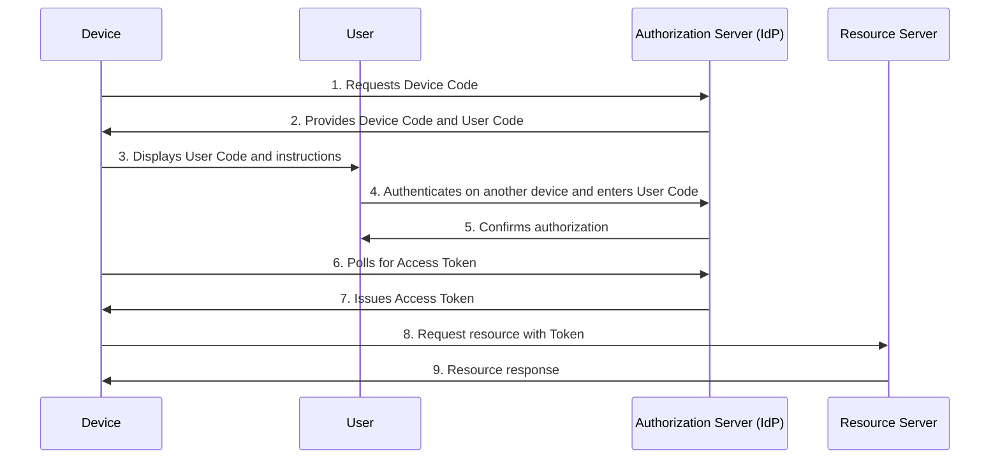
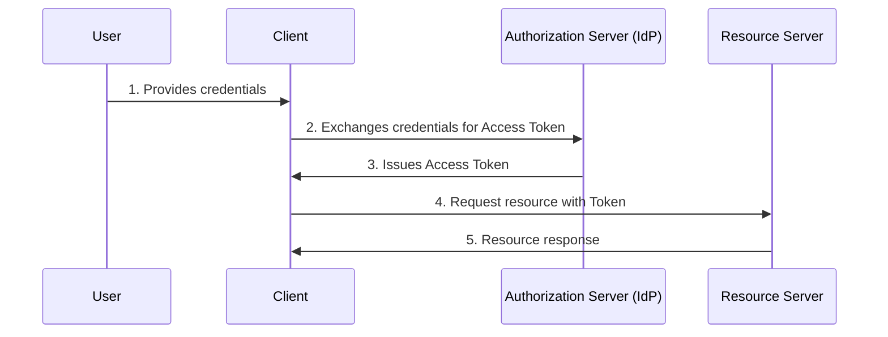
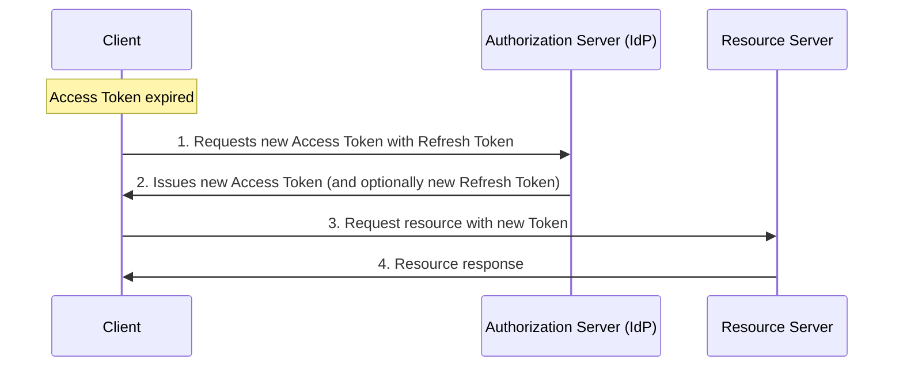
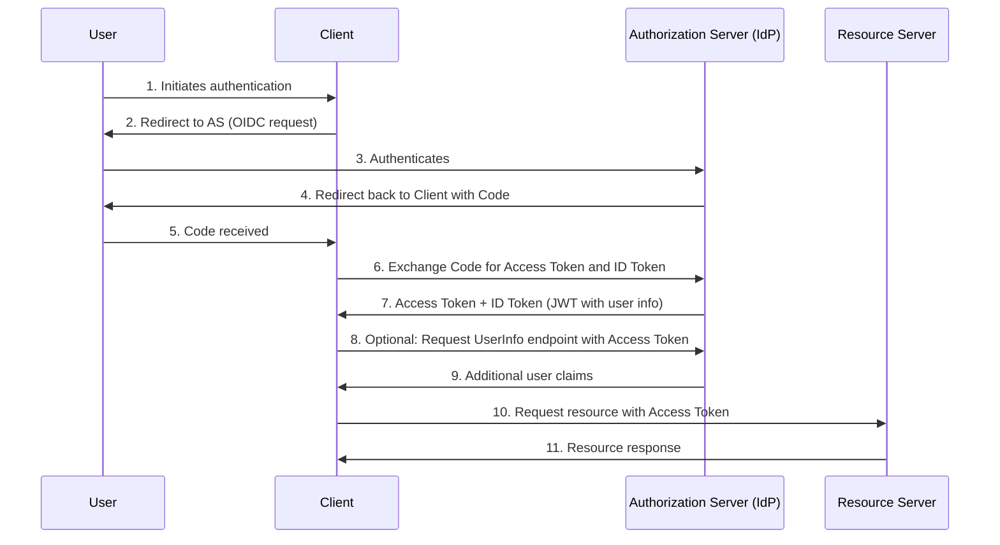
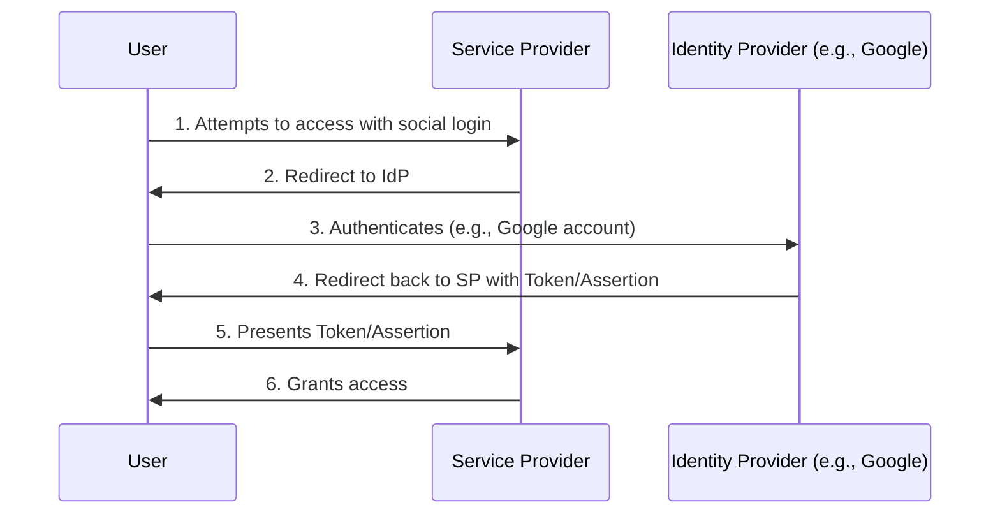

# Identity Provider (IdP) Overview

## What is an Identity Provider?

An **Identity Provider (IdP)** is a trusted system or service responsible for creating, maintaining, and managing digital identities for users while providing authentication and authorization services to applications or service providers (SPs). IdPs enable secure access to resources, often through features like **Single Sign-On (SSO)**, allowing users to access multiple applications with a single set of credentials. They manage user data securely, including credentials, profile information, and access policies, and communicate identity assertions to SPs without exposing sensitive data like passwords.

## Role of an IdP

The primary roles of an IdP include:

- **User Authentication**: Verifying user identity using credentials (e.g., username/password, biometrics, or multi-factor authentication).
- **Identity Management**: Managing user profiles, attributes (e.g., roles, permissions), and lifecycle events like onboarding or deactivation.
- **Authorization**: Determining access rights and issuing tokens or assertions to SPs for resource access.
- **Federation and SSO Support**: Enabling seamless login across multiple domains or applications, reducing password fatigue and centralizing security control.
- **Compliance and Security**: Enforcing standards like multi-factor authentication (MFA), auditing access, and protecting against threats such as credential stuffing.

IdPs are critical for enterprises, cloud services, and federated environments, decoupling identity management from individual applications for improved security and efficiency.

## Major IdP Providers

The following table lists prominent IdP providers, categorized by type, with their key strengths:

| Provider              | Type                     | Key Strengths                                                                 |
|-----------------------|--------------------------|-------------------------------------------------------------------------------|
| **Okta**             | Commercial              | Enterprise-grade SSO, adaptive MFA, extensive app integrations; ideal for complex needs. |
| **Microsoft Entra ID** | Commercial            | Seamless Microsoft ecosystem integration, conditional access, hybrid support. |
| **Auth0 (Okta)**     | Commercial              | Developer-friendly CIAM, customizable UIs, social logins, passwordless auth.  |
| **Ping Identity**    | Commercial              | Robust for regulated industries, identity orchestration, on-prem/hybrid options. |
| **IBM Security Verify** | Commercial           | Hybrid IT focus, identity governance, adaptive access for large organizations. |
| **Google Cloud Identity** | Commercial         | Integrates with Google Workspace, OAuth-based, cross-platform SDKs.          |
| **AWS Cognito**      | Commercial              | Serverless, scalable for apps; supports social/federated logins, MFA.         |
| **OneLogin**         | Commercial              | API-first for DevSecOps, unlimited app scaling, SMB-friendly.                 |
| **Oracle Identity Cloud** | Commercial         | Oracle ecosystem integration, adaptive authentication for enterprises.        |
| **Keycloak**         | Open-Source             | Powerful IAM, self-hosted, supports SAML/OIDC; highly customizable.           |
| **FusionAuth**       | Open-Source/Commercial  | Developer-focused, flexible deployment, modern auth features.                 |
| **Authentik**        | Open-Source             | Affordable, powerful for self-hosting; versatile but has a steep learning curve. |

These providers are leaders in 2025, with Okta and Microsoft Entra ID dominating enterprise adoption. Selection depends on factors like organization size, budget, and specific requirements (e.g., open-source for cost savings or commercial for robust support).

## IdP Authentication Flows

IdPs use standardized protocols like **SAML**, **OAuth 2.0**, and **OpenID Connect (OIDC)** to manage authentication and authorization flows. These flows vary based on use case (web apps, APIs, mobile), security needs, and client type. Below, each flow is illustrated using a Mermaid sequence diagram, followed by a detailed use case description highlighting a specific, practical application.

### 1. SAML Flows (Common for Enterprise SSO)
- **SP-Initiated Flow**:

  - **Use Case**: An employee at a large corporation uses a web-based HR portal (e.g., Workday) to check payroll details. The portal, acting as the SP, redirects the employee to the company’s IdP (e.g., Okta) for authentication. After entering credentials and passing MFA, the IdP sends a SAML assertion to Workday, granting the employee access to sensitive HR data. This flow is ideal for enterprises needing secure, centralized authentication across multiple internal applications.

- **IdP-Initiated Flow**:

  - **Use Case**: A university student logs into the campus identity portal (e.g., using Microsoft Entra ID) to access various services like email, course management (e.g., Canvas), or library resources. After authenticating once, the student selects Canvas from the portal’s dashboard. The IdP sends a SAML assertion to Canvas, allowing immediate access without re-authentication. This flow suits centralized dashboards where users choose from multiple services after a single login.

### 2. OAuth 2.0 Flows (For Authorization, Often Paired with OIDC)
- **Authorization Code Flow**:

  - **Use Case**: A user wants to access a project management tool like Trello via a third-party mobile app that integrates with Trello’s API. The app redirects the user to Trello’s authorization server (IdP) to log in. After authentication, the IdP issues an authorization code, which the app exchanges for an access token (using PKCE for security). The app uses the token to fetch the user’s Trello boards. This flow is ideal for secure, server-side web or mobile apps accessing protected APIs.

- **Implicit Flow** (Deprecated):

  - **Use Case**: A legacy single-page application (SPA) like an older JavaScript-based dashboard allows users to view Google Calendar events. The SPA redirects the user to Google’s authorization server, which returns an access token directly in the browser’s URL after authentication. The SPA uses the token to fetch calendar data. This flow, though deprecated due to security risks (e.g., token exposure in URLs), was used for browser-based apps without secure backend servers.

- **Client Credentials Flow**:

  - **Use Case**: A microservice in a company’s backend infrastructure needs to access a protected API (e.g., a billing service) to process recurring payments. The microservice authenticates directly with the IdP (e.g., AWS Cognito) using its client ID and secret, receiving an access token. It then uses the token to call the billing API. This flow is perfect for machine-to-machine communication where no user interaction is required.

- **Device Code Flow**:

  - **Use Case**: A user wants to log into a streaming app (e.g., Netflix) on a smart TV, which lacks a full browser. The TV app requests a device code from the IdP (e.g., Netflix’s OAuth server), displaying a code and URL. The user visits the URL on their phone, logs in, and enters the code. The TV polls the IdP, receives an access token, and accesses the streaming service. This flow is designed for input-constrained devices.

- **Resource Owner Password Credentials Flow** (Legacy):

  - **Use Case**: An older desktop application (e.g., a legacy email client) prompts the user to enter their username and password directly. The app sends these credentials to the IdP (e.g., an outdated OAuth server) to obtain an access token for accessing email servers. This flow, now discouraged due to security risks (e.g., credential exposure), was used in tightly controlled environments with trusted clients.

- **Refresh Token Flow**:

  - **Use Case**: A mobile banking app needs to maintain a user’s session without requiring re-authentication every time the access token expires (e.g., every hour). The app uses a refresh token, previously obtained during login, to request a new access token from the bank’s IdP (e.g., Auth0). This allows the user to continue accessing account details seamlessly, ideal for applications requiring persistent access.

### 3. OpenID Connect (OIDC) Flows

  - **Use Case**: A modern web application (e.g., a SaaS analytics platform) allows users to log in to view personalized dashboards. The app uses OIDC with the Authorization Code flow to authenticate users via an IdP like Google. After login, the IdP provides an ID token (JWT) with user details (e.g., email, name) and an access token for API calls. The app queries the UserInfo endpoint to fetch additional profile data, enabling a tailored user experience. This flow is ideal for apps needing both authentication and user profile information.

### 4. Other Flows
- **Federated Flows**:

  - **Use Case**: A user signs into a productivity app like Notion using their Google account. Notion (the SP) redirects the user to Google’s IdP for authentication. After logging in with their Google credentials, the IdP sends a token or assertion back to Notion, granting access. This flow is common for consumer apps leveraging social logins to simplify user onboarding and authentication.

- **Provider-Specific Flows**:
  Some IdPs (e.g., AWS Cognito) offer enhanced or basic flows for specific ecosystems, such as brokering sessions with external IdPs. Diagrams vary by provider implementation.
  - **Use Case**: A mobile e-commerce app uses AWS Cognito to allow users to log in via their Facebook account. Cognito acts as an intermediary, brokering authentication with Facebook’s IdP to obtain tokens, then managing user sessions within the AWS ecosystem. This flow is useful for apps integrating with cloud-native IdPs and external identity providers for a seamless user experience.

## Choosing the Right Flow
- **Security**: Avoid flows exposing tokens in URLs (e.g., Implicit). Use PKCE for public clients.
- **Context**: Web apps favor Authorization Code or SAML; APIs use Client Credentials; devices use Device Code.
- **Standards**: OIDC is preferred for modern apps due to its flexibility and JWT support.

## Additional Explanations for Beginners

If you're new to IdP concepts, here are key questions that beginners often have, answered and explained in detail to build a solid foundation. These address fundamental confusions, practical considerations, and deeper insights not covered in the main sections.

### 1. What is the difference between an IdP, a Service Provider (SP), and a Relying Party (RP)?
- **IdP (Identity Provider)**: The IdP is the central authority that authenticates users and issues identity assertions or tokens. It "provides" the identity verification, like a driver's license issuer proving who you are.
- **SP (Service Provider)**: In protocols like SAML, the SP is the application or service that relies on the IdP for authentication. For example, a cloud app like Salesforce (SP) trusts an IdP like Okta to verify users before granting access.
- **RP (Relying Party)**: This term is more common in OAuth/OIDC contexts and is similar to SP—it's the client or application that "relies" on the IdP (often called Authorization Server) for tokens. The key difference is terminology: SP is SAML-specific, while RP is broader for OAuth/OIDC. In practice, they overlap; think of RP/SP as the "consumer" of identity info from the IdP.

### 2. How does Single Sign-On (SSO) work with an IdP, and why is it beneficial?
- SSO allows users to log in once and access multiple applications without re-entering credentials. The IdP handles the initial authentication and shares assertions/tokens with SPs/RPs.
- **How it Works**: When you log into an IdP (e.g., via a company portal), it creates a session. For subsequent apps, the IdP vouches for you by sending a token or assertion, avoiding repeated logins.
- **Benefits**: Reduces "password fatigue" (fewer passwords to remember), improves security (centralized MFA and auditing), and boosts productivity (seamless access). For beginners, start with SSO in tools like Google Workspace—log in once to access Gmail, Drive, etc.
- **Drawbacks**: If the IdP is compromised, all connected apps are at risk, so strong IdP security is crucial.

### 3. What are the main protocols (SAML, OAuth, OIDC), and how do they differ?
- **SAML (Security Assertion Markup Language)**: XML-based for SSO in enterprises. Focuses on authentication and authorization via assertions. Best for web apps in business settings (e.g., logging into corporate tools).
- **OAuth 2.0**: Framework for authorization, allowing apps to access resources without sharing credentials (e.g., "Log in with Google" grants limited access). It's not for authentication alone but pairs well with OIDC.
- **OIDC (OpenID Connect)**: Builds on OAuth for authentication, adding ID tokens (JWTs) with user info. Modern standard for web/mobile apps needing both auth and user details.
- **Differences**: SAML is older, enterprise-focused, and XML-heavy; OAuth is for API access; OIDC is user-friendly with JSON. Choose SAML for legacy systems, OIDC for new apps.

### 4. What are the pros and cons of major IdP providers, and which is best for beginners?
- **Commercial Providers (e.g., Okta, Auth0, Microsoft Entra ID)**: Pros: Easy setup, robust support, integrations; Cons: Costly (subscription-based), vendor lock-in.
- **Open-Source (e.g., Keycloak, Authentik)**: Pros: Free, customizable, self-hosted; Cons: Steeper learning curve, requires maintenance.
- **For Beginners**: Start with Auth0 (now part of Okta)—it's developer-friendly with free tiers, quickstarts, and social logins. For small projects, try Keycloak for hands-on learning without costs.

### 5. How do I choose an IdP for a small project or personal use?
- Consider: Budget (free tiers like Auth0's), scale (start small), integrations (e.g., with your app stack), and ease (UI vs. code-based). For a personal blog with social login, use AWS Cognito or Google Cloud Identity—simple and scalable.
- Steps: 1) Define needs (SSO? Social logins?); 2) Test free trials; 3) Check docs/tutorials; 4) Ensure compliance (e.g., GDPR if handling user data).

### 6. What are common security considerations when using an IdP?
- **Risks**: Token theft (e.g., via phishing), weak MFA, misconfigured flows (e.g., Implicit exposing tokens).
- **Best Practices**: Always use HTTPS, enable MFA, rotate secrets, monitor logs for anomalies. For flows, prefer Authorization Code with PKCE over Implicit. Regularly audit permissions to avoid over-granting access.
- **Beginner Tip**: Start with passwordless options (e.g., magic links) to reduce credential risks.

### 7. What is the difference between authentication and authorization?
- **Authentication (AuthN)**: Verifies "who you are" (e.g., username/password check by IdP).
- **Authorization (AuthZ)**: Determines "what you can do" (e.g., read-only vs. admin access, based on roles).
- IdPs handle both: AuthN via login, AuthZ via tokens/assertions with claims. Example: Logging into a bank app (AuthN) then viewing (but not editing) transactions (AuthZ).

### 8. What is identity federation, and how does it relate to IdPs?
- Federation allows identity sharing across domains (e.g., using your work IdP to access a partner's app). IdPs enable this by trusting each other via standards like SAML/OIDC.
- **Example**: Logging into a travel booking site with your airline's credentials— the site (SP) federates with the airline's IdP.
- Benefits: Seamless cross-org access; Drawbacks: Requires trust agreements.

### 9. Can you provide a step-by-step example of implementing a simple IdP flow?
- **Simple OIDC Authorization Code Flow with Auth0**:
  1. Sign up for Auth0 free account and create an application (RP).
  2. Configure redirect URIs and enable OIDC.
  3. In your app code (e.g., Node.js), use a library like `openid-client` to redirect users to Auth0's login page.
  4. After login, Auth0 redirects back with a code.
  5. Exchange code for tokens via Auth0's token endpoint.
  6. Validate ID token (JWT) and use access token for APIs.
- Resources: Follow Auth0's quickstart guides for your tech stack.

### 10. What is a glossary of key terms for IdP beginners?
- **Assertion**: A statement from IdP about a user's identity (e.g., SAML XML).
- **Token**: Digital key for access (e.g., JWT in OIDC, access/refresh in OAuth).
- **JWT (JSON Web Token)**: Compact, signed token with user claims.
- **MFA (Multi-Factor Authentication)**: Extra verification (e.g., SMS code).
- **PKCE (Proof Key for Code Exchange)**: Security extension for public clients.
- **CIAM (Customer Identity and Access Management)**: IdP focused on external users (vs. workforce).

### 11. What are some real-world examples of IdP failures or breaches, and lessons learned?
- **Example**: 2023 Okta breach exposed customer data due to support tool vulnerabilities. Lesson: Limit admin access, use zero-trust models.
- **General Advice**: Diversify providers if possible; implement backup auth methods.

### 12. What are emerging trends in IdPs as of 2025?
- Passwordless auth (biometrics, passkeys), decentralized identities (e.g., Web3), AI-driven threat detection. Standards like FIDO2 for secure, phishing-resistant logins are gaining traction.

This document provides a comprehensive overview of IdPs, their roles, major providers, and authentication flows, with Mermaid diagrams and detailed use case descriptions to illustrate practical applications. If your markdown renderer supports Mermaid (e.g., GitHub, some IDEs), these will display as interactive diagrams; otherwise, they appear as code blocks.