# Industrial Work Surface

Imagine you’re a maintenance engineer working on an oil rig. You have been tasked with the simple job – changing a pump. Let's see how even such a simple task can very quickly become complex. First, the information that you need is scattered across various systems. Then, you may have communication hurdles -  need information on the replacement pump model? You might need to track down the purchasing department, or wait for an email response from the engineer who specified it. Further, you have version control issues. Was that the latest manual that you found tucked away in a dusty folder, or is there a newer version lurking somewhere else?

This fragmented process wastes time, increases the risk of errors, and makes the whole exercise dated and inefficient. The number of different applications can sometimes be mindboggling. Many tasks require copying information from one system to another, and in some cases, even between digital and physical systems.

Kognitwin aims to solve this by becoming a one-stop shop where all of the relevant information is gathered, processes are digitalized, and where users can perform their jobs with all the required context at their fingertips. This is what it means to be an industrial work surface.

## Innovating and Adapting with Kognitwin

Although no two assets are the same, there are still several commonalities between processes across heavy asset industries. On a high level, they all follow at least parts of these six steps:

Identifying the problem or the potential improvement.
Scoping the necessary changes.
Planning what is to be done and how it is to be done.
Scheduling the work, looking at constraints from other ongoing activities.
Executing the plan on the field.
And closing out and reviewing the work in order to ensure compliance with the regulations, as well as identifying improvements for the next time.


Within these activities, there are various rules overseeing different parts. Kognitwin has a suite of applications, targeting all the steps in this process such that insights, actions and data from one process flows naturally to the next, allowing multiple people to collaborate effectively.
Further, it allows you to customize and adapt the key building blocks to fit with your processes while still benefitting from new features and improvements to the core parts of the applications.

## Kognitwin Connects Data
**Data Ingestion**: Kognitwin can ingest a wide variety of industrial datasets and formats. Depending on the frequency of update, data can be ingested (and refreshed) either through push/ pull APIs or as offline dumps in Excel or other formats.


**Normalization**: Data normalization organizes large streams of data into manageable chunks. Through data cleaning and pattern matching techniques, we can create a solid baseline of high integrity datasets, ready to be used within Kognitwin.


**Contextualization**: Contextualization is the process of cross-linking data sources, either through direct mapping or through pattern match, such that diverse datasets can be seen ‘in context’ of each other.


**Visualization**: With data ingested, structured, and contextualized, Kognitwin allows its visualization in various ways, and quick navigation between 3D models, documents, charts, and data dashboards. 


### Data Ingestion:
After finishing this module, you will be able to:
1) Know datasets and source systems Kognitwin can already integrate
2) Understand how data is ingested into the platform
3) List what is required from customer to facilitate data ingestion

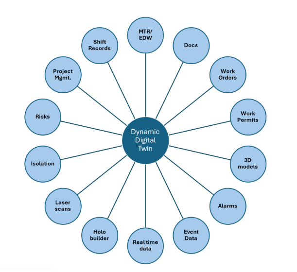

As a fundamental value proposition, Kognitwin brings all customer data together. A typical heavy industry asset maintains data in multiple source systems (applications). For example, there might be separate software systems to maintain Tag Register, Documents, 3D, Real-time and Operational data, so on and so forth. This fragmentation not only makes it difficult for the asset personnel to retrieve and manage data, but it also complicates data analysis and decision-making. By bringing all these data sources into a unified platform, Kognitwin enables streamlined access and insights. 
A common question that potential customers ask is, what kind of data can be ingested into Kognitwin, and which source systems can be integrated? So, let's start our journey from there. The below table provides an overview of commonly ingested data types, and the systems they come from. This is by no means an exhaustive list though - as a platform, Kognitwin is extremely adaptable and can accommodate new data types and integrations as needed.


| Dataset | Example of Source System(s) | Comments |
|---------|-----------------------------|----------|
| Tags | Aveva |  |
| Documents | Assai |  |
| 3D models | Aveva PDMS, or any common CAD software | .rvm, .nwd, .vue formats are supported |
| Laser scans | Common LIDAR scanners | .e57, .ptx, .las, .laz formats are supported |
| FLOCs | SAP |  |
| Operational Data | PACER, SAP, Permit Vision (work permits) | This could include datasets for Equipment, Work orders, Notification, Tasklist, Maintenance Plan |
| BOM | SAP, Cintellate |  |
| MOC | Cintellate, FSR |  |
| Deviations | FSR |  |
| Realtime Sensor Data | OSISoft Pi |  |
| Equipment integrity, Flange Data | One-IMS | Maintenance data from Integrity Management Systems (Equipment Integrity and Risk data including equipment specs., corrosion loops, circuits, RCM, Hazop, etc.) |
| Project Management | Primavera Project, Activities / Turnaround | Data from Primavera databases |
| Threats and Opportunities | Fit4MTO |  |
| Alarms | Dynamo |  |
| Leaks register | Multiple sources | Leak data capturing type of leak, substance, leak rate, etc. + temporary equipment used to handle leaks |
| Procedures data | AKMS |  |
| Operator rounds data | IntellaTrac | Can be integrated into Operations Cockpit |
| Sample monitoring data | Sample Manager | Sample monitoring data for integration into PTM |

In the next module, we will talk in depth about all these datasets and what is required from the customer to enable their integration with Kognitwin.

Key Takeaways
- Kognitwin unifies fragmented data from various source systems, facilitating streamlined access, data analysis, and decision-making.
- Commonly ingested data types include tags, documents, 3D models, laser scans, operational data, BOMS, MOCs, deviations, real-time sensor data, and more.
- Kognitwin is adaptable and capable of integrating with new sources.

#### Data Requirements
##### Master Tag Register
Each asset in the facility, such as equipment, instrument, piping, etc., is identified using it’s tag, which is a name given to the asset following a naming convention. The tags form the basis of all the information about the facility, making it easier to maintain and categorize different data in the facility. The master list of tags is the core requirement for Kognitwin to establish relationships (links and mappings) and contextualization processes. 
 
- Data can be transferred through Azure blob, SharePoint, Aspera, etc. as a manual dump, or be transferred through an API from the source system.
- KDI requirements:
  - Asset hierarchy
  - Tag naming convention/Equipment nomenclature guidelines
  - Tag relationships (with tags, with FLOCs, with Documents, etc.) 

##### 3D Models
CAD 3D models constitute a digital replica of facility. The models are one of the ways to visualize a facility on Kognitwin. Zooming in and out to inspect locations, measuring distances digitally, exploring equipment information, and gathering areal insights on various operational and maintenance activities of the facility are few of the uses of 3D model in the twin.  
- Supported Formats: .vue, .rvm (preferred format), .nwd
- If models are in Aveva PDMS, it is recommended to have them exported in .rvm format for KDI usage. Models should have .rvm file (for the 3D models) and .att files (for metadata).  .vue files for 3D model should should be accompanied with .mdb2 files for attributes metadata.
- nwd format is not supported directly. It is converted into .rvm which can result in loss of parameters during conversion, low performance on tablets, etc.
- Data can be transferred through Azure blob, SharePoint, Aspera, etc.
- KDI requirements:
  - Geolocation (location, coordinate system)
  - 3D tag naming convention (Tag naming rulesets, asset hierarchy shared in a descriptive document (to help in mapping 3D tags with EDW tags).
  - Plot plan (A document with the site plan (contains information like areas/zones, coordinate systems, reference points, etc.)  or 2D layout with Orthographic images
  - 3D to Tag mappings (Optional) 

#### Quiz: Preferred Format for 3D Model Export from Aveva PDMS

**What is the preferred format for 3D model export from Aveva PDMS?**

- .vue
- .rvm
- .nwd

**Answer:** .rvm

##### Laser Scans
Laser scans help in dynamic surveying of the real facility. In Kognitwin, these scans are located in the 3D space with the help of ‘point cloud data represented by bubbles in space’. When activated, laser scans give the true picture of the area as at the time when the scans were taken, thereby letting the users look at the facility digitally and helping them to identify equipment, read signboards, etc. The laser scans are usually paired with their corresponding 360 images as per the data received from client. 
- Supported Formats: .e57, .ptx
- Data can be transferred through Azure blob, SharePoint, Aspera, etc.
- KDI requirements:
  - Geolocation (location, coordinate system)
  - Plot plan (A document with the site plan (contains information like areas/zones, coordinate systems, reference points, etc.) or 2D layout with Orthographic images


##### 360 Images
360 images help in picture visualization of the real facility. In Kognitwin, these images are located in the 3D space that can be activated with menus on bubbles representing point cloud data. When activated, images give the true picture of the area as of the time when the images were taken, thereby letting the users look at the facility digitally and helping them to identify equipment, read signboards, etc. The laser scans are usually paired with their corresponding 360 images as per the data received from client.
- Supported Formats: PNG, JPG, JPEG
- Data can be transferred through Azure blob, SharePoint, Aspera, etc.
- KDI requirements:
  - 360 Image file name should follow the same nomenclature as counterpart laser scans Geolocation (location, coordinate system)
  - Plot plan (A document with the site plan (contains information like areas/zones, coordinate systems, reference points, etc.) or 2D layout with Orthographic images

### Question: What is required for 360 images to be correctly mapped in Digital Twin?
- Video file references
- Matching nomenclature with corresponding laser scans
- PI tag metadata

**Answer**: Matching nomenclature with corresponding laser scans

##### Videos
Videos can also be integrated on the visualization layer of Kognitwin. The videos are placed in the 3D space designated to the facility. A video player will be launched as a small pop-up window where the video can be played in the twin itself.  
- Supported Formats: .mp4, .avi
- Data can be transferred through Azure blob, SharePoint, Aspera, etc.
- KDI requirements:
  - Geolocation (location, coordinate system). Even if the videos do not have geolocation information, they can be placed on the view as per client requirements. 

##### Documents
All type of documents are ingested in Kognitwin and can be viewed by users as and when required. These documents also include engineering documents such as P&IDs, isometric drawings, operation manuals, specification sheets, etc.  
The normal documents are contextualized in Kognitwin to create ‘Live documents’, which are smart documents in which the text present is identified using OCR, linked to corresponding tags, and made clickable to help users plan or monitor their work seamlessly by just opening live documents.

- Supported Formats: DGN, DWG, DXF, DOC, DOCX, VSD, VSDX, PPT, PPTX, RTF, MSG, XML, CSV, XLS, XLSX, PDF, TXT, HTML
- Data can be transferred through Azure blob, SharePoint, Aspera, etc. as a manual dump, or be transferred through an API from the source system.
- KDI requirements:
  - Tag naming convention/Equipment nomenclature guidelines
  - Document to Tag relationships (often fetched from Aveva or SAP)
  - Document to Document relationships
  - OCR has limited capacity with text recognition. For scanned docs, 150 DPI or more should is the minimum requirement.  

#### Quiz: What is Required for Scanned Documents to be Processed via OCR?

**What is required for scanned documents to be processed via OCR?**

- image captions,
- Json format,
- minimum 150 DPI resolution

**Answer:** minimum 150 DPI resolution

##### Realtime sensor data
The real-time data from various sensors functioning at the facility can be fetched and visualized in Kognitwin. This data can be monitored in charts, which can also be positioned against the equipment in the 3D model. The real-time values are updated with bubbles shown in a layer on the live documents, that are placed right next to their corresponding equipment on the diagram.
- Time-based data is fetched from Azure event hub or API
- KDI requirements:
  - List of Pi tags and meta data (mainly UOM)
  - Pi tag to EDW tag relationships
  - Historical data  

### Question: What kind of data is retrieved through event hubs and displayed alongside 3D models and live documents?
- Realtime sensor data
- Mechanical integrity data
- Transactional data

**Answer**: Realtime sensor data

##### Transactional Data
The day-to-day operational data of the facility comprises repair and maintenance jobs which are governed by industry standard work processes. These include job notifications, work orders, work permits, tasklists etc. The inventory management is a part of such activities, and is captured under bill of materials or BoMs, maintenance plans, etc. The transactional information is also captured under other data types such as operator rounds, turnaround data, leak registers, etc., which are maintained by different service providers to the company. Kognitwin fetches these transactional datasets from different source systems, and links them to their relevant tags, FLOCs (functional locations) to help create a wholesome picture for the users.  
Mode of transfer:
- Transfer using API (Data is fetched from source system via a middleware e.g. MuleSoft, AIF)
- Transfer using excel files (accepted for historical loads)
- API availability to be informed to KDI.
- KDI configures the set up to receive and route SAP data correctly to the respective asset based on Site ID of the incoming datasets
- KDI requirements:
  - Data Hierarchy
  - Common Data Model Mapping
  - Historical data

##### Mechanical Integrity Data
Equipment integrity data is captured with the help of systems like One-IMS. The IMS data can be integrated in Kognitwin and linked to corresponding tags, FLOCs or Equipment. This data contains equipment integrity information such as equipment specifications, circuits, corrosion loop data, etc.  
Mode of transfer:
- Transfer using API (Data is fetched from source system via a middleware e.g. MuleSoft, AIF)
- Manual transfer using excel files (accepted for historical loads)
- API availability to be informed to KDI
- KDI configures the set up to receive and route SAP data correctly to the respective asset based on Site ID of the incoming datasets
- KDI requirements:
  - Data Hierarchy
  - Common Data Model Mapping
  - Historical data  

#### Architecture
Before we delve deeper into how the aforementioned data is ingested into Kognitwin, it is worthwhile to spend some time understanding the overall architecture and its components.

The following model outlines the high-level architecture of Kognitwin Service Platform in a technical context:

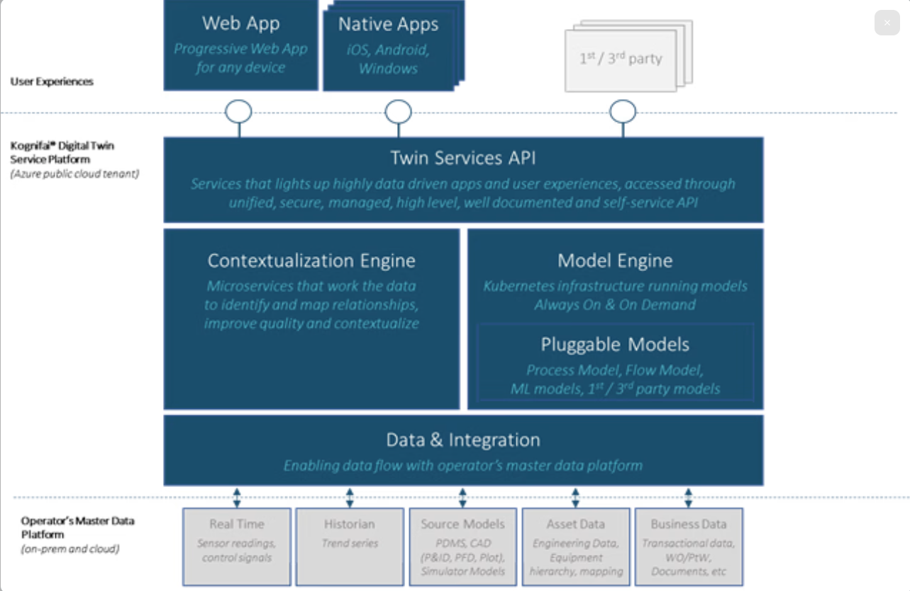

1 **Data Sources**: On the left, the grey boxes represent five core data domains sourced from the operator’s source systems:
- Real-Time Data
- Historian Data
- Source Models
- Asset Data
- Business Data
These data areas form the foundational input for the platform, but the platform is not limited to only these data sources. Additional data sources can enhance functionality.

2 **Data & Integration Services**: The Data & Integration layer provides the critical interface to connect and synchronize data flows between the Master Data Platform and the Service Platform. It ensures seamless ingestion, transformation, and exchange of data across components.

3 **Contextualization Engine**: Positioned further in the architecture, the Contextualization Engine is responsible for linking data, structures, and semantics. This engine operates without dependency on a predefined master model, dynamically establishing relationships and providing the contextual "glue" between disparate data objects.

4 **Model Engine**: A pivotal element, the Model Engine, encompasses services that facilitate the deployment and management of "pluggable models," which include:
- Physical models
- Mathematical models
- Machine learning models
This engine provides scalable and flexible capabilities for modeling various scenarios.

5 **Twin Services API***: This unified API aggregates the platform's diverse services and functionalities, enabling developers to build highly data-driven applications and user interfaces. The API ensures a secure, standardized connection to the Service Platform, presenting its capabilities as a cohesive continuum.

6 **Applications**: On the rightmost end, applications interact with the Actual State, Modelled State, and Predicted State of assets via the Twin Services API. The Web App, developed by KDI, serves as the primary user interface. Additionally, companion apps for iOS and Android offer tailored experiences optimized for mobile devices and other specific form factors like smartphones.

This architecture highlights a modular, scalable, and interoperable framework for delivering comprehensive, data-driven solutions.

### Key Takeaways
- The platform features a modular architecture with focus on adaptability and scalability.
- Various layers of the architecture facilitate import, processing, and visualization of data.
- Security, safety, and standardization are prioritized in the development philosophy.

### Question: Which system component is responsible for dynamically linking data and semantics in the architecture?
- Task pipeline
- Contextualization engine
- Model engine

**Answer**: Contextualization engine

### Terminology
Before we go further, it would be worthwhile to understand some terminology that you will encounter during the rest of this course, and in future projects involving the Kognitwin platform. While this is not critical to understanding how Kognitwin provides value, an understanding of these terms will enable a deeper understanding of what the journey customer's data goes through.

**Asset**
Kognitwin uses the term asset internally to describe a single entry in the asset database. The asset may for example describe an aspect of an actual physical entity, like a pipe or valve, or it may describe some semantic construct like a processing system or similar. An asset may be combined with other assets describing other aspects of the same entity to form a more complete description.
Example assets: Field, Installation, Area, System, Site, Pipe from PDMS, Pipe from PnID, Valve, Document, Tag, Equipment, Work Order, Note, Measurement etc.
To re-iterate, anything that goes as an entry in the database is an asset.

**Project**
Project is the top-level construct for defining client & backend behavior. For a given deployment, there should exist a default project with configuration for e.g. dynamic database indexes, logging behavior, client configurations.  Projects can be used to store data for client & backend consumption that has not yet been conceptualized to a separate module. Examples include various data templates etc. needed in frontend UX.

**Source**
A source, or data source, is any kind of external data source Kognitwin integrates with. Data sources may include, but are not limited to:
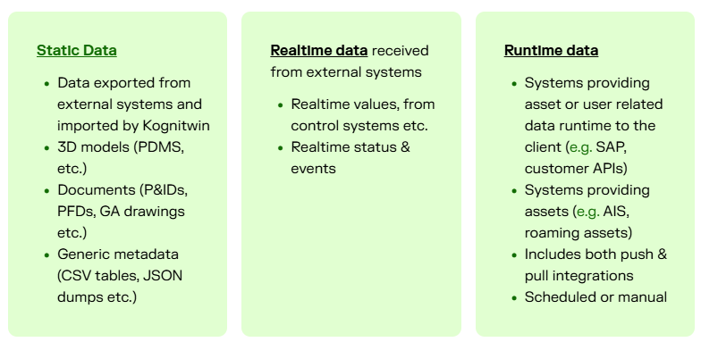

Sources serve as one axis of information access control in Kognitwin’s RBAC system. Different roles grant access to do different sources and thereby their respective data. Users affiliated with a particular role will be able to see data from all sources this role provides access to.

### Question: In digital twin platform, what is a source?
- Any external system providing data for ingestion
- A PDF or drawing format
- The server used for document storage

**Answer**: Any external system providing data for ingestion

**Attributes and Derived Properties**
The derive task is a contextualization task that adds and removes relevant data to and from an asset by applying different rules. The process of “deriving” properties is sometimes also referred to as “normalization” as one of the common operations is to extract information from customer-specific properties or attributes into the commonly used derived section of an object.

It should be noted that Kognitwin’s database automatically indexes all derived properties, while attributes and data, which are considered to be “raw data” are not indexed. It it therefore good practice to “derive” the information and values that you will later query for instead of doing queries involving data and attributes. The queries will perform a lot faster that way.

**Asset relationships, mapping and linking**
The assets are stored in the asset collection in MongoDB. And all the connections this asset has with other assets are stored within it as well. There are different types of connections:
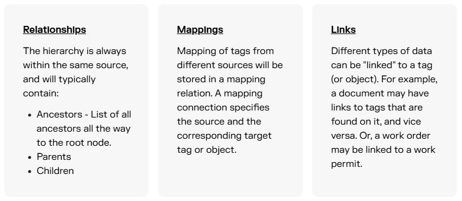

**Common Data Model**

A Common Data Model (CDM) is a standardized data model that promotes data interoperability and consistency by providing a shared language and structure for data representation, enabling easier integration and sharing across different systems and applications. Not only should a pre-defined CDM be agreed with the larger clients with multiple assets, but it is also ideal to keep the data model consistent across clients as much as possible.

'Normalization' is the process of integrating new data sources into the common model and making them effectively usable. You will find more details about asset modelling in the "What is Normalization" section on "Data Normalization" module.

### Question: What is the purpose of Common Data Model?
- To format documents for printing
- To promote data interoperability and consistency across systems
- To generate 3d models from scanned images

**Answer**: To promote data interoperability and consistency across systems

**Task Pipelines**

The process of populating the asset model consists of three separate steps per data source:
- Import of raw data
- Derive common, normalized properties
- Contextualize the imported assets

For each data source, therefore, there will typically be:
- One import task
- One or more normalization/derive tasks
- One or more contextualization tasks

The tasks can be chained together into task pipelines. A pipeline is thus a sequence of tasks that will execute one after the other.

There exists a collection of different import tasks, and their common purpose is to parse the raw data, transform into assets, and post the assets to the database through the /assets endpoint.

Of course, these are just one kind of pipelines, albeit the most common - there are other specialized pipelines for unique tasks.

### Question: What is the fundamental function of task pipelines in the normalization process?

- run one-time manual checks on data,
- automate workflow to import, normalize, and contextualize data,
- import and visualize 3d models

**Answer**: automate workflow to import, normalize, and contextualize data

### Asset Schema

For those of you who would like to go into the details of how data is structured at an asset level, this module covers the asset schema in depth, with the help of examples. This is a bit heavy on the technical concepts though and, as such, is not included in the final assessment. These concepts are also more fully explored in the subsequent deployment courses for developers.

Asset in the context of data, is used to describe a single entry in the asset database. The below represents a schema, and we're going to go through each of the sections below.
```json
{
  id: 'asset',
  source: 'meta',
  type: 'Asset',
  relationships: {},
  derived: {},
  data:{},
  mappings: {},
  links: [],
  attributes: [],
}
```

**ID** - The identifier of an asset must be unique within the set of assets with the same source property. The asset identifier must be a valid unicode string, however it is strongly recommended to use a limited character set to ease development and debugging, and avoid encoding/decoding issues.  eg: ```id: 'Asset 0'```
**Source** - The source property of an asset must be the identifier of a valid data source (foreign key). Combined with the id field, provides a way to uniquely identify any single asset in the system.
The source field is used internally to associate assets with a given data source. Properties of the data source may affect the results of a given query for associated assets, e.g due to authorization or other behavioral properties of the data source. eg: ```source: 'v3d'```
**Type** - The asset type property can be used to identify assets representing a distinct concept within a data source. It provides a natural way to group similar assets and query by a combination of type and other properties.
The value may be any valid unicode string. eg: ```type:  'General'```
**Data** - The data property is to support schema-less non-indexed data in an asset. eg: 
```json
{
  id: 'CampaignLookup',
  source: 'cui',
  data: [
    {
      "campaignCode": "28",
      "campaign": "KUI 2013 - Oppgang stikk"
    },
    {
      "campaignCode": "29",
      "campaign": "KUI 2014 - Feltsveiser L46"
    }
  ]
}
```
**Attributes** - The attributes array provides storage for arbitrary key/value pairs on the asset. Attributes should be used to roundtrip/preserve any data that may be interesting for data display or computations, or values that may be needed for further processing at a later time.
Attributes should typically not be used in queries. eg:
```json
{
  attributes: [
    {
      key: 'someproperty',
      value: 'somevalue'
    }
  ]
}
```
**Derived** - The derived object provides key/value storage for important calculated or derived properties of an asset. The values stored are typically extracted or mapped from source data using business rules or other configurations. Derived properties are typically available as indexed queries, depending on the deployment configuration.
For example, We know that the customer/data coding rules say A is a code for area and S is a code for system. We decide that we want to query assets based on area and system, so we design an importer capable of extracting the area code using e.g regex matching. The importer could then create something like the following output asset: eg:
```json
{
  id: 'A123_S99',
  source: 'cad',
  derived: {
    area: 'A123',
    system: '99'
  },
  media: {
    source: 'converted.fbx'
  },
  attributes: [
    {
      key: 'prop',
      value: 'something'
    }
  ]
}
```
**Relationships** - The relationships property describes relationships between assets within a single data source. We describe parent/child relationships using the two properties given, with children being a simple array containing the id values of all children, and ancestors  containing the id values of all ancestors of the asset.
Since the relationships are within a data source, the parent/child relationship information does not need to explicitly contain source info.
The reason for using an array of ancestors instead of e.g a simple parent field, is to be able to easily and quickly query hierarchical information without having to resort to recursive queries. Relationship properties are indexed, and usable in queries.
```json
{
  children: ['MyChild'],
  ancestors: ['Root', 'MyParent']
}
```
**Mappings** - key/value pairs that describe how assets from different data sources may represent or describe the same entity. The key represents the id of the data source the mapped asset is part of, while the value represents the id field of the asset itself, or an array of id values. To retrieve the mapped asset these must be provided as source and id parameters to a query.
The mappings may be one to one or one to many. This is useful in many different scenarios. For example, a pipe may be represented as multiple independent sections by a simulator, while the 3d model of the same pipe is one large continuous model.
There will not necessarily be a single authorative data source that can provide all properties for an asset. In such scenarios, e.g using the sum/union of all properties from all assets mapping to each other can provide the basis for display or further processing.
Usually, data from different data sources use slightly (or in some cases, totally) different naming/identity schemes which can make creating the mappings difficult. We provide tasks for using a combination of data transforms and introspection for creating mappings in these scenarios.
Mappings are indexed and can be used in queries.
```json
{
  id: 'Valve_RT',
  source: 'rt',
  mappings: {
    '3d': ['Valve_Model_A', 'Valve_Model_B'],
    'sim': 'Valve_Config',
  }
}
```
**Links** - Can be used to provide arbitrary links between assets. The assets can be from any data source, and can also be in the same data source.
We use the links to describe relationships that are not of the natural hierarchical nature of e.g relationships, and that are not between assets representing the same entity (covered by mappings).
The type field of a link is used to assign a type to the link so that collections of links of the same type may be queried in combination with other criteria.
Links are indexed and can be used in queries.
```json
{
  id: 'Valve A'
  links: [
    {
      type: 'document',
      source: 'pnid',
      id: 'Document A'
    },
    {
      type: 'note',
      source: 'notes',
      id: 'Note 23'
    }
  ]
}
```
**Media** - The media object provides storage for properties describing media (files, images, models) associated with an asset.
Any values stored in this property may be validated against the available storage solutions.
Media properties should not be used in queries.
```json
{
  media: {
    visual: {
      source: 'path/file.asset'
    },
    thumbnails: {
      default: 'path/thumb.png'
    }
  }
}
```
> **Sidenote**  
> Words like object, entity or component could also have been used for the same purpose.  
> The word asset may be used in a given customer context, or technical context, to describe something other than what we mean by the term.

## Data Normalization
**What you will learn**
After finishing this course, you will be able to:
- Understand how Kognitwin's data normalization process enhances data reliability and prepares for contextualization
- Recognize patterns and gap in data, and how to deal with them?
- Benefits of Data Normalization and how focusing on this process will improve data over time

### What is Normalization?
Data normalization is the process of organizing data in a database to reduce redundancy, improve integrity, and enhance storage and retrieval efficiency. It involves structuring data into tables and establishing relationships between them according to specific rules.
It is the foundation of effective database design - extracting the key information of various sources (e.g. start and stop time of workorders) so that they work consistently in the applications that can be built generically on top of that.

### Question: What is the primary purpose of data normalization in Kognitwin?

- to replicate data across systems for backups,
- to organize data, reduce redundancy and improve integrity,
- to convert 3d models into realtime measurements

**Answer**: to organize data, reduce redundancy and improve integrity

#### Asset Modelling

All data managed and displayed by Kognitwin must be represented in the Twin database. This includes engineering tags, documents, 3D entities, real-time measurements, work orders, and site images. These individual data objects collectively form what are referred to as Assets.

It is a prerequisite that the customer provides the naming convention.

Asset modelling occurs in the first phase of deployment and defines how data from various sources is represented and interconnected in Kognitwin. A clear, precise model is critical, as all subsequent phases depend on it. Poor modelling can cause complications and delays later in the process.

Assets, as the most common data type, encapsulate all forms of customer data. The model provides a standard for:

- Identifying and categorizing data
- Defining relationships between assets
- Linking to non-asset data (e.g., images, URLs)
- Ensuring normalization and consistency

The asset modelling phase addresses key questions:

- What properties (attributes) are available for each asset type?
- Can normalized values (e.g., tag name, unit, document type) be derived?
- How can relationships be created between assets across sources—for example, linking a 3D equipment object to diagrams it appears in?
- Is the data sufficient to establish links?
- Can a tag in 3D data be uniquely identified via ID, name, or a designated attribute or is there a pattern that need to be identified and used to create the relationships?
- How can uniqueness of asset objects be maintained?
- Duplicate tag names may exist in some facilities; best practice is to append a postfix to source names to ensure unique Source & Id pairs.

Asset modelling is both a discovery and design exercise. It's essential to understand naming conventions for tags, documents, and equipment. While many facilities have engineering manuals for this, reverse engineering may be required.

Typical conventions include:

- Equipment tags: equipment type, system/process unit, sequence number
- Pipe/line tags: size, fluid type, process unit, sequence number, design pressure, insulation
- Document IDs: document type, process unit, revision number, and more

Later configuration steps—such as extracting document types via regex or parsing diagrams for tag patterns—rely heavily on these conventions.

With a solid understanding of these elements, you'll be well-equipped to define the baseline asset model and functionality scope. This foundation will simplify integrating additional data sources in the future.

### Question: What must customers provide before asset modeling can begin?

- software licenses for thirdparty systems,
- naming conventions for tags, documents, and equipments,
- a list of documents to upload

**Answer**: naming conventions for tags, documents, and equipments

### How does it work?

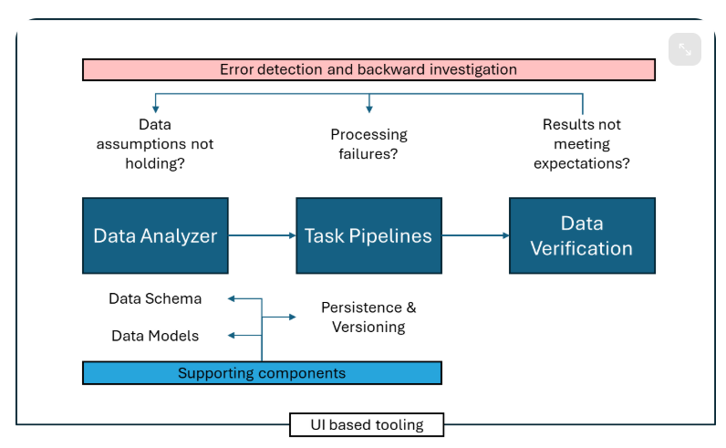

#### 1. Data Analysis & Processing

- **Data Analyzer**: Extracts insights and ensures that raw data aligns with expected patterns.
- **Task Pipelines**: Manages workflow automation and ensures efficient data processing. To be reliable, all pipelines must be capable of rerunning on raw data and perfectly reproducing existing outputs. This guarantees consistency in results, supports debugging, and allows for historical data verification.
- **Data Verification**: Validates data quality and ensures consistency with predefined models.

#### 2. Supporting Components

- **Data Schema**: Defines the structure of data, ensuring standardization.
- **Pipeline Persistence & Versioning**: Maintains historical versions of pipelines for reproducibility.
- **Data Models**: Provides predefined templates and rules for structuring data.

### Question: Which component defines how data is organized and ensures consistency in the pipeline?

- OCR module,
- UI-based annotation tool,
- Data Schema

**Answer**: Data Schema

#### 3. Error & Anomaly Detection (Alarms)

Three types of alarms help monitor and manage pipeline issues:

- **Data Assumptions Not Holding**: Flags when raw data does not conform to expected assumptions. To maintain data integrity, pipelines should include mechanisms to track changes in incoming raw data. Significant deviations or unexpected patterns may indicate issues requiring special handling. Automated alarms should be set up to notify teams when anomalies occur.
- **Processing Failures**: Errors can arise during data processing, particularly when data does not conform to expected models. Pipelines must include validation checks to detect and handle these errors efficiently. If data fails validation, appropriate error-handling mechanisms should be in place, such as:
  - Logging errors for review
  - Sending alerts for manual intervention
  - Implementing fallback strategies to prevent system failures
- **Data Not Meeting Expectations**: Identifies inconsistencies or deviations in final output. To maintain data integrity, pipelines should include mechanisms to track changes in incoming raw data. Significant deviations or unexpected patterns may indicate issues requiring special handling. Automated alarms should be set up to notify teams when anomalies occur.

### Question: What happens when incoming data violates expected patterns or assumptions?

- Alarms are triggered to notify of data issues,
- The system auto-deletes the data,
- It is accepted but not processed

**Answer**: Alarms are triggered to notify of data issues

#### Quiz: Three Steps in a Standard Data Pipeline

**What are three steps in a standard data pipeline?**

- Tag, compress, validate
- Import, normalization, contextualization
- Upload, edit, archive

**Answer:** Import, normalization, contextualization

#### Quiz: Why Normalization Important for Query Performance

**Why is normalization important for query performance?**

- it helps clean old data
- It allows effiecent data retrieval
- it compresses files

**Answer:** It allows effiecent data retrieval

#### 4. Data Pipeline Tooling (UI)

The entire system is managed via a **UI-driven Data Pipeline Tooling** that integrates these components, ensuring smooth operation, monitoring, and troubleshooting.

### What's the value?

#### 1. Reduces Data Redundancy

By organizing data into structured, logical formats, normalization minimizes duplicate records across systems and sources. This not only makes more sense, but also prevents conflicting versions of the same data, ensuring a single source of truth for all asset-related information.

#### 2. Improves Data Integrity and Consistency

Normalization enforces relationships between data entities through standardized schemas and reference models. This ensures that changes made in one place are reflected across all connected systems, maintaining consistency and preventing errors due to outdated or mismatched values.

#### 3. Enhances Query Performance

With well-structured and optimized data tables, normalized systems allow for faster, more efficient data retrieval. Queries can be executed with minimal processing overhead, improving response times for users and enabling smoother operations within the data pipeline tooling.

#### 4. Simplifies Data Maintenance and Updates

A normalized database structure streamlines updates and maintenance activities. Since each piece of data exists in only one place, it's easier to apply corrections, update attributes, or extend the data model without the risk of inconsistencies or system-wide disruptions.

## Data Contextualization
**What you will learn**
After finishing this course, you will be able to answer:
- What is meant by contextualization?
- How does contextualization work in Kognitwin, and what are the pre-requisites?
- What value does contextualization bring?

**What is Contextualization?**
Contextualization is the process to align, map and link data from all underlying sources to form the holistic, amalgamated data representation encompassing all relevant data and the contexts the data belongs to. It ties all the data, structure, and semantics together to create an asset model. With the help of data contextualization, we can prepare the data, ingest this data into a relationship-based setting, and further transform the capabilities of the assets into a smoother operation. Contextualization is the most significant enabler for value creation, because it ties data from different master systems into one, cohesive landscape.
In one sentence, it's the process that allows varied datasets to be seen and analyzed "in context of each other", instead of in siloes. It is one of the fundamental value propositions of Kognitwin.
Now let's see what it really looks like.

Contextualization in action
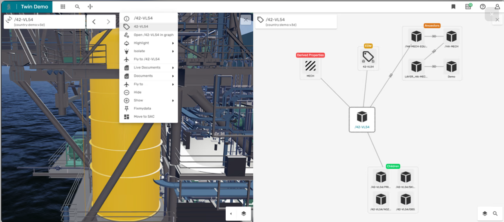
The graph view becomes increasingly richer and more useful as more datasets are ingested and contextualized.

When you're navigating through the 3D model of a site, and identify an equipment that you want to know more about, wouldn't it be useful if you could just get all the relevant information at your fingertips, seamlessly integrated? This is what contextualization enables. The 3D equipment object, let's say a separator, becomes linked to the tag for that equipment in the Master Tag Register (MTR)/ Electronic Data Warehouse (EDW). The tag, in turn, allows linking to FLOC, Work Orders, Notifications, Integrity, so on so forth. Retrieving all this information on Kognitwin and seeing it as a "Hub and Spoke Model" graph is literally two clicks - versus logging in to multiple source systems and searching on each of them separately, in traditional ways of working. 

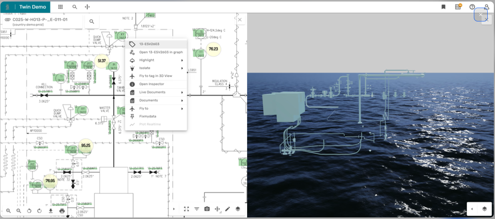

Similarly, contextualization brings documents alive, by recognizing tags and making them interactive. Click on any mapped tag to instantly retrieve all linked data, fly to that equipment in your 3D model, look at real-time sensor data, and even isolate entire piping and instrumentation systems in 3D.


In this same way, other datasets too are integrated, cross linked and visualized for enhanced decision-making and operational efficiency. This is the power of contextualization.

**Key Takeaways**
- Contextualization aligns, maps, and links data from various sources to create a holistic and integrated data representation.
- It enables seamless access to relevant information across different systems, enhancing efficiency and decision-making.
- Contextualization is a key feature of Kognitwin, providing significant value by integrating diverse datasets into a cohesive landscape.

**How does it work?**
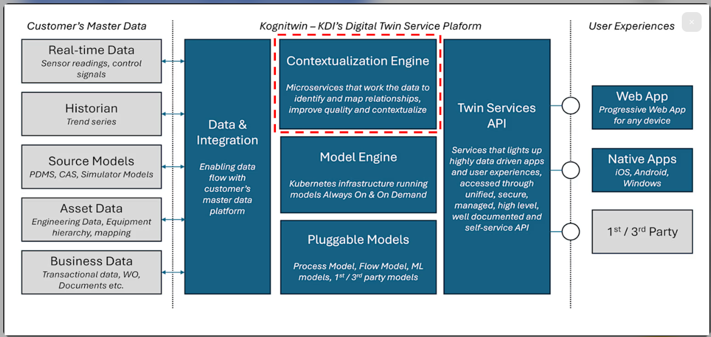
Contextualization Engine represents the services that ties data, structures, and semantics together without relying on any master model. It provides orchestration of contextualization as well as other data preparation and transformation capabilities. It utilizes algorithms and artificial intelligence such as machine learning, and acts as the glue that links the various objects together. It will collect, contextualize, validate, inspect & analyze, approve or reject data. 

In simple words - it cross-links data sources. 
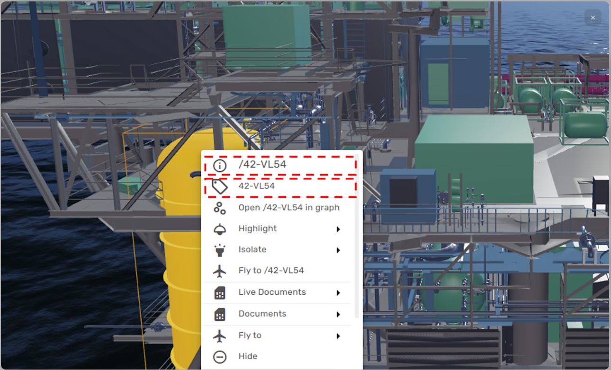
When you right click a 3D object in the model, in the context menu, you see not only the name of the 3D object you have clicked (/42-VL54), but also the name of the tag it is linked to (42-VL54). This is an indication that a link has been established between the two.
There are multiple ways of establishing these links.
**Direct Mappings**
Often, the client team might already have these mappings well established on their side. In such cases,  they might give us Excel or CSV files that simply are lists of 3D elements in one column, and which MTR tag they map to, in the second column. This mapping can be directly ingested to create the kind of relationships you see above.
(Remember: a mapping is a connection between assets from different sources)
For the above example, the mapping file would have looked something like:
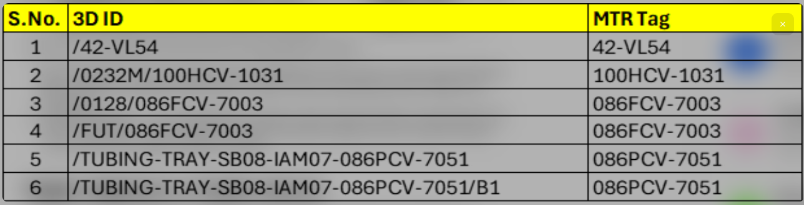

If your asset is sharing this with you, here are some guidelines to follow:

- Multiple 3D objects should not map to the same EDW tag. Like #3 and #4 in above table. While this data can be ingested and even processed, it breaks certain functionalities, and is therefore not encouraged.
- Consider #5 and #6 - in the 3D asset hierarchy, #6 is a 'child' of #5. All children automatically inherit the MTR mapping of the parent and must not be individually mapped. As such, customer should remove #6 from the mapping file before sharing.

#### Regular Expressions (RegEx) rulesets

Direct mappings may not always be available, and when available, they might not be exhaustive. In such cases, RegEx rulesets can be applied to define patterns as the basis of contextualization.

Consider the situation where a mapping file was not available from the customer. Our visualization team may then write some pattern matching rules based on their understanding and experience.

For example, a simple one would be removing the leading "/" from the 3D object name, take the rest of the text, and search for an MTR tag of that name. You can see how this would cover #1 in the above table perfectly.

Not all rules are that simple to decipher though. For example, #2 is a bit more complex - should we remove the whole first section? Does it work that way? There's no obvious answer. And therefore, creating these rulesets are greatly helped if the developer has relevant experience. Even then, it's good to get customer's feedback once the mapping is done, and tweak accordingly.

### What's the value?

You have gathered enough data, but does it provide you with enough context to work with your assets? Can you obtain maximum business value from the data coming from various sources and does it help you in your operational decision making? This is where "Contextualization" is required when you are working with large amount of raw data.

It thereby acts as the glue that links the various objects, from various sources, together e.g., documents, images, media files etc.

Data contextualization helps users to take better decisions by providing answers to the following questions:

- What information is this asset providing?
- How can I use the asset's information for its scheduled maintenance?
- When can I create a work order?
- How efficiently can my maintenance team reach the asset and fix the glitches?
- How can I maintain this asset efficiently without disturbing its other components?
- What relevant information do I need to fix/maintain the plant and its assets?
- What is the best way to operate the plant?
- When should the asset be replaced?
- What is the best type of equipment needed to develop/fix this asset?
- How should the asset's performance be managed?

#### Quiz: Primary Purpose of Contextualization in Digital Twin

**What is the primary purpose of contextualization in Digital Twin?**

- To replace the need for source systems,
- TO align, map, and link data from various sources into a cohesive view,
- To store file and documents in the cloud

**Correct Answer:** TO align, map, and link data from various sources into a cohesive view,

#### Quiz: Graph View in Contextualization

**Which of the following best describes the "graph view" in contextualization?**

- An interactive web of linked data that grows richer with more contextualized datasets,
- A visual list of tags,
- A static document repository

**Correct Answer:** An interactive web of linked data that grows richer with more contextualized datasets,

#### Quiz: Contextual Link Indication

**What does it mean when a 3D object in the model shows both its object name and tag name in the context menu?**

- THe object is duplicated at source and needs to be cleaned,
- A contextual link between the 3d object and edw tag has been established,
- The 3d model is not mapped

**Correct Answer:** A contextual link between the 3d object and edw tag has been established,

#### Quiz: Creating Mappings Without Direct Files

**How can mappings be created when direct mapping files are unavailable?**

- Using regex rulesets to define matching patterns,
- By renaming all tags manually,
- By converting documents to 3D models

**Correct Answer:** By renaming all tags manually,

#### Quiz: Method to Create Mappings When Files Unavailable

**Which method helps create mappings when customer mapping files are unavailable?**

- Physical site visits
- Manual renaming
- Regular expression rulesets

**Answer:** Manual renaming

#### Quiz: Contextualization in Operational Decision-Making

**How does contextualization help in operational decision-making?**

- It eliminiates the need for human intervenstion in plant operations
- It enables better decisions by linking relevant data like tags, documents, and sensor values to assets,
- it schedules all maintenances automatically

**Correct Answer:** It enables better decisions by linking relevant data like tags, documents, and sensor values to assets,

#### Quiz: Key Advantage of a Digital Twin for Industrial Facilities

**What is the key advantage of a Digital Twin for industrial facilities?**

- Eliminates need for sensor data
- Consolidates fragmented data into a unified platform
- Automates equipment installation

**Answer:** Consolidates fragmented data into a unified platform

#### Quiz: Purpose of the Contextualization Engine

**What is the purpose of the Contextualization Engine?**

- Manages sensor calibration
- Leverages conversational AI to find related data
- Links data, structures and semantics

**Answer:** Links data, structures and semantics

## Data Visualization
**What you will learn**
With data ingested, structured, and contextualized, Kognitwin allows its visualization in various ways, and quick navigation between 3D models, documents, charts, and data dashboards. 


After finishing this course, you will be able to:
- How is data brought alive on intuitive UI in Kognitwin?
- What is a workflow in Kognitwin terminology?
- What tools and features exist to extract most value out of visualized data?

### What is visualization?

'Visualization' is an umbrella term for all methods and processes in Kognitwin which enables users to see and interact with their contextualized data, to facilitate day to day work through an intuitive UI and generate insights.

#### Quiz: Meaning of Visualization in Kognitwin

**What is the meaning of 'visualization' in Kognitwin?**

- To export data to external systems for graph generation,
- To enable users to view and interact with contextualized data through an intuitive UI
- To allow manual annotation of sensor readings on documents

**Correct Answer:** To enable users to view and interact with contextualized data through an intuitive UI

Kognitwin integrates different datasets and presents it through various 'workflows', each targeted towards specific use cases.

#### Definition: Workflow

Workflows is another name given to the user interface views in the application behavior. Workflows contain information on which UI components are displayed, along with the relationships and interactions of different datasets relevant to that particular view.

#### Quiz: What is a Workflow in Kognitwin?

**What is a workflow in the context of Kognitwin?**

- A set of assigned tasks and corrections
- A data structure defining UI behavior and layout,
- The process of work approval

**Answer:** A data structure defining UI behavior and layout,

To take a simple example, Documents Search workflow allows users to search for documents using a rich set of filters, save these filters for quick re-use later, and view the documents as well as their metadata.

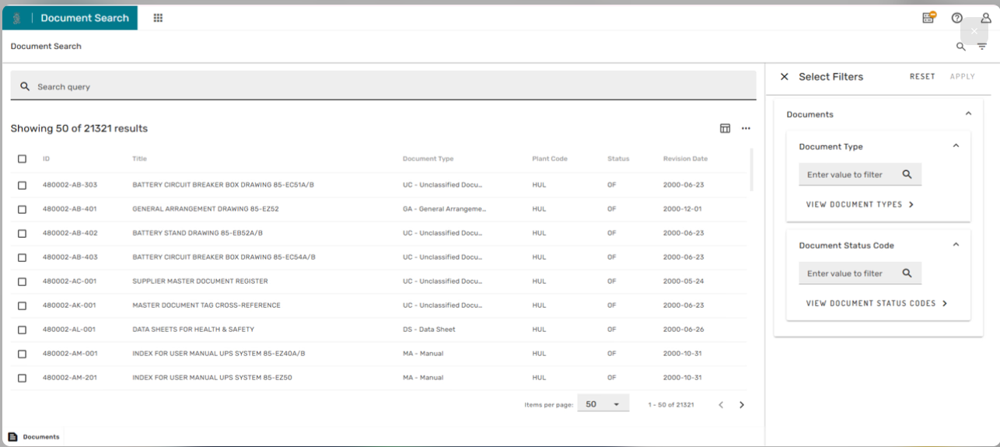

The visualization in this case is simple - Display all available data in list form, along with capability to show a document in the side pane.

Now, let's take a more complex example, the Risk Visualization workflow.

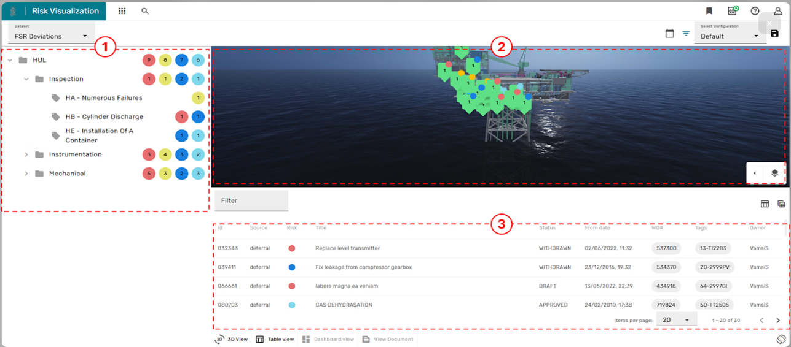

This allows visualization of risk data in multiple ways. You can look at the aggregated data at various levels, dive deeper into record level details, and also visualize everything on the 3D view for more context. We will come back to this workflow later for more understanding but note for now that each different way of visualization adds unique value.

And each workflow is designed to visualize data in the manner most suited to its specific dataset, and its specific use case.

We will learn more about the different workflows available in Kognitwin later. But in the next section, let's see how some common datasets are visualized.

### Ways of Visualization?
Let's quickly look at how some of the most commonly utilized datasets are brought to life in Kognitwin.
#### 3D Landing Workflow/View
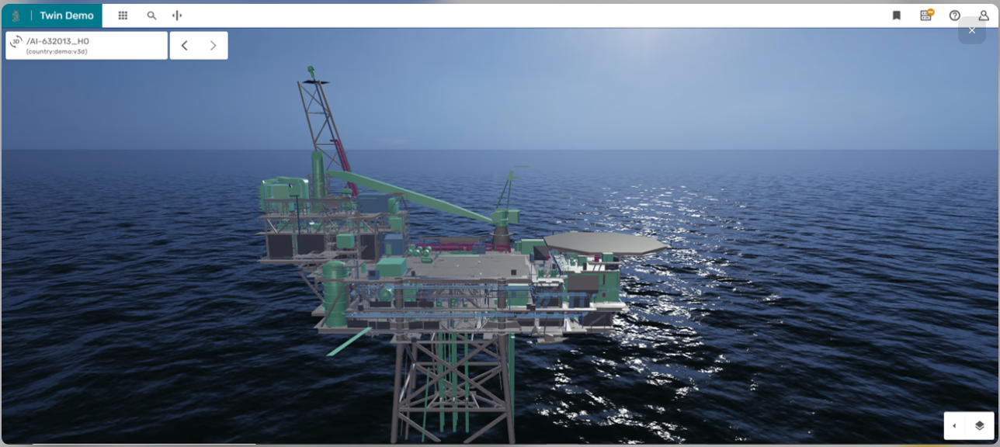

If the customer's assets already have 3D models, they are ingested into Kognitwin, and make visualizing everything else easier. Using your mouse and keyboard, Kognitwin allows you to navigate through the model, as you would walk through the actual facility. Each object in the model is made interactive, and all related data is available at a mouse click. This immersive experience enhances understanding and decision-making.

#### Search Workflow/Inspector View
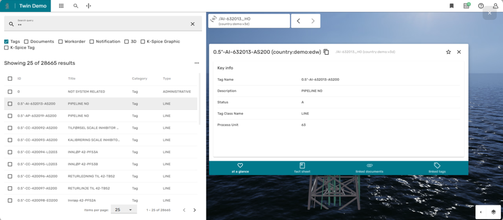
Once the customer's master tag register has been ingested, you can find specific tags through Global Search. When you find the tag you are looking for, right click to bring up the inspector. The inspector provides detailed information about the tag, everything that has been made available from the MTR - but also much more.

The "much more" part comes from the fact that tag data sits at the center of the Kognitwin data model. It is the glue that holds everything together. This aspect of the data model is best visualized as a 'spider web' graph that illustrates the connections between various datasets.
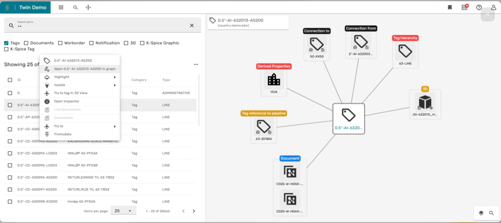

Graph view allows you to see and follow these relationships, and to get an intuitive understanding of how data in Kognitwin is stitched together - what are the dependencies, why something might be broken, and what is required to fix it.

#### Quiz: Role of Master Tag Register in Kognitwin

**What role does the Master Tag Register (MTR) play in Kognitwin?**

- It store 3d model layers
- It houses archieved PDFs
- It serves as the cental reference for asset tags and relationships

**Answer:** It serves as the cental reference for asset tags and relationships

#### Quiz: How Graph View Helps with Understanding Tag Data

**How does the Graph View help with understanding tag data?**

- By listing tags in alphabetical order
- By visualizing relationships between data as a spider well for intuittive understanding
- By showing a linear history of tag updates

**Answer:** By visualizing relationships between data as a spider well for intuittive understanding

#### Operations data shown as 'badges' on 3D
This is the umbrella term for a lot of work data - work orders, permits, notifications, MOCs, threats and opportunities, etc. These datasets are made searchable on the landing page, but also visualized in a dedicated workflow called Cumulative Work Visualization.
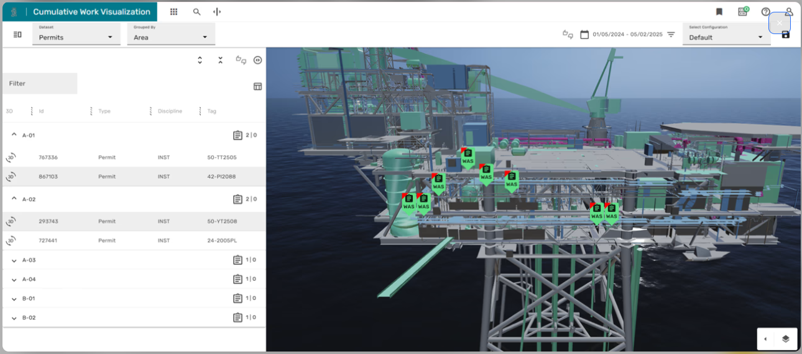

Users can select the dataset(s) they want to visualize, and also decide how they want to group the data. The data is then visualized in grouped list format (left panel), and as interactive badges on top of the 3D model.

#### Document View
One of the most valuable features of Kognitwin are live documents. Once your flat documents have been ingested and contextualized, they are ready to be visualized as interactive images where you can:

- Identify key equipment, instruments, pipes, etc., and their data
- Fly to these objects in your 3D model and compare them side by side with the document
- Navigate between related P&IDs, to follow a pipe system, for example.
- Look at real time data from your instruments directly on the P&ID
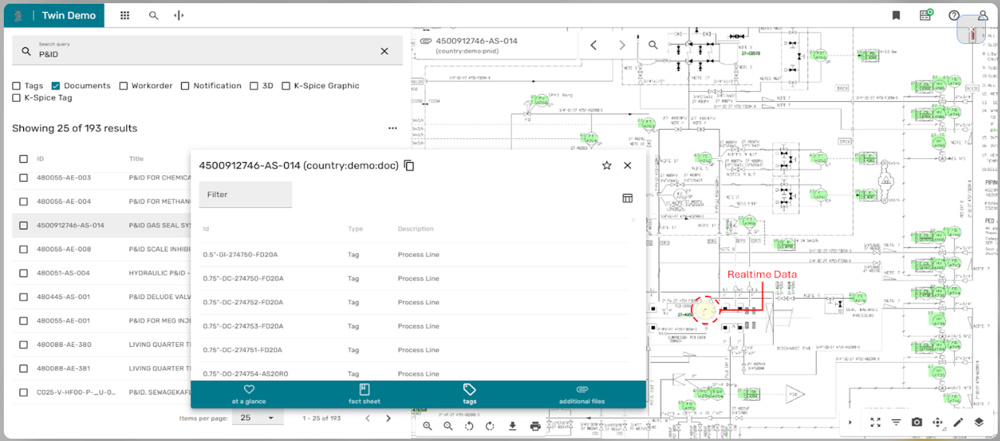

#### Realtime Charts
We have already seen that realtime data from sensors can be found through global search, and on documents. But this dataset too has its own dedicated workflow, called Realtime Viewer.
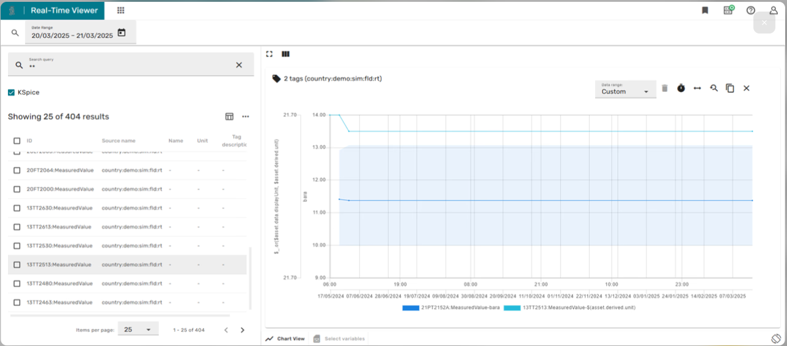
Realtime data can be seen plotted as charts - showing single or multiple trends - and the workflow presents tools to analyze, filter, and export data efficiently.

Moreover, these data trends are also available in the inspector through equipment tags in 3D or MTR.
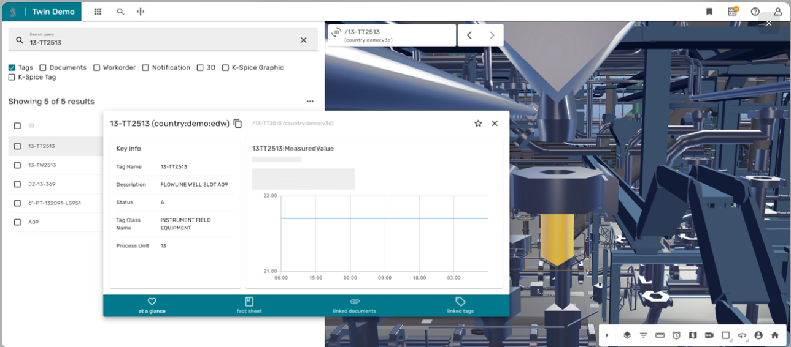

#### Risk Workflow
This includes deferrals, deviations, leaks, alarms, overrides, near misses, and other datasets that encapsulate perceived risks. The workflow for visualizing this is called Cumulative Risk Visualization, and is very similar to CWV discussed earlier.
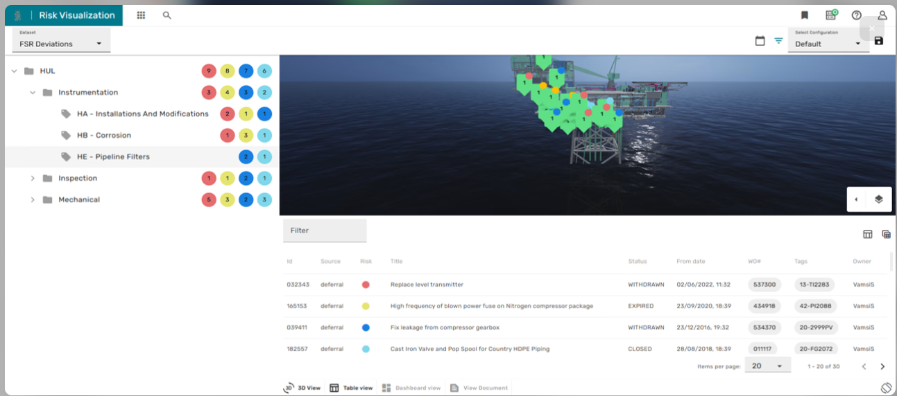

There are a few additional functionalities that this workflow provides which is not present in CWV:

- A hierarchical view of your data, to visualize risks at site, area, process unit, or FLOC level.
- Colour coded risk indicators to quickly assess severity levels.
- Dashboard view to slice and dice the data per your requirement

#### Quiz: Feature Distinguishing CRV from CWV

**What feature distinguishes the Cumulative Risk Visualization (CRV) workflow from CWV?**

- It allows filtering data by date ranges,
- It is easy to use,
- It provides hierarchical and color-coded risk indicators

**Correct Answer:** It allows filtering data by date ranges

#### Advanced 3D data views: Laser Scans and 360 Images
These datasets augment the 3D model, or act as its substitute if 3D is not available. They can provide a detailed visual context which may not be clear through models. This enhances spatial awareness and accuracy.

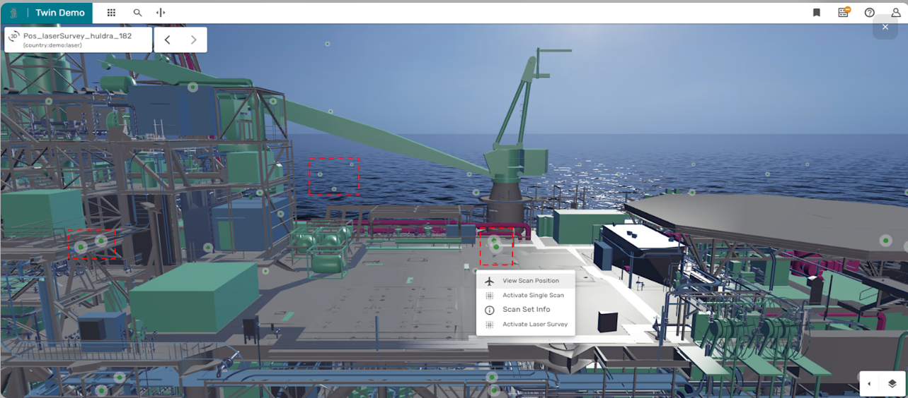
Laser scans, laser surveys, and 360 photos - where available - can be turned on from the layers menu in the 3D viewer. Once they're switched on, you will see green/red bubbles appear which denote that a scan/ photo is available for that area. Right click and activate these to load the scan/ photo.

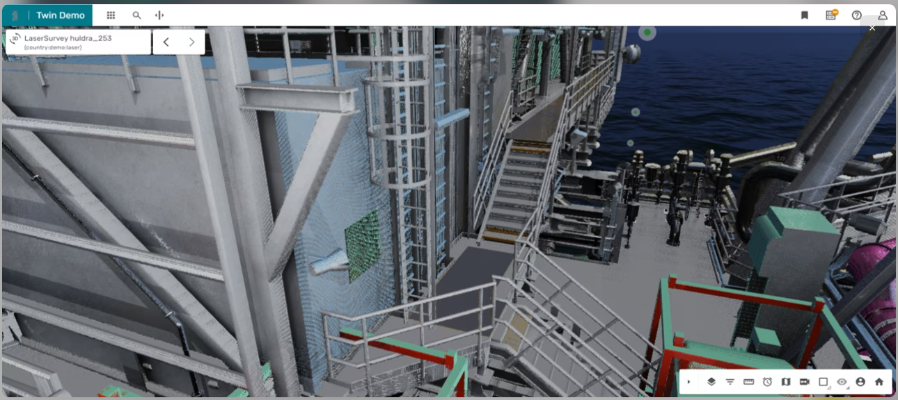

You can go from scan to scan to get a good pictorial understanding of the area.

#### Quiz: What Happens When Laser Scans or 360 Images Are Turned On

**What happens when laser scans or 360 images are turned on in the 3D viewer?**

- All documetns are automatically annotated,
- Green/red bubbles appear to indicate available visuals for that area,
- A 2D impage opens in a new tab

**Correct Answer:** Green/red bubbles appear to indicate available visuals for that area

#### Quiz: How Laser Scans Are Accessed in 3D Viewer

**How can laser scans be accessed within the 3D viewer?**

- By activating green/red bubbles fromthe layers menu
- From dashboard settings
- Via document inpsector

**Answer:** By activating green/red bubbles fromthe layers menu

### Tools and Features

The visualization experiences discussed in the previous section are further enhanced by a variety of tools and features designed to optimize ease of use, and functionality.


#### Layers
One of the basic view functions is the ability to turn ‘layers’ on and off. This is the first option on the 3D toolkit.
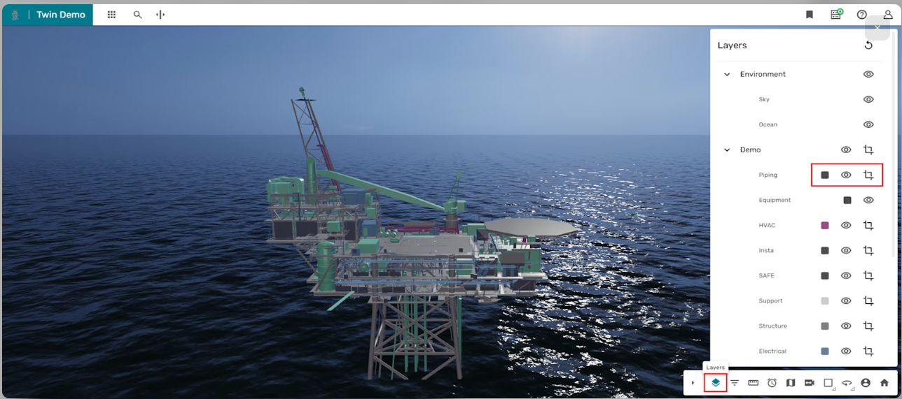

When the 3D model is ingested, it is segregated into different layers, based on component type, disciplines, vendors, etc. While normally the model is visualized as an integrated entity, it is possible to choose which layers you want to see, and turn the others off. For example, maybe you want to follow a piping system and find it useful to turn off everything else. You can also choose which colour each layer is visualized in, and have the option of 'cropping' layers too. Many of these options are also available for contextualized documents.

#### Quiz: Purpose of Layers in the 3D Toolkit

**What is the purpose of layers in the 3D toolkit?**

- to show satellite imagery,
- to look inside 3d objects like vessels, pipes, etc,
- To organize the model by component types and allow selective viewing

**Correct Answer:** To organize the model by component types and allow selective viewing

#### Effects and modes
You can choose to visualize the 3D model in different ways, such as Glass Mode, desaturated, etc., to suit your purpose. For example, if you want to focus on a small component, normally hidden from view, turn to glass mode to easily locate it.
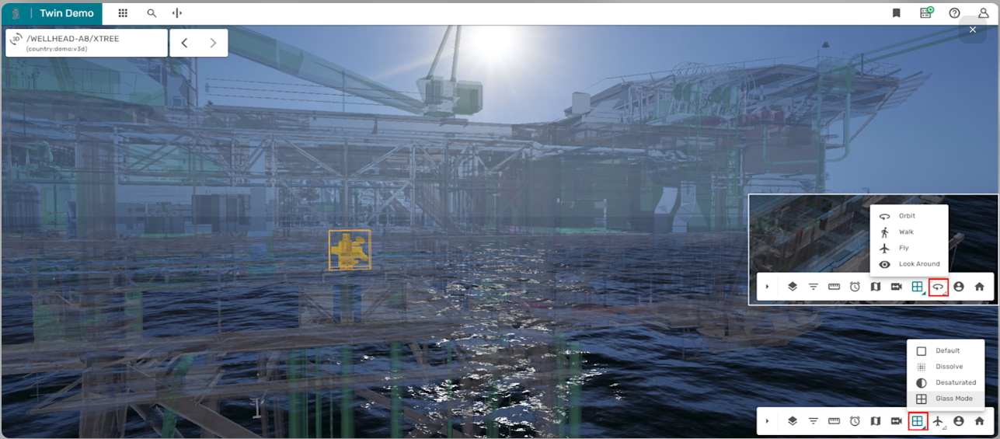

You can also decide how you interact with the model. Depending on your preference and purpose, you can simulate walking, flying, orbiting, etc.

#### Highlight and isolate
| 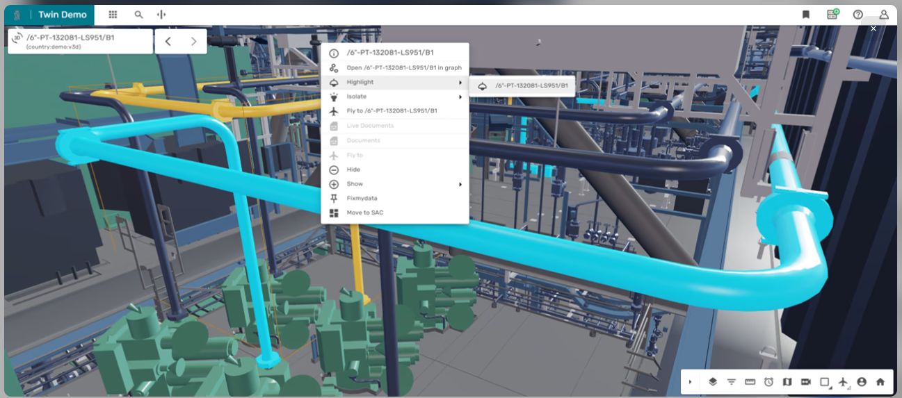 | 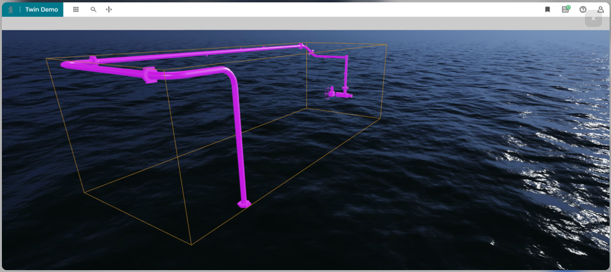 |

It is possible to highlight - or even isolate - specific components to distinguish them easily. For example, in order to follow a piping system through the 3D model. This feature enhances clarity and focus during analysis.

#### Quiz: What Does the 'Highlight and Isolate' Tool Help Users Do

**What does the 'Highlight and Isolate' tool help users do?**

- lock equipment for editing,
- focus on specific components in the 3D model by separating them visually,
- Change color settings in the UI

**Correct Answer:** focus on specific components in the 3D model by separating them visually

#### Annotations
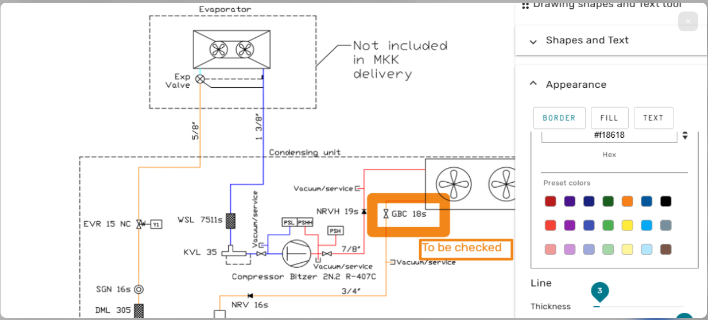

Annotations allow users to add notes, comments, or highlights directly on live documents for collaboration and communication. This feature is particularly useful for teams working on maintenance, inspections, or reviews, enabling them to mark up documents with specific instructions, observations, or questions without altering the original file.

#### Quiz: Common Use of Annotations in Live Documents

**What is a common use of annotations in live documents?**

- To collaborate through markups like commends or highlights
- TO compress documents for better performance
- To generate heat maps

**Answer:** To collaborate through markups like commends or highlights

## Introduction to workflows 
### Advanced 3D View - Laser Scans
#### What is it?

Laser scans, also known as LIDAR (Light Detection and Ranging) are a remote sensing technology that uses laser light to measure distances and generate highly accurate 3D representations of objects or environments. In Kognitwin, they may supplement 3D models, or may act as a substitute where 3D models are not available. Where present, they may help improve visualization, analysis, and decision-making processes by highlighting differences between designed and as-build elements.

#### Who will use it?

All users trying to visualize the physical layout of the asset.

#### How to use it?

Laser scans appear as point clouds within the 3D environment, allowing users to interact with and analyze the scanned data. Users may simply click on bubbles available on the 3D landing page to activate the scans and may then drag or re-orient the view as required.

🧰 Check out this quick course on Kognitwin – Laser Scans Overview

#### Business Value

In an industrial context, laser scans have several applications, such as:

- **Surveying and Mapping**: Laser scans are used to gather precise data in industries like construction, mining, and engineering for creating maps, topographic surveys, or detailed 3D structures.
- **Inspections and Asset Management**: Industries can use laser scans to inspect the condition of equipment, structures, and systems, allowing for better maintenance and monitoring of assets.
- **Robotics and Automation**: Laser scans provide real-time spatial data that robots can use to navigate, identify objects, or perform complex tasks in a variety of industrial settings.
- **Quality Control**: By comparing digital models obtained from laser scans with the original design or standard specifications, industries can identify deviations and ensure the quality of their products or processes.
- **Safety and Risk Management**: Laser scans can help identify hazards, assess risk and vulnerability, or monitor environmental factors in industrial sites to improve safety and compliance with regulations.

Overall, laser scanning technology enables industries to enhance efficiency, accuracy, and safety by offering precise visualization, measurements, and analysis of their operational environments.

#### Quiz: Key Use of Laser Scans in Kognitwin

**What is a key use of laser scans in Kognitwin?**

- provide an alternative way to record real time sensor data
- Monitor sensors and produce alerts when parameters fall outside specified ranges
- Visualize and inspect physical layouts in 3D

**Answer:** Visualize and inspect physical layouts in 3D

#### Live Document Dashboard

**What is it?**

The P&ID dashboard workflow is a reporting dashboard for validating contextualized documents. With this tool users can check individual documents for which connections the identified tags and document links have to other data sources such as:

- EDW Tag
- Realtime data items
- 3D objects
- etc.

**Who will use it?**

Kognitwin super-users

**How to use it?**

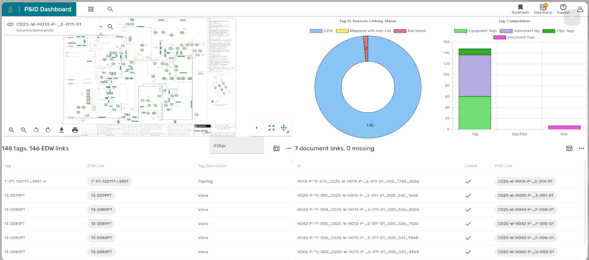

On the Live Document Dashboard, users can search for and dive into any contextualized document. The workflow gives a quick but detailed overview of the contextualization quality of the document, in the form of a list of hot-spotted and mapped tags, off-page connectors to other documents, as well as the 3D mapping of tags identified on the document. Superusers, or the data management teams, can use this to assess gaps in source data, or Kognitwin contextualization improvement opportunities, and drive those initiatives towards better results.

**Business Value**
This tool helps maximize the value users get out of Kognitwin. It shows gaps in contextualization, as well as in the underlying data, and provides insights for improvement. Kognitwin is all about connected, cross linked data, and this is a tool to enhance that.

#### Quiz: Tool for Reporting Gaps in Contextualization on Parsed Diagrams

**What tool allows users to report gaps in contextualization on parsed diagrams?**

- Risk tracker
- Live Document Dashboard
- Isolation Planner

**Answer:** Live Document Dashboard

#### Quiz: Role of the P&ID Dashboard in Kognitwin

**What is the role of the ‘P&ID Dashboard’ in Kognitwin?**

- View camera feeds
- Track connections between diagrams and their contextualized data,
- Manage login credentials

**Answer:** Track connections between diagrams and their contextualized data,

### Cumulative Work Visualization

**What is it?**
The CWV is a valuable workflow for operational maintenance activities and streamlines the efforts of the workers involved. For a maintenance planner, for example, who has to frequently dispatch  personnel to various areas of the plant, the CWV workflow can be utilized for grouping of tasks. For instance, if a crew is to be sent to complete concrete repairs in one area of the facility, the CWV workflow can be used to quickly search for any other concrete work on open work orders so as to utilize the crew and utilities sent out in the facility for the same jobs across the entire facility. Besides the value it provides for day-to-day planning, the workflow is especially important for offshore facilities where the logistics of mobilizing to platforms are much more difficult and costly.

**Who will use it?**
Operations , Maintenance

**How is it used?**


Cumulative work visualization allows work data - work orders, notifications, permits, MOCs, etc. - to be grouped and visualized in a centralized dashboard for better planning and coordination. Users can select the dataset(s) they are interested in, group them in various ways - by FLOCs, plants, types, etc. - and apply date ranges and other filters. The resulting data is listed, and also visualized on top of the 3D model as badges, for further investigation and deep dives. Users can use the "Conflict configurator" to define activities that may not be done in close proximity. For example, any maintenance or isolation work that could vent flammable gases should not be carried out in vicinity of hot-works. The tool allows for quick visual identification of such conflicts, and safer, more effective planning. 


**Business Value**

- Quick and easy access to work related data
- Helps visually finding the physical location in which the planned work needs to be done
- Quicker detection of work conflicts leading to better planning and safer operations
- Gives opportunity to find and plan simultaneous work in the same physical location e.g. Scaffolding is required at the same location for two different jobs. Then CWV will show that these jobs can be planned together

#### Quiz: Data Visualized in Cumulative Work Visualization

**What kind of data is visualized in Cumulative Work Visualization (CWV)?**

- Planned and active operations data
- Real time sensor failures
- User access logs

**Answer:** Planned and active operations data

### Cumulative Risk Visualization

#### What is it?

Cumulative Risk Visualization is an application that enables the end user to perform Cumulative Risk Management. The application aggregates and visualizes risk and threats from a range of data sources. The risks and threats are visualized on user-friendly dashboards in a contextualized way connected to the assets hierarchy structure. This gives the user a more holistic view of risks and threats affecting the operation of the plant. Barrier model of organizational, operational and technical barriers can also be configured.

The most commonly ingested datasets in this workflow are deviations, MOCs, and threats. But the workflow is very configurable for integrating with other datasets from a variety of source systems.

#### Who will use it?

HSE, Operations, Technical Safety

#### How to use it? 

The Cumulative Risk Visualization (CRV) workflow starts with an overview of the site. To the left is an asset hierarchy of the site’s plants which can be expanded to show specific process areas. The breakdown structure of the plant will be tailored to each customer. Each process area has a risk associated with it. The risk is color-coded and visible in the 2D/3D model to the right if the site’s data quality allows it. The table on the bottom right shows relevant data related to the processes selected in the asset hierarchy to the left.
 
Similar to CWV, it allows risk data to be grouped and visualized in a centralized dashboard for better risk management. Users can select the dataset(s) they are interested in, apply date ranges and other filters, and visualize it conveniently for further investigation and deep dives. 
Users can visualize risk data on 3D view, Dashboard view and Table view. The dashboards are easily configurable at the backend, and can be customized based on customer needs. Additionally, the workflow highlights the risk in the SCE barrier.
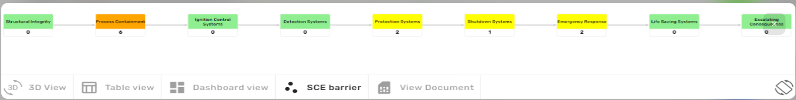

You can visualize the health of the SCE barrier and identify the systems where risks are accumulated by selecting the desired dataset and expanding the tree view to your desired level. Clicking on any of the level with risk, updates the SCE Barrier to show the count of systems with risks. You can also identify the risks in SCE by using the SCE column in the table view.

#### Business Value

- Overview of location and degree of risks
- Configurable integrated barrier model

Hazardous industries such as the oil and gas sector can have a large scale impact due to incidents. To model risks and threats in complex industrial plants, models have evolved to look at these systems as a whole instead of the sum of its parts. A few of these models have become well known, such as the bowtie and swiss cheese models. To create models, diverse and continuously updated data is required. Kognitwin provides updated data from diverse sources that can be analyzed for risk and threat mitigation purposes. Kognitwin dynamically visualizes the risks’ position and creates swiss cheese inspired barrier models for its users.

#### Quiz: Workflow for Risk Visualization with Hierarchy and Barriers

**Which workflow allows visualization of risks and threats with asset hierarchy and barrier models?**

- Technical Support Cockpit
- Isolation Planning
- Cumulative Risk Visualization

**Answer:** Cumulative Risk Visualization

#### Quiz: Color-Coded Feature in CRV Depicting Severity

**What color-coded feature in Cumulative Risk Visualization (CRV) depict severity?**

- inspection in heatmaps
- Risk indicators
- Layers

**Answer:** Risk indicators

### Isolation Planning

#### What is it?

- Digitalization of the isolation planning process
- Utilizes other equipment data in the twin to evaluate the integrity of physical items in the plan
- Visualization of the isolation plan in both 2D and 3D

Mechanical isolation planning is about creating a safe physical barrier around a specified location within a process plant, typically a piece of equipment (tank, compressor, pump, etc.). This is normally closed and pressurized systems with potentially hazardous content like chemicals or hydrocarbons. The typical sequence in physical execution of mechanical isolation planning is:

- Stop inflow and outflow (Close valves).
- Depressurize, drain, purge and clean.
- Verify safe isolation and open system (Split flanges).
- Perform the necessary work (typically maintenance activities) and reset the isolation plan.

Kognitwin's Isolation Planning workflow digitalizes the whole process.

#### Who will use it?

Operations, Maintenance

#### How to use it?


While creating an isolation plan, users are prompted to choose the unit in which their created plans will be grouped under, and other metadata. This can also be edited later, and the associated information also helps with searching for and filtering plans later. 

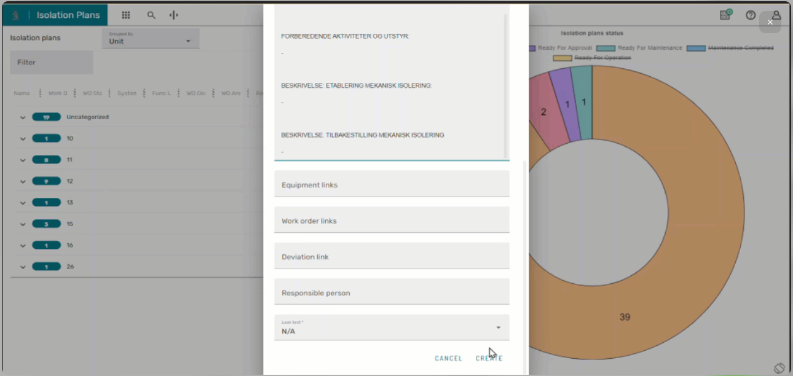
Users can then add contextualized P&IDs already present with Kognitwin, or upload documents from their device.

On the document, or even on the 3D model, user can add flange (split, blind, etc.) and valve (open, close) details to create the isolation plan.
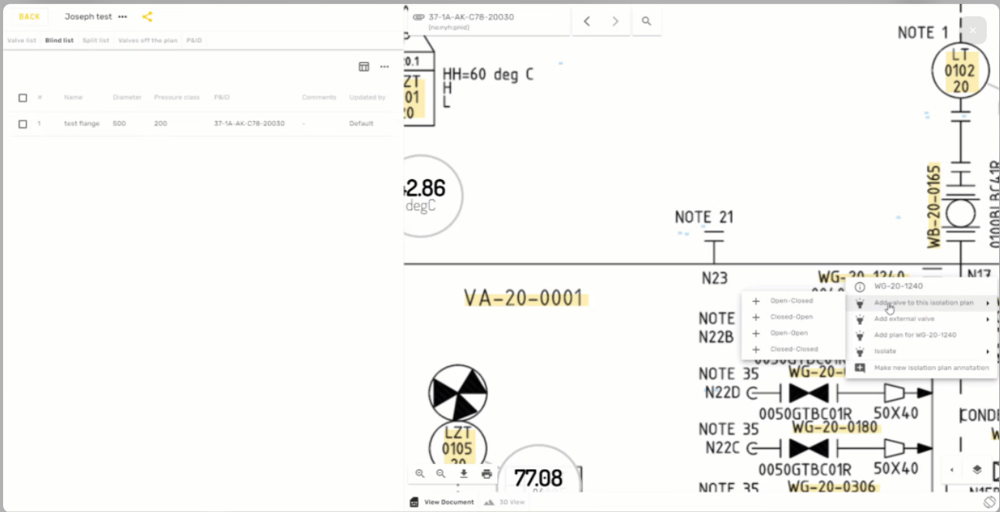
The P&ID will then show the marked flanges and valves, and other markups clearly, and can be printed. The workflow also allows printing labels and reports from the created isolation plans through the on-site label printer. The created isolation plans can be shared and re-used.

#### Business Value

- **Save time/reduce man hours**: By digitizing/automating the isolation plan, planning process we are able to reduce a considerable amount of man hours on all facilities. All the integrated data sources are available, so we can query and prefill all necessary information as long as the valve tag is verified. Most facilities are using the equivalent of several full time employees on creating isolation plans.
- **Improve the isolation planning process (3D/Flanges)**: If the facility have a good quality 3D model, we can utilize this for both: Easier familiarization with the equipment and surroundings. Find the valves and flanges with easiest access. Use e.g. flange tags from the 3D model to identify the correct flanges in the plan. Documents like P&IDs normally doesn't contain any tags for flanges.
- **Improving risk elements**: Conflict detection, example: Project activities vs. normal operations (Different organization and systems today). Same valve in more than one isolation plan. Any of the valves have issues: Notification, deviation, integrity issue, internal leak, known gas leak, etc. We can query this from other data sets, very hard to implement in the manual paper based approach they have today.
- **Pre made isolation plan**: Isolation plans can be created long before they are put to use, a lot can happen in the meantime. We can query all relevant data sources from the creation date to the start date: Have anything happened to any of these valves?
- **Integrated overviews, giving a better operational overview to help efficiency**.
- **Visualize all active isolation plans in relevant workflows (SIMOPS, CWV, CRW, etc.)**.
- **Look at all future work orders in the same area, are there any upcoming work that could be done at the same time?**
- **Sensor verification**: Moving from paper to digital/live documents, it's possible to use both physical and potentially virtual sensors in the verification and surveillance of safe isolation plans.

#### Quiz: Primary Aim of Isolation Planning Workflow

**What does the Isolation Planning workflow in Kognitwin primarily aim to achieve?**

- Remove duplicate documents
- Manage staffing schedules
- Automate and visualize the mechanical isolation planning process in 2D and 3D

**Answer:** Automate and visualize the mechanical isolation planning process in 2D and 3D

### Work Package Management

#### What is it?

A work package is an information bundle that provides the necessary information to execute work to the required standard in a safe and efficient manner and is required for most work orders of a certain degree of complexity or novelty. This typically includes the work order details and technical documents and specifications (P&IDs, isometric drawings, data sheets, manuals, and procedures).

Kognitwin's Work Package Management is an application that allows users to browse, find, edit, and duplicate existing work packages and create and curate new ones - quickly and reliably.

#### Who will use it?

- Work Preparers/Planners: Create and curate
- Work Executors/Technicians: Consume

#### How to use it?


Kognitwin's Work Package Management workflow is centered around FLOCs. Work libraries are created for one or more FLOCs and populated with relevant documents, work orders, and other artifacts. These libraries are then used to create work packages quickly and efficiently. When documents used in work packages are updated in the DMS, work package owners are automatically notified to review any changes to markups, annotations, etc. Created work packs can be shared with other users enabling seamless collaboration and version control.

Check out this quick course on Kognitwin – Work Package Management

#### Business Value

- Enable remote work preparation and planning
- Enable cross-discipline collaboration
- Increase efficiency with reuse and all necessary data and information readily available
- Improve safety with high-quality content that enables the technician to execute the work safely and right the first time

Today's practice is slightly different across companies and plants, but they have in common that documents and information are subtracted from various sources, and a somewhat "dead" product is created. This is a time-consuming and cumbersome process, with an end-product that is not easily searchable or reusable. Since all necessary data sources are readily available and contextualized in Kognitwin, "live" products can be created, edited, consumed, and reused within the same space.

### Fix My Data

#### What is it?

Fix My Data is a feature in Kognitwin that allows any user to place pins on data that is incorrect or incomplete or has any kinds of issues. There are existing business processes where data issues are managed, and these pins in Kognitwin can be input to such process.

Objects that can be pinned are:

- Tags
- FLOCs
- Documents
- 3D
- Laser scans
- Notifications
- Work orders
- Maintenance plans
- Task lists
- Real-time data
- And other data objects the asset might have contextualized in Kognitwin

By implementing the Fix My Data functionality and processes, the Digital Twin can provide a more accurate 3D representation of what is physically at the asset and ensure documents are accurate. High quality data is a key backbone to efficiently operating an asset.

#### Who will use it?

All Kognitwin users should use it, to identify data issues and provide information to help resolve the issues. Fix My Data is also an important tool for the Information Management teams, responsible for information quality and processes to resolve data issues.

#### How to use it?


User can right click the data object and open the "New Pin" form to create pin in Kognitwin main landing page and search. Pins created by a user will be set to "Draft" status as default. A pin in "Draft" status is only visible to the user that created the pin. User will have to "Submit" pin for it to be visible to Pin Administrator.

Pin Dashboard lists all created pins that are visible to the user, based on user role. In this dashboard user can search, sort and filter data based on the different columns. User with "Pin Admin" role can use the Pin Dashboard to edit, delete and manage pins.

Pins can also be exported from the dashboard to excel or pdf format. A screenshot of a computer.

#### Business Value

Fix My Data workflow is one of the ways Kognitwin helps customers identify and resolve gaps in their source data. By contextualizing and visualizing everything in an easy to navigate environment, it makes it easier for users to quickly pinpoint issues and improve data accuracy. This leads to better decision-making, increased operational efficiency, and enhanced asset reliability.

#### Quiz: Primary Benefit of Fix My Data Feature

**What is the primary benefit of the Fix My Data feature?**

- It lets users report and annotate data issues for resolution
- It allows users to change 3D models
- It creates work orders automatically

**Answer:** It lets users report and annotate data issues for resolution

### Query & Visualize
#### What is it?
Query and Visualize enables users to query data from multiple sources into table view with sorting, filtering and grouping functionality. The query results can then be viewed and visualized in different components. The views can be either bookmarked to your personal user, or shared with other roles. The user will also be able to download the queried results into either a PDF or an Excel file from the resulting table.

#### Who will use it?
All people at the site

#### How to use it?


This query builder allows the users to construct and customize powerful queries based on specific parameters and criteria, as needed for planning meetings in general.

The result table let the user group, filter, search and view the outcomes of their queries in a structured table format, providing a clear overview of the data.

Users can combine sources and conditions, and apply criteria on any of the derived properties from the selected datasets.

#### Business Value
- Gives all information quickly, reducing time spent gathering data
- Enhances operational insight and decision-making by enabling users to see the combined data in table, 3D and Gantt all in one place.

#### Quiz: What Query & Visualize Allows Users to Do

**What does the Query & Visualize tool allow users to do?**

- automate document classification
- Measure equipment pressure in realtime
- Query and view data from multiple soruces, export results

**Answer:** Query and view data from multiple soruces, export results

### Proactive Technical Monitoring
#### What is it?
Equipment's performance is monitored based on its related sensors' operational envelope. Bad-actors are highlighted for further investigation. A configuration tool where real time signals can be grouped together and the operational envelope can be defined. Proactive Monitoring empowers users with valuable insights into their equipment and processes. It allows users to group related sensors (e.g., pressure, temperature, level, flow, concentration) and establish upper and lower value boundaries, forming an operational envelope. The definition of this envelope considers various factors based on the engineering discipline. For instance, reliability engineers may set limits to maximize equipment uptime and lifespan, while process engineers prioritize safe operations and optimization.

#### Who will use it?
- Process engineers
- Reliability engineers
- Rotating equipment engineers
- Flow assurance engineers
- Chemical engineers
- Environmental engineers

#### How to use it?


Pre-requisites: Realtime data with PTM limits on all datasets created and maintained by the data owner.

Once the data is configured this way and ingested into Kognitwin Proactive Technical Monitoring workflow, users can monitor equipment performance and receive alerts for anomalies. As with most other workflows, here too users can group and filter data based on their preferences. These set of preferences can also be saved as a whole configuration, to be easily re-used later. Colour coding indicates which values are within limits, which outside, and where data is not being received as expected. Based on trend analysis, common bad actors are also identified.

#### Business Value
- By detecting bad-actors early and reviewing KPIs, timely preventive action can be taken and potential unscheduled deferment or unplanned downtime can be avoided.

Companies without a digital twin often rely on traditional tools and methods for monitoring and managing their assets. These tools may include standalone sensor systems, periodic manual inspections, and reactive maintenance practices. The absence of a digital twin can result in limited real-time insights, making it challenging to proactively address issues, optimize performance, and achieve operational efficiency. These companies may face difficulties in adapting to industry advancements that leverage advanced analytics, machine learning, and simulation technologies to enhance decision-making and asset management.

#### Quiz: What Proactive Technical Monitoring Helps Identify

**What does Proactive Technical Monitoring help identify?**

- Underperforming sensors or systems
- Expired documentation
- Asset video camera feed

**Answer:** Underperforming sensors or systems

### Technical Support Cockpit
#### What is it?
Technical Support Cockpit (TSC) is a feature for technical monitoring and anomaly detection of equipment. It is designed to handle anomaly alerts. An anomaly alert is generated when equipment is not operating as expected (e.g., the temperature of an electric motor is too high). These alerts need to be handled by one or several engineers, and the outcome can be one of the following:

- Raise a maintenance request: For example, if the electric motor needs to be replaced.
- Make an operational change: Adjust the operation so that the equipment performs as expected (e.g., reduce the speed of the electric motor to ensure it operates within its temperature limits).
- Reject the anomaly alert: For example, if the temperature limit for triggering the alert was incorrect.

Anomaly alerts can be generated from external systems and streamed to Kognitwin through an API, or they can be generated directly within Kognitwin, where users have configured their own monitoring rules.

#### Who will use it?
- Operations

#### How to use it?


Technical support cockpit has several levels allowing users to dig deeper as per their requirements.

- Level 1: Provides an overview of active alerts, the number of equipment being monitored, and the total number of equipment included in the cockpit. Also displays "bad actors" — equipment with the most alerts over the past week.
- Level 2: Shows details about alerts and equipment.
- Level 3: Provides details about a specific piece of equipment.
- Level 4: Displays details about a specific alert.

Users can configure one high limit and one low limit for an equipment metric. If the time series data exceeds these limits, an alert (event) is generated.

Users can configure a custom monitoring rule through the user interface. In other words, the user can create calculations where the output is used as a metric to monitor the equipment. For example, a user can create a metric that represents the temperature efficiency of an electric motor by dividing the temperature by the motor's speed. This derived metric can provide a better indication of motor performance compared to temperature alone. High or low limits can also be applied to the custom monitoring rule.

#### Business Value
- Central hub for monitoring, alerts & insights.
- Contextualized Data – Live sensor data + historical trends + simulations.
- Integrated Alerts – Links anomalies to maintenance actions.
- Prevent Downtime – Detect inefficiencies early, avoid failures.
- Optimize Performance – Ensure assets run at peak efficiency.
- Enable Predictive Maintenance – Cut costs with smarter strategies.

#### Quiz: Core Function of Technical Support Cockpit

**What is the core function of the Technical Support Cockpit (TSC)?**

- Approving site access requests
- Designing equipment schematics
- Handling anomaly alerts for equipment and linking them to action like maintenance

**Answer:** Handling anomaly alerts for equipment and linking them to action like maintenance

#### Quiz: What Technical Support Cockpit Integrates with to Generate Actionable Alerts

**What does the 'Technical Support Cockpit' integrate with to generate actionable alerts?**

- Weather feeds
- Historical trends, live sensor data and simulations
- Password managers

**Answer:** Historical trends, live sensor data and simulations

### Operations Cockpit
#### What is it?
The Situational Awareness Cockpit is a powerful feature in Kognitwin that can be customized to support business processes and serve as the central work surface for all roles and teams related to this work process. Unlike a simple dashboard of KPIs, the cockpit provides a tailored overview of the most relevant data for the current situation in the asset, specific to each user role. This means that everyone, from the asset manager to the field operator, will be presented with the most relevant data for their job and responsibilities. From this situational awareness view, different users can investigate all data presented by drilling down to the very details and any supporting data as relevant.

This workflow is still under development, and not rolled out fully to customers.

#### Who will use it?
- Operations

#### How to use it?
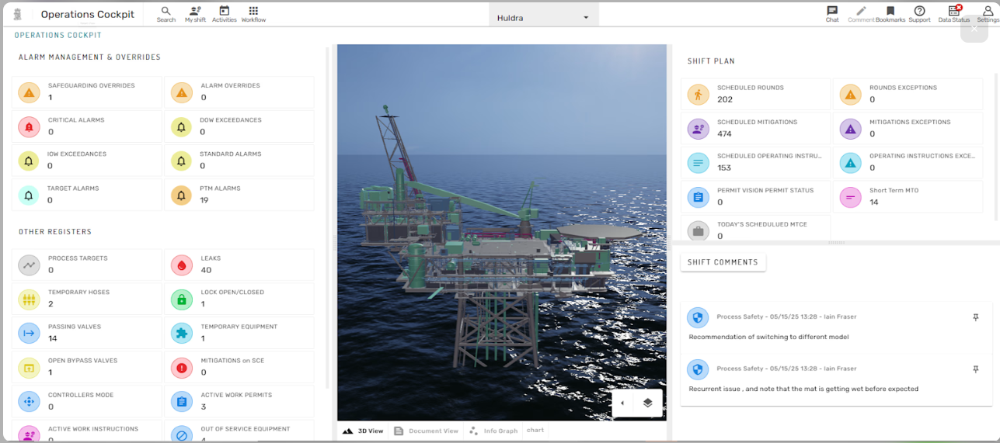

Key features of the cockpit in this first version include:

- Dynamic tiles: Tiles that update dynamically, providing a structured view of live information from many sources.
- Drill-down functionality: The ability to drill down from the top-level tiles into multiple levels of data, offering more and more granularity.
- Role-based access: Persons assigned to roles that are configured with authorities and tasks, as well as crew and shift scheduler.
- Flexible register module: A very flexible register module that can be configured to manage a variety of data sets, such as leaks, temporary equipment, alarms, impairments, and bypass valves.
- Tasks, workflows and comments: Ability to create, schedule, assign and execute tasks in workflows with different roles, as well as the integrated commenting feature supports and log all activities during shift and into shift handover and producing the formal shift handover report.

#### Business Value
The real value of the cockpit and its components is that decisions can be made quickly, consistently, and with all relevant data at hand. This means that your team can be more productive and efficient, while also ensuring that you have the information you need to make informed decisions.

- Contextualized data: The system contextualizes data to information, allowing people to use their time to take decisions and plan, initiate, execute, monitor, and close out work tasks.
- Consistent and efficient decision-making: Decisions are taken quicker and more consistently since data and information are presented in a consistent manner.
- Capturing learnings: Learnings are captured by allowing all users to enter comments that are linked to the data and indexed for easy re-use in the future.
- Unified information: Everyone takes decisions based on the same information, and everyone can see and understand the asset performance across siloed systems, teams, and processes.

### Kognitwin Grid
#### What is it?
A digital twin for grid companies. Retrieved data from siloed applications within functional domains into a modern architecture, providing superior insights through data contextualization, simulation and analytics with advanced visualization.

Kognitwin Grid is structured in 4 modules, enabling data and documentation retrieval and decision-support across operations, maintenance and development planning.

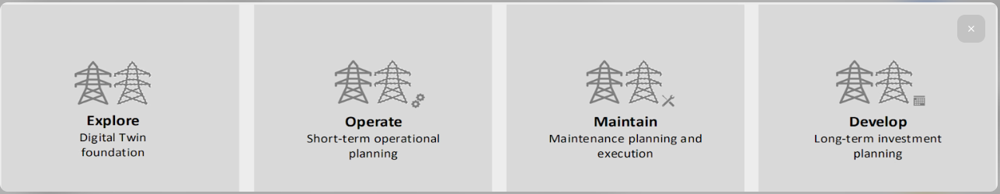

#### Explore
- Centralized and contextualized data and document visualization
- Grid model import, 3D engine, 3D scans
- Search and access to operational and asset-based data
- Advanced querying with asset co-pilot
- Data exchange
- Role-based access

#### Operate
- Forecast losses, congestion & voltage deviations in the short-term through simulation with ML algorithms
- Integration sensor data such a DLR (Dynamic Line Rating)
- What-if scenario simulator for decision support, assessing the impact of using flexible assets, non-firm agreements, flexibility markets, batteries and network reconfiguration
- Forecast & minimize losses through grid reconfiguration recommendation

#### Maintain
- Identify maintenance needs and impact on operations
- Plan, schedule & create work orders
- Integration with sensor to visualize maintenance needs (condition-based monitoring) in one place and impact on operations
- Integration with fault detection, vegetation management

#### Develop
- New grid connections and capacity increase requests analysis
- Remote grid switch location optimization
- Long-term investment planning decision support

#### Who will use it?
Depending on the module, there will be different personas

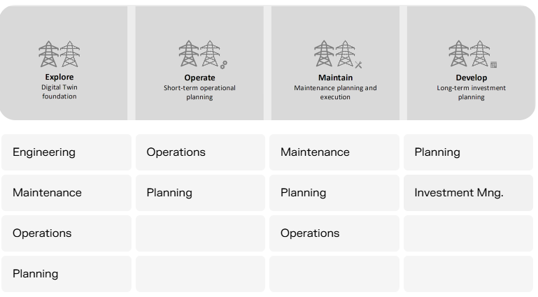

#### How to use it?
Check out this quick course on Kognitwin Grid - Introduction & Capabilities

#### Business Value
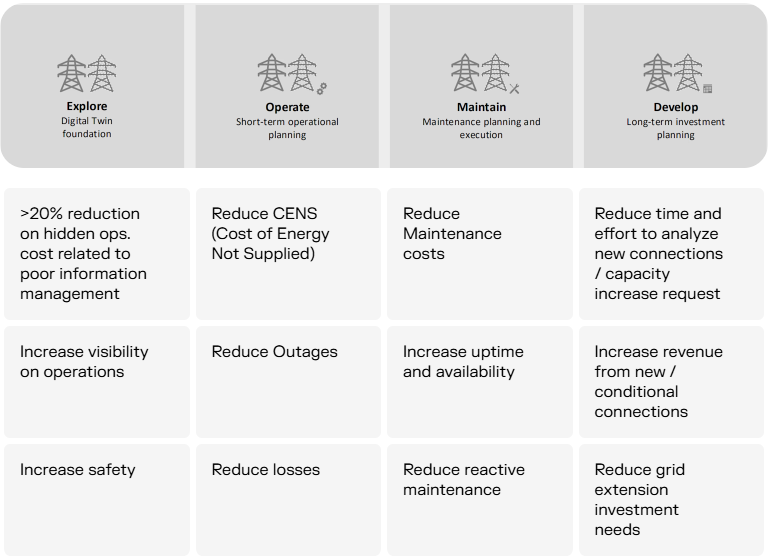

### More workflows

Besides the more commonly and generally used workflows already covered, Kognitwin also has other tools in the catalogue that have been developed for more niche use cases, and deployed in a more selective manner. While we encourage our customers to start with the Collaborate package first that includes the more commonly utilized workflows, some of the workflows mentioned below - or even a few others not covered in this course - may be of interest to them.

#### Always-on dashboard
The Always-on dashboard interfaces with K-Spice, Kongsberg's dynamic process simulation solution, to leverage its powerful capabilities right from an internet browser. Cloud-based simulations offer enhanced plant insights through clear, intuitive graphics that combine field data and simulated data for a comprehensive view.

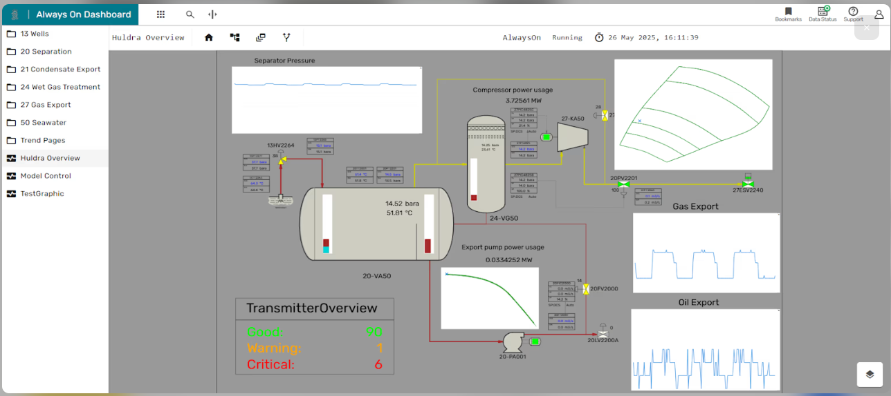

#### Energy Nomination
The goal of the nomination application is to simplify the work of forecasting and buying electricity for the asset use. This was a niche use case for a specific asset, to optimize the price paid for electricity from the state grid by predicting more accurately. There are two parts to the solution:

- A nomination workflow providing an overview of the nominations and the ability to manually over-ride them in an efficient matter.
- An auto-nomination bot that creates a basic nomination based on the last electricity consumption.

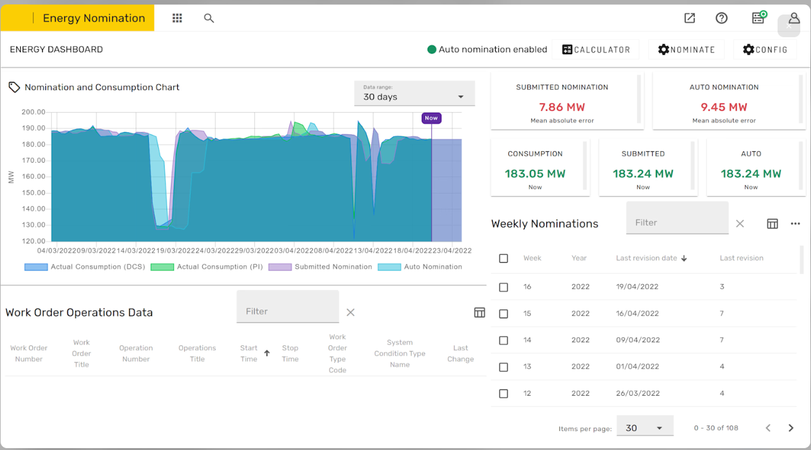

#### Cable Management
The Cable Management feature enables localization, visualization and filtration of cables and cable-related data at a site. Visualization is in 3D and multiple cable datasets can be looked at in combination. The data can be filtered by cable type. Cable Management also enables the user to inspect cables for detailed information.

Visualizing the location of cable routing on site, it also gives the user quick access to each individual cable’s details, such as what each of their endpoints are connected to.


 


