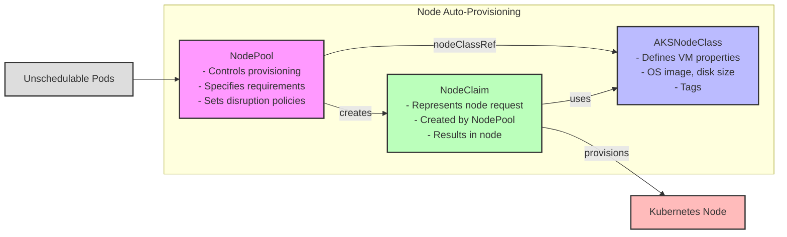
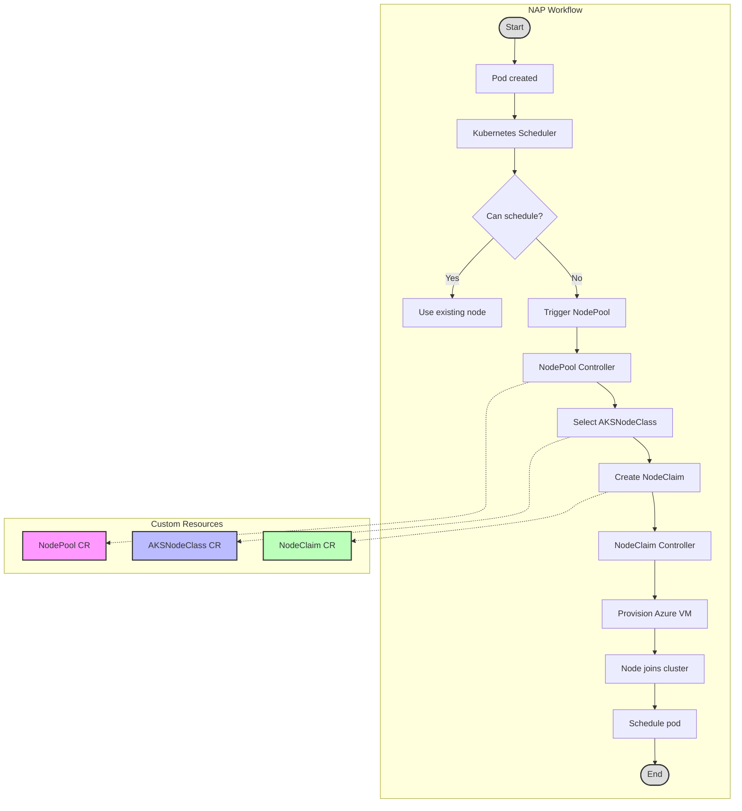
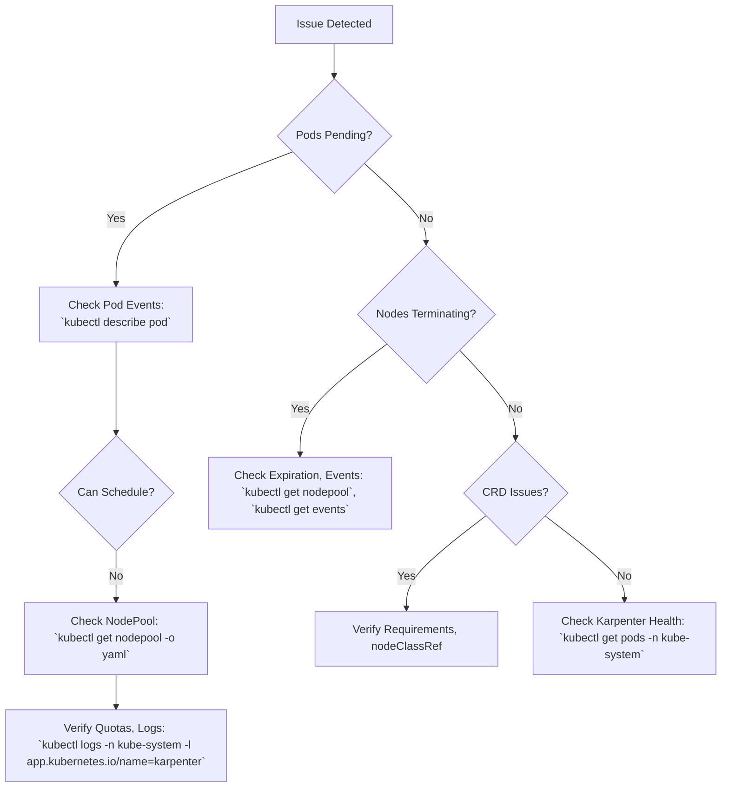

# Node Auto-Provisioning (NAP) in AKS

## Table of Contents

- [Node Auto-Provisioning (NAP) in AKS](#node-auto-provisioning-nap-in-aks)
  - [Table of Contents](#table-of-contents)
  - [Introduction](#introduction)
    - [What is Bin-Packing?](#what-is-bin-packing)
    - [Key Benefits](#key-benefits)
    - [Glossary](#glossary)
  - [Prerequisites](#prerequisites)
    - [Required Azure Resources and Tools](#required-azure-resources-and-tools)
    - [Installing the Latest AKS Preview CLI Extension](#installing-the-latest-aks-preview-cli-extension)
    - [Registering the NodeAutoProvisioningPreview Feature Flag](#registering-the-nodeautoprovisioningpreview-feature-flag)
    - [Verifying Registration Status](#verifying-registration-status)
    - [Network Requirements](#network-requirements)
  - [Quick Start](#quick-start)
    - [Creating an AKS Cluster with NAP](#creating-an-aks-cluster-with-nap)
    - [Connecting to the Cluster](#connecting-to-the-cluster)
    - [Installing Node Viewer for Monitoring](#installing-node-viewer-for-monitoring)
  - [Core Components](#core-components)
    - [CRDs in NAP](#crds-in-nap)
    - [Custom Resource Relationships](#custom-resource-relationships)
    - [NAP Workflow](#nap-workflow)
  - [Setup and Configuration](#setup-and-configuration)
    - [Node Provisioning Modes](#node-provisioning-modes)
    - [Checking if Cluster Autoscaler is Enabled](#checking-if-cluster-autoscaler-is-enabled)
      - [Method 1: Using Azure CLI](#method-1-using-azure-cli)
      - [Method 2: Using kubectl](#method-2-using-kubectl)
      - [Method 3: Check Azure Portal](#method-3-check-azure-portal)
    - [Migrating from Cluster Autoscaler to NAP](#migrating-from-cluster-autoscaler-to-nap)
    - [Creating Custom Resources](#creating-custom-resources)
      - [Custom AKSNodeClass Example](#custom-aksnodeclass-example)
      - [Custom NodePool Example](#custom-nodepool-example)
  - [Managing NAP](#managing-nap)
    - [Testing NAP](#testing-nap)
    - [Monitoring NAP](#monitoring-nap)
    - [Default vs. Custom NAP Configuration](#default-vs-custom-nap-configuration)
      - [When to Create Custom CRDs](#when-to-create-custom-crds)
      - [Overriding Default CRDs](#overriding-default-crds)
      - [Using Multiple AKSNodeClass and NodePool Resources](#using-multiple-aksnodeclass-and-nodepool-resources)
        - [Directing Workloads to Specific NodePools](#directing-workloads-to-specific-nodepools)
        - [Checking NodePool and AKSNodeClass Status](#checking-nodepool-and-aksnodeclass-status)
    - [Upgrading with NAP](#upgrading-with-nap)
      - [Cluster Upgrades](#cluster-upgrades)
      - [Node Image Upgrades](#node-image-upgrades)
- [Advanced Features](#advanced-features)
  - [Advanced Consolidation Strategies](#advanced-consolidation-strategies)
    - [How Consolidation Works](#how-consolidation-works)
    - [Single-Node Consolidation](#single-node-consolidation)
      - [Mechanics](#mechanics)
      - [Use Cases](#use-cases)
      - [Example Scenario](#example-scenario)
      - [Configuration Example](#configuration-example)
      - [Best Practices](#best-practices)
    - [Multi-Node Consolidation](#multi-node-consolidation)
      - [Mechanics](#mechanics-1)
      - [Use Cases](#use-cases-1)
      - [Example Scenario](#example-scenario-1)
      - [Configuration Example](#configuration-example-1)
      - [Best Practices](#best-practices-1)
    - [Consolidation Policies](#consolidation-policies)
    - [Disruption Budgets](#disruption-budgets)
    - [Best Practices for Consolidation](#best-practices-for-consolidation)
    - [Practical Example](#practical-example)
    - [Limitations and Considerations](#limitations-and-considerations)
      - [Disruption Budgets](#disruption-budgets-1)
  - [Scheduling Constraints and Disruption Controls](#scheduling-constraints-and-disruption-controls)
    - [Node Expiration](#node-expiration)
      - [Mechanics](#mechanics-2)
      - [Example Configuration](#example-configuration)
      - [Practical Scenario](#practical-scenario)
      - [Best Practices](#best-practices-2)
    - [Multiple Budget Policies](#multiple-budget-policies)
      - [Mechanics](#mechanics-3)
      - [Example Configuration](#example-configuration-1)
      - [Practical Scenario](#practical-scenario-1)
      - [Best Practices](#best-practices-3)
    - [Protecting Nodes from Disruption](#protecting-nodes-from-disruption)
      - [Mechanics](#mechanics-4)
      - [Example Commands](#example-commands)
      - [Practical Scenario](#practical-scenario-2)
      - [Best Practices](#best-practices-4)
    - [Respecting Pod Disruption Budgets](#respecting-pod-disruption-budgets)
      - [Mechanics](#mechanics-5)
      - [Example Configuration](#example-configuration-2)
      - [Practical Scenario](#practical-scenario-3)
      - [Best Practices](#best-practices-5)
    - [Best Practices for Scheduling Constraints and Disruption Controls](#best-practices-for-scheduling-constraints-and-disruption-controls)
    - [Practical Example](#practical-example-1)
    - [Limitations and Considerations](#limitations-and-considerations-1)
  - [Drift Detection and Handling](#drift-detection-and-handling)
    - [What is Drift?](#what-is-drift)
    - [How NAP Identifies Drift](#how-nap-identifies-drift)
    - [Testing and Observing Drift](#testing-and-observing-drift)
      - [Alternative Test: NodePool Drift](#alternative-test-nodepool-drift)
    - [Monitoring Drift Events](#monitoring-drift-events)
    - [Best Practices for Drift Management](#best-practices-for-drift-management)
    - [Practical Example](#practical-example-2)
    - [Limitations and Considerations](#limitations-and-considerations-2)
    - [Zone-Aware Scheduling](#zone-aware-scheduling)
      - [Using Zone Labels and Requirements](#using-zone-labels-and-requirements)
      - [Spreading Workloads Across Zones](#spreading-workloads-across-zones)
  - [Best Practices](#best-practices-6)
    - [General Best Practices](#general-best-practices)
    - [Bin-Packing Optimization](#bin-packing-optimization)
    - [Consolidation Best Practices](#consolidation-best-practices)
    - [Upgrade Best Practices](#upgrade-best-practices)
    - [Zone Configuration Best Practices](#zone-configuration-best-practices)
  - [Troubleshooting NAP](#troubleshooting-nap)
    - [Node and Pod Provisioning Issues](#node-and-pod-provisioning-issues)
    - [Node Termination Issues](#node-termination-issues)
    - [Configuration Issues](#configuration-issues)
    - [Checking Karpenter Health](#checking-karpenter-health)
    - [Troubleshooting Flowchart](#troubleshooting-flowchart)
    - [Getting Help](#getting-help)
  - [Conclusion](#conclusion)
  - [Command Reference](#command-reference)
  - [Self-hosted Karpenter in AKS](#self-hosted-karpenter-in-aks)
    - [Key Differences from Managed NAP](#key-differences-from-managed-nap)
    - [When to Choose Self-hosted](#when-to-choose-self-hosted)
    - [Self-hosted Installation Overview](#self-hosted-installation-overview)
    - [Installing Self-hosted Karpenter Without Managed NAP](#installing-self-hosted-karpenter-without-managed-nap)
      - [Why This Works](#why-this-works)
      - [Requirements](#requirements)
      - [Installation Steps](#installation-steps)
      - [Best Practices](#best-practices-7)
      - [Troubleshooting Self-hosted Karpenter](#troubleshooting-self-hosted-karpenter)
      - [Additional Notes](#additional-notes)

## Introduction

Node Auto-Provisioning (NAP) in Azure Kubernetes Service (AKS) is a managed feature powered by Karpenter that automatically provisions and scales nodes based on workload demands. Unlike the traditional Cluster Autoscaler, NAP provides faster node provisioning, better resource utilization through intelligent bin-packing, and simplified scaling operations. This guide covers setup, configuration, advanced features, and best practices for using NAP in AKS.

### What is Bin-Packing?

Bin-packing refers to the efficient allocation of containers (pods) onto nodes to maximize resource utilization. Effective bin-packing:
- Optimizes pod placement to reduce wasted CPU and memory.
- Minimizes the number of nodes needed by matching pod requirements to node capacity.
- Supports diverse workloads by provisioning appropriately sized nodes.

### Key Benefits

- **Faster Provisioning**: Nodes are created in seconds, compared to minutes with Cluster Autoscaler.
- **Efficient Resource Use**: Intelligent bin-packing reduces waste and optimizes costs.
- **Simplified Scaling**: Declarative configurations streamline cluster management.
- **Flexible Workload Support**: Provisions diverse node types based on workload needs.

### Glossary

- **Bin-Packing**: The process of efficiently allocating pods to nodes to maximize resource utilization.
- **AKSNodeClass**: A Custom Resource Definition (CRD) defining VM properties like OS image and disk size.
- **NodePool**: A CRD controlling node provisioning rules and referencing an AKSNodeClass.
- **NodeClaim**: A CRD representing a request for a new node with specific properties.
- **Karpenter**: An open-source node provisioning tool powering NAP in AKS.
- **Drift**: A mismatch between a node’s current state and its desired state defined in CRDs.

## Prerequisites

Before using NAP in AKS, ensure the following requirements are met. See [Creating an AKS Cluster with NAP](#creating-an-aks-cluster-with-nap) for setup steps.

### Required Azure Resources and Tools

- Active Azure subscription with contributor access.
- Azure CLI (version 2.50.0 or later recommended).
- `kubectl` configured to connect to your AKS cluster.
- Sufficient VM size quotas in your subscription.

### Installing the Latest AKS Preview CLI Extension

NAP requires the `aks-preview` CLI extension (version 0.5.170 or later):

```powershell
# Check if aks-preview extension is installed
$extension = az extension list --query "[?name=='aks-preview'].version" -o tsv

# Remove old version if found
if ($extension) {
    Write-Host "Removing existing aks-preview extension version: $extension"
    az extension remove --name aks-preview
}

# Install the latest aks-preview extension
az extension add --name aks-preview

# Verify the installed version
az extension show --name aks-preview --query version -o tsv
```

> **Note**: Check the [official Azure documentation](https://learn.microsoft.com/en-us/azure/aks/node-auto-provisioning) for the latest version requirements.

### Registering the NodeAutoProvisioningPreview Feature Flag

NAP is in preview and requires registering a feature flag:

```powershell
# Register the NAP feature flag
az feature register --namespace "Microsoft.ContainerService" --name "NodeAutoProvisioningPreview"

# Check registration status
az feature show --namespace "Microsoft.ContainerService" --name "NodeAutoProvisioningPreview"
```

Registration takes 5-10 minutes. Wait until the status shows `"state": "Registered"`.

### Verifying Registration Status

Confirm the feature flag is registered:

```powershell
# Verify the feature is registered
$status = az feature show --namespace "Microsoft.ContainerService" --name "NodeAutoProvisioningPreview" --query "properties.state" -o tsv
if ($status -eq "Registered") {
    Write-Host "NodeAutoProvisioningPreview feature is successfully registered."
} else {
    Write-Host "NodeAutoProvisioningPreview feature is not yet registered. Status: $status"
}
```

Refresh the provider registration after the feature is registered:

```powershell
az provider register --namespace Microsoft.ContainerService
```

### Network Requirements

NAP requires:
- Azure CNI with overlay networking mode.
- Cilium data plane.

Specify these during cluster creation:

```powershell
--network-plugin azure
--network-plugin-mode overlay
--network-dataplane cilium
```

## Quick Start

This section provides the minimal steps to set up an AKS cluster with NAP and start monitoring it. For advanced setup, see [Setup and Configuration](#setup-and-configuration).

### Creating an AKS Cluster with NAP

Create a resource group and AKS cluster with NAP enabled:

```powershell
# Create resource group
az group create -l eastus -n nap-rg

# Create AKS cluster with NAP
az aks create `
    -n nap `                         # Specifies the name of the AKS cluster as 'nap'
    -g nap-rg `                      # Defines the resource group 'nap-rg' where the cluster will be created
    -c 2 `                           # Sets the initial node count to 2 for the default node pool
    --node-provisioning-mode Auto `  # Enables NAP by setting the provisioning mode to 'Auto', using Karpenter for dynamic node scaling
    --network-plugin azure `         # Configures Azure CNI as the network plugin for Kubernetes networking
    --network-plugin-mode overlay `  # Uses overlay networking mode for Azure CNI, required for NAP to simplify IP management
    --network-dataplane cilium       # Specifies Cilium as the network dataplane, required for NAP to provide advanced networking features
```

### Connecting to the Cluster

Get credentials and verify connectivity:

```powershell
az aks get-credentials -g nap-rg -n nap --overwrite-existing
kubectl get nodes
```

### Installing Node Viewer for Monitoring

Node Viewer visualizes node resources. Install it based on your platform:

**For Windows**:

```powershell
$installDir = "$env:USERPROFILE\bin"
$downloadUrl = "https://github.com/Azure/aks-node-viewer/releases/latest/download/aks-node-viewer_Windows_x86_64.zip"
$tempZip = "$env:TEMP\aks-node-viewer.zip"

if (!(Test-Path $installDir)) {
    New-Item -ItemType Directory -Path $installDir -Force
}

Invoke-WebRequest -Uri $downloadUrl -OutFile $tempZip
Expand-Archive -Path $tempZip -DestinationPath $installDir -Force

if ($env:PATH -notlike "*$installDir*") {
    [Environment]::SetEnvironmentVariable("PATH", "$env:PATH;$installDir", "User")
    $env:PATH = "$env:PATH;$installDir"
}

aks-node-viewer -v
```

Run Node Viewer:

```powershell
aks-node-viewer -resources cpu,memory -disable-pricing
```

## Core Components

NAP uses Custom Resource Definitions (CRDs) to manage node provisioning. This section explains the CRDs, their relationships, and the NAP workflow.

### CRDs in NAP

1. **AKSNodeClass**:
   - **What it does**: Defines the properties and characteristics of Azure virtual machines (VMs) that NAP provisions as Kubernetes nodes. It acts as a template specifying details such as the operating system image (e.g., AzureLinux, Mariner), OS disk size, Azure resource tags, and other VM configurations like spot instance usage. This CRD ensures that nodes meet specific requirements for workloads, such as compliance needs or hardware specifications (e.g., GPU support).
   - **Role in NAP**: AKSNodeClass is referenced by a NodePool via the `nodeClassRef` field, providing the VM configuration details needed when NAP creates a new node. It allows administrators to standardize node configurations across the cluster.
   - **Example use case**: You might create an AKSNodeClass for memory-optimized VMs (e.g., E-series) with a specific OS image for a database workload, ensuring all nodes provisioned for that workload have consistent properties.
   - **Interaction**: The AKSNodeClass is used by the NodeClaim to define the VM’s properties when provisioning a new node.

2. **NodePool**:
   - **What it does**: Configures the rules and constraints for node provisioning, acting as the central controller that monitors unschedulable pods and decides when and how to create new nodes. It specifies requirements (e.g., CPU architecture, OS, VM family), disruption policies (e.g., consolidation behavior), and references an AKSNodeClass to define the VM properties.
   - **Role in NAP**: The NodePool controller watches for pods that cannot be scheduled due to insufficient resources, then creates a NodeClaim to request a new node that meets the pod’s requirements. It enables fine-grained control over scaling behavior, such as prioritizing certain VM types or setting consolidation policies to optimize resource use.
   - **Example use case**: A NodePool might be configured to provision only compute-optimized VMs (e.g., F-series) for CPU-intensive workloads, with a policy to consolidate nodes when underutilized to reduce costs.
   - **Interaction**: NodePool references an AKSNodeClass and creates NodeClaims, orchestrating the entire provisioning process.

3. **NodeClaim**:
   - **What it does**: Represents a request for a specific node in the cluster, automatically generated by the NodePool controller when it detects unschedulable pods. It combines the NodePool’s requirements and the referenced AKSNodeClass’s VM properties to define the exact specifications for a new node (e.g., CPU, memory, OS).
   - **Role in NAP**: NodeClaim is the mechanism that triggers the actual provisioning of a new Azure VM, which then joins the Kubernetes cluster as a node. Once provisioned, the node is used to schedule the previously unschedulable pods.
   - **Example use case**: If a pod requires 8GB of memory and cannot be scheduled, the NodePool creates a NodeClaim requesting a node with at least 8GB of memory, referencing an AKSNodeClass for the VM’s OS and disk configuration.
   - **Interaction**: NodeClaim is created by the NodePool, uses the AKSNodeClass for VM specs, and results in a Kubernetes node.

List CRDs and resources:

```powershell
kubectl get crd | grep -i karpenter
kubectl get nodepools
kubectl get aksnodeclass
kubectl get nodeclaim
```

### Custom Resource Relationships

This diagram shows how NAP components interact:



**Flow Description**:
This flowchart illustrates the relationships and interactions between NAP’s core components in the node provisioning process:
- **Unschedulable Pods**: The process begins when pods cannot be scheduled due to insufficient resources, triggering the NodePool controller.
- **NodePool**: The NodePool monitors these pods, evaluates their requirements (e.g., CPU, memory, OS), and references an AKSNodeClass to determine the VM configuration. It then creates a NodeClaim to request a new node.
- **AKSNodeClass**: Provides the VM specifications (e.g., OS image, disk size, tags) that the NodeClaim uses to define the new node’s properties.
- **NodeClaim**: Acts as a formal request for a node, combining NodePool’s requirements and AKSNodeClass’s VM specs. It triggers the provisioning of an Azure VM.
- **Kubernetes Node**: The NodeClaim results in a new Azure VM that joins the cluster as a Kubernetes node, enabling the previously unschedulable pods to be scheduled.
This flow highlights the declarative nature of NAP, where NodePool orchestrates provisioning by leveraging AKSNodeClass and NodeClaim to dynamically create nodes tailored to workload needs.

### NAP Workflow

This diagram illustrates how NAP provisions nodes:



**Flow Description**:
This flowchart outlines the step-by-step process of how NAP provisions a new node in response to workload demands:
- **Start → Pod Created**: The workflow begins when a new pod is created in the Kubernetes cluster.
- **Kubernetes Scheduler**: The Kubernetes Scheduler attempts to place the pod on an existing node.
- **Can Schedule?**: The scheduler checks if there’s a suitable node with sufficient resources.
  - **Yes → Use Existing Node**: If a node is available, the pod is scheduled, and the process ends.
  - **No → Trigger NodePool**: If no node can accommodate the pod, the NodePool controller is triggered.
- **NodePool Controller**: The NodePool evaluates the pod’s requirements (e.g., CPU, memory, OS) based on its configuration.
- **Select AKSNodeClass**: The NodePool selects an AKSNodeClass that defines the VM properties (e.g., OS image, disk size) for the new node.
- **Create NodeClaim**: The NodePool creates a NodeClaim, specifying the node’s requirements and referencing the AKSNodeClass.
- **NodeClaim Controller**: The NodeClaim controller processes the NodeClaim, initiating the provisioning process.
- **Provision Azure VM**: An Azure VM is created based on the NodeClaim’s specifications.
- **Node Joins Cluster**: The VM joins the Kubernetes cluster as a node.
- **Schedule Pod**: The original pod is scheduled on the new node, completing the process.
- **End**: The workflow concludes with the pod running on the provisioned node.
The diagram also shows the Custom Resources (NodePool CR, AKSNodeClass CR, NodeClaim CR) that the controllers interact with, emphasizing their roles in the provisioning process. This flow demonstrates NAP’s efficiency in dynamically scaling the cluster to meet workload demands.

## Setup and Configuration

This section covers node provisioning modes, migrating from Cluster Autoscaler, and creating custom resources. See [Quick Start](#quick-start) for initial setup.

### Node Provisioning Modes

AKS supports three node provisioning approaches:

| Mode | Description | Scaling Engine | Features | Management |
|------|-------------|----------------|----------|------------|
| **Auto (NAP)** | Dynamic provisioning with Karpenter | Karpenter | Fast scaling, better bin-packing, diverse node types | Managed by Azure |
| **Manual** | Traditional autoscaling with node pools | Cluster Autoscaler | Slower scaling, limited node types | Managed by Azure |
| **Self-hosted Karpenter** | Custom Karpenter installation | Karpenter | Full customization, more operational overhead | Customer-managed |

**Commands**:

```powershell
# Create cluster with NAP (Auto mode)
az aks create -n nap-cluster -g my-resource-group -c 2 --node-provisioning-mode Auto

# Create cluster with Cluster Autoscaler (Manual mode)
az aks create -n ca-cluster -g my-resource-group -c 2 --node-provisioning-mode Manual

# Check provisioning mode
az aks show -n $CLUSTER_NAME -g $RESOURCE_GROUP --query "nodeProvisioningMode" -o tsv
```

For self-hosted Karpenter, see [Self-hosted Karpenter in AKS](#self-hosted-karpenter-in-aks).

### Checking if Cluster Autoscaler is Enabled

Before enabling NAP, ensure Cluster Autoscaler is disabled, as they cannot coexist.

#### Method 1: Using Azure CLI

```powershell
$CLUSTER_NAME="your-cluster-name"
$RESOURCE_GROUP="your-resource-group"

az aks show -n $CLUSTER_NAME -g $RESOURCE_GROUP --query "agentPoolProfiles[].{Name:name, AutoScaling:enableAutoScaling}" -o table
```

If `AutoScaling` is `True`, Cluster Autoscaler is enabled.

#### Method 2: Using kubectl

```powershell
kubectl get pods -n kube-system | grep cluster-autoscaler
kubectl logs -n kube-system -l app=cluster-autoscaler
```

#### Method 3: Check Azure Portal

1. Navigate to your AKS cluster.
2. Go to "Node pools" and check if "Autoscale" is enabled.

### Migrating from Cluster Autoscaler to NAP

To switch to NAP:

1. Disable Cluster Autoscaler on all node pools.
2. Update the cluster to Auto mode.

```powershell
$NODEPOOLS=$(az aks nodepool list -g $RESOURCE_GROUP --cluster-name $CLUSTER_NAME --query "[].name" -o tsv)

foreach ($NODEPOOL in $NODEPOOLS) {
    az aks nodepool update -g $RESOURCE_GROUP --cluster-name $CLUSTER_NAME --name $NODEPOOL --disable-cluster-autoscaler
}

az aks update -g $RESOURCE_GROUP -n $CLUSTER_NAME --node-provisioning-mode Auto
```

> **Note**: This is disruptive. Plan carefully for production clusters.

### Creating Custom Resources

Custom AKSNodeClass and NodePool resources allow tailored node provisioning. See [Core Components](#core-components) for CRD details.

#### Custom AKSNodeClass Example

```yaml
apiVersion: karpenter.azure.com/v1alpha2
kind: AKSNodeClass
metadata:
  name: nap-aksnodeclass
spec:
  imageFamily: AzureLinux
  osDiskSizeGB: 128
  tags:
    env: prod
```

#### Custom NodePool Example

```yaml
Custom NodePool Example
```

## Managing NAP

This section covers testing, monitoring, and managing NAP configurations and upgrades.

### Testing NAP

Deploy a workload to test node provisioning:

```powershell
kubectl apply -f - <<EOF
apiVersion: apps/v1
kind: Deployment
metadata:
  name: test-deploy
spec:
  replicas: 10
  selector:
    matchLabels:
      app: test
  template:
    metadata:
      labels:
        app: test
    spec:
      containers:
      - name: test
        image: nginx
        resources:
          requests:
            memory: "1Gi"
EOF

kubectl get pod -o wide
kubectl get node
kubectl scale deploy test-deploy --replicas 20
kubectl get events -A --field-selector source=karpenter -w
```

### Monitoring NAP

Monitor NAP using:

1. **Node Viewer**: `aks-node-viewer -resources cpu,memory -disable-pricing`
2. **Karpenter Events**: `kubectl get events -A --field-selector source=karpenter -w`
3. **Node Status**: `kubectl get node`

### Default vs. Custom NAP Configuration

NAP creates default NodePool and AKSNodeClass resources with sensible settings. Custom CRDs offer more control.

#### When to Create Custom CRDs

Use custom CRDs for:
- Specialized VM sizes or hardware (e.g., GPUs).
- Cost optimization (e.g., spot instances).
- Compliance needs (e.g., specific OS images).
- Multi-tenant scenarios or advanced scaling policies.

#### Overriding Default CRDs

View and override default CRDs:

```powershell
kubectl get nodepool default -o yaml
kubectl get aksnodeclass default -o yaml
kubectl apply -f custom-nodepool.yaml
kubectl apply -f custom-aksnodeclass.yaml
```

Custom CRDs coexist with defaults. Use weights to prioritize NodePools:

```yaml
apiVersion: karpenter.sh/v1beta1
kind: NodePool
metadata:
  name: high-priority-pool
spec:
  weight: 100
```

#### Using Multiple AKSNodeClass and NodePool Resources

Define multiple CRDs for diverse workloads:

```yaml
apiVersion: karpenter.azure.com/v1alpha2
kind: AKSNodeClass
metadata:
  name: compute-optimized
spec:
  imageFamily: AzureLinux
  osDiskSizeGB: 128
  tags:
    workload-type: compute
---
apiVersion: karpenter.sh/v1beta1
kind: NodePool
metadata:
  name: compute-pool
spec:
  template:
    spec:
      nodeClassRef:
        name: compute-optimized
      requirements:
      - key: karpenter.azure.com/sku-family
        operator: In
        values: ["F"]
      - key: kubernetes.io/os
        operator: In
        values: ["linux"]
      - key: karpenter.sh/capacity-type
        operator: In
        values: ["on-demand"]
  disruption:
    consolidationPolicy: WhenUnderutilized
```

##### Directing Workloads to Specific NodePools

Use annotations or node affinity:

```yaml
apiVersion: apps/v1
kind: Deployment
metadata:
  name: batch-processing-app
spec:
  template:
    metadata:
      annotations:
        karpenter.sh/nodepool: compute-pool
    spec:
      containers:
      - name: batch-processor
        image: my-batch-app:latest
```

**Node Affinity Example**:

```yaml
apiVersion: apps/v1
kind: Deployment
metadata:
  name: memory-intensive-app
spec:
  template:
    spec:
      affinity:
        nodeAffinity:
          requiredDuringSchedulingIgnoredDuringExecution:
            nodeSelectorTerms:
            - matchExpressions:
              - key: karpenter.azure.com/sku-family
                operator: In
                values: ["E"]
      containers:
      - name: memory-app
        image: my-memory-app:latest
```

##### Checking NodePool and AKSNodeClass Status

```powershell
kubectl get nodepool
kubectl get nodes --show-labels | findstr "karpenter.sh/nodepool"
kubectl get nodeclaim -o custom-columns=NAME:.metadata.name,NODEPOOL:.spec.nodeClaim.nodePoolRef.name
kubectl get nodeclaim -o custom-columns=NAME:.metadata.name,NODECLASSREF:.spec.nodeClassRef.name
```

### Upgrading with NAP

#### Cluster Upgrades

- **Control Plane**: NAP handles node provisioning during upgrades. Ensure sufficient capacity.
- **Node Image Upgrades**: Update AKSNodeClass with new image versions; NAP replaces nodes gradually.

#### Node Image Upgrades

```yaml
apiVersion: karpenter.azure.com/v1alpha2
kind: AKSNodeClass
metadata:
  name: default
spec:
  imageFamily: AzureLinux
```

# Advanced Features

This section covers advanced NAP configurations for optimization and resilience.

## Advanced Consolidation Strategies

Consolidation in Node Auto-Provisioning (NAP) optimizes resource utilization by identifying and removing underutilized or empty nodes, reducing Azure compute costs while maintaining workload performance. Powered by Karpenter, NAP’s consolidation strategies analyze node usage, pod requirements, and disruption constraints to determine when to terminate nodes, ensuring minimal impact on applications. This section provides an in-depth look at single-node and multi-node consolidation, consolidation policies, configuration options, and best practices for balancing cost efficiency with workload stability.

### How Consolidation Works

Consolidation relocates pods from underutilized or empty nodes to other nodes with sufficient capacity, allowing unused nodes to be terminated. This process enhances cluster efficiency by minimizing the number of active nodes. NAP’s consolidation mechanism includes:

- **Node Evaluation**: The NodePool controller periodically assesses nodes to identify those that are empty (no workload pods, excluding DaemonSets) or underutilized (low CPU/memory usage).
- **Pod Rescheduling**: NAP checks if pods on the target node can be rescheduled to existing nodes or a new, optimally sized node without violating constraints (e.g., affinity, taints, or Pod Disruption Budgets).
- **Node Termination**: If pods can be relocated, the node is drained and terminated, freeing resources.
- **Bin-Packing Optimization**: NAP prioritizes efficient pod placement during rescheduling to maximize resource utilization (see [Bin-Packing Optimization](#bin-packing-optimization)).

Consolidation is configured via the `disruption` section in a NodePool, with settings like `consolidationPolicy` and `consolidateAfter` controlling the strategy and timing.

### Single-Node Consolidation

Single-node consolidation targets individual nodes that are empty or underutilized, relocating their pods to other existing nodes or a new node with better resource alignment. This approach minimizes disruption by focusing on one node at a time, making it suitable for workloads requiring high availability or gradual optimization.

#### Mechanics
- **Identification**: NAP identifies a single node that is either empty (no workload pods, excluding DaemonSets) or underutilized (e.g., using less than 30% of CPU/memory, depending on internal thresholds).
- **Pod Relocation**: NAP evaluates whether the node’s pods can be rescheduled to existing nodes with available capacity or if a new, smaller node should be provisioned to replace the underutilized one.
- **Termination**: After pods are rescheduled, the node is drained and terminated, reducing cluster costs.
- **Disruption Control**: Single-node consolidation limits the scope of disruption, respecting Pod Disruption Budgets (PDBs) and disruption budgets in the NodePool.

#### Use Cases
- **High-Availability Workloads**: Ideal for stateful applications (e.g., databases) where minimizing simultaneous disruptions is critical.
- **Small Clusters**: Effective in clusters with few nodes, where multi-node consolidation may be too aggressive.
- **Incremental Optimization**: Useful when gradual cost reduction is preferred over rapid, large-scale consolidation.

#### Example Scenario
A cluster has three nodes, each with 4 CPUs and 16GB memory:
- **Node 1**: Pod A (1 CPU, 4GB), Pod B (1 CPU, 2GB) → 50% CPU, 37.5% memory used.
- **Node 2**: Pod C (0.5 CPU, 1GB) → 12.5% CPU, 6.25% memory used.
- **Node 3**: Pod D (0.5 CPU, 1GB) → 12.5% CPU, 6.25% memory used.

Node 2 is underutilized. With single-node consolidation, NAP reschedules Pod C to Node 1 (which has 2 CPUs and 10GB available) and terminates Node 2. The result is:
- **Node 1**: Pod A (1 CPU, 4GB), Pod B (1 CPU, 2GB), Pod C (0.5 CPU, 1GB) → 62.5% CPU, 43.75% memory used.
- **Node 3**: Pod D (0.5 CPU, 1GB) → 12.5% CPU, 6.25% memory used.
- **Node 2**: Terminated, saving costs.

#### Configuration Example
```yaml
apiVersion: karpenter.sh/v1beta1
kind: NodePool
metadata:
  name: single-node-consolidation
spec:
  disruption:
    consolidationPolicy: WhenEmptyOrUnderutilized
    consolidateAfter: 2m
    budgets:
    - nodes: "1"  # Limits consolidation to one node at a time
  template:
    spec:
      nodeClassRef:
        name: default
      requirements:
      - key: kubernetes.io/os
        operator: In
        values: ["linux"]
      expireAfter: Never
```
This configuration targets individual nodes that are empty or underutilized after 2 minutes, limiting disruption to one node at a time. The `expireAfter: Never` ensures nodes are only terminated via consolidation, not expiration.

#### Best Practices
- **Limit Disruption**: Use a small disruption budget (e.g., `nodes: "1"`) to ensure only one node is consolidated at a time.
- **Set a Reasonable `consolidateAfter`**: A value like `2m` prevents premature termination during temporary workload fluctuations.
- **Monitor Impact**: Check consolidation events to verify minimal disruption:
  ```powershell
  kubectl get events -A --field-selector reason=Consolidating
  ```
- **Combine with PDBs**: Protect critical workloads with Pod Disruption Budgets:
  ```yaml
  apiVersion: policy/v1
  kind: PodDisruptionBudget
  metadata:
    name: critical-app-pdb
  spec:
    minAvailable: 1
    selector:
      matchLabels:
        app: critical-app
  ```

### Multi-Node Consolidation

Multi-node consolidation optimizes resource usage across multiple nodes simultaneously, often by consolidating pods from several underutilized nodes onto fewer, more efficient nodes or a single new node. This approach is more aggressive, aiming for significant cost savings in large or dynamic clusters.

#### Mechanics
- **Identification**: NAP identifies multiple nodes that are underutilized or empty, assessing whether their pods can be consolidated onto existing nodes or a new node with optimized capacity.
- **Pod Relocation**: Pods from multiple nodes are rescheduled, potentially triggering the provisioning of a new node (e.g., a larger VM to accommodate all pods) or using spare capacity on existing nodes.
- **Termination**: After pods are rescheduled, the underutilized nodes are drained and terminated, significantly reducing the cluster’s node count.
- **Resource Efficiency**: Multi-node consolidation maximizes bin-packing by consolidating pods onto fewer nodes, often achieving higher resource utilization.

#### Use Cases
- **Large Clusters**: Effective in clusters with many nodes, where underutilization is common due to workload variability.
- **Cost-Sensitive Workloads**: Ideal for stateless applications, CI/CD pipelines, or dev/test environments where cost savings outweigh minor disruptions.
- **Dynamic Workloads**: Suited for workloads with frequent scaling, where nodes often become underutilized after workload spikes.

#### Example Scenario
Using the same cluster as above:
- **Node 1**: Pod A (1 CPU, 4GB), Pod B (1 CPU, 2GB) → 50% CPU, 37.5% memory used.
- **Node 2**: Pod C (0.5 CPU, 1GB) → 12.5% CPU, 6.25% memory used.
- **Node 3**: Pod D (0.5 CPU, 1GB) → 12.5% CPU, 6.25% memory used.

Nodes 2 and 3 are underutilized. With multi-node consolidation, NAP determines that Pods C and D can be rescheduled to Node 1, which has sufficient capacity. Alternatively, NAP might provision a new, smaller node (e.g., 2 CPUs, 8GB) to host Pods C and D, terminating both Nodes 2 and 3. Possible outcomes:
- **Option 1 (Existing Node)**:
  - **Node 1**: Pod A (1 CPU, 4GB), Pod B (1 CPU, 2GB), Pod C (0.5 CPU, 1GB), Pod D (0.5 CPU, 1GB) → 75% CPU, 50% memory used.
  - **Nodes 2 and 3**: Terminated, saving costs.
- **Option 2 (New Node)**:
  - **Node 1**: Pod A (1 CPU, 4GB), Pod B (1 CPU, 2GB) → 50% CPU, 37.5% memory used.
  - **New Node**: Pod C (0.5 CPU, 1GB), Pod D (0.5 CPU, 1GB) → 50% CPU, 25% memory used (on a 2 CPU, 8GB node).
  - **Nodes 2 and 3**: Terminated.

#### Configuration Example
```yaml
apiVersion: karpenter.sh/v1beta1
kind: NodePool
metadata:
  name: multi-node-consolidation
spec:
  disruption:
    consolidationPolicy: WhenEmptyOrUnderutilized
    consolidateAfter: 30s
    budgets:
    - nodes: "10%"  # Allows up to 10% of nodes to be consolidated simultaneously
  limits:
    cpu: "100"  # Caps total CPU to control cluster size
  template:
    spec:
      nodeClassRef:
        name: default
      requirements:
      - key: karpenter.azure.com/sku-cpu
        operator: Lt
        values: ["5"]
      - key: kubernetes.io/os
        operator: In
        values: ["linux"]
```
This configuration aggressively consolidates multiple nodes after 30 seconds, limiting disruptions to 10% of nodes and capping total CPU at 100 cores. The `sku-cpu` requirement ensures smaller VMs are considered for new nodes.

#### Best Practices
- **Control Disruption**: Use a percentage-based budget (e.g., `nodes: "10%"`) to limit simultaneous terminations in large clusters.
- **Optimize Node Selection**: Use requirements to favor smaller or cost-effective VM SKUs for new nodes during consolidation.
- **Monitor Aggressiveness**: A short `consolidateAfter` (e.g., `30s`) suits dynamic workloads but may cause churn; test in non-production first.
- **Track Resource Usage**: Use `aks-node-viewer` to visualize cluster utilization post-consolidation:
  ```powershell
  aks-node-viewer -resources cpu,memory -disable-pricing
  ```
- **Handle Constraints**: Ensure pods have flexible scheduling requirements (e.g., no strict anti-affinity) to enable multi-node consolidation.

### Consolidation Policies

NAP supports three consolidation policies in the NodePool’s `spec.disruption.consolidationPolicy`:

- **WhenEmpty**: Terminates empty nodes (no workload pods, excluding DaemonSets). Conservative, suitable for critical workloads.
  ```yaml
  apiVersion: karpenter.sh/v1beta1
  kind: NodePool
  metadata:
    name: empty-only-consolidation
  spec:
    disruption:
      consolidationPolicy: WhenEmpty
      consolidateAfter: 5m
  ```
- **WhenUnderutilized**: Terminates underutilized nodes if pods can be rescheduled. Balances cost and stability.
  ```yaml
  apiVersion: karpenter.sh/v1beta1
  kind: NodePool
  metadata:
    name: underutilized-consolidation
  spec:
    disruption:
      consolidationPolicy: WhenUnderutilized
      consolidateAfter: 1m
  ```
- **WhenEmptyOrUnderutilized**: Terminates both empty and underutilized nodes. Aggressive, ideal for cost-sensitive environments.
  ```yaml
  apiVersion: karpenter.sh/v1beta1
  kind: NodePool
  metadata:
    name: aggressive-consolidation
  spec:
    disruption:
      consolidationPolicy: WhenEmptyOrUnderutilized
      consolidateAfter: 30s
  ```

### Disruption Budgets

Disruption budgets limit the number of nodes that can be terminated simultaneously, ensuring availability during consolidation.

**Example**:
```yaml
apiVersion: karpenter.sh/v1beta1
kind: NodePool
metadata:
  name: controlled-disruption
spec:
  disruption:
    consolidationPolicy: WhenEmptyOrUnderutilized
    consolidateAfter: 30s
    budgets:
    - nodes: "20%"  # Limits disruptions to 20% of nodes
    - nodes: "2"    # Or a fixed number of nodes
```
This ensures no more than 20% of nodes (or 2 nodes, whichever is smaller) are consolidated at once.

### Best Practices for Consolidation

- **Policy Selection**:
  - Use `WhenEmpty` for critical workloads to avoid pod evictions.
  - Use `WhenUnderutilized` or `WhenEmptyOrUnderutilized` for cost optimization in stateless or dynamic environments.
- **Tune Timing**:
  - Set `consolidateAfter` (e.g., `1m` or `5m`) to avoid thrashing; shorter values like `30s` suit highly dynamic workloads.
- **Limit Disruptions**:
  - Use disruption budgets to cap simultaneous terminations (e.g., `nodes: "10%"` or `nodes: "1"`).
  - Implement PDBs for critical applications:
    ```yaml
    apiVersion: policy/v1
    kind: PodDisruptionBudget
    metadata:
      name: app-pdb
    spec:
      minAvailable: 2
      selector:
        matchLabels:
          app: critical-service
    ```
- **Monitor Events**:
  - Track consolidation actions:
    ```powershell
    kubectl get events -A --field-selector reason=Consolidating
    ```
- **Test Configurations**:
  - Experiment in non-production to assess disruption and cost savings.
- **Combine Features**:
  - Use with [Zone-Aware Scheduling](#zone-aware-scheduling) to maintain zone distribution.
  - Leverage [Drift Detection](#drift-detection-and-handling) to replace outdated nodes during consolidation.

### Practical Example

A cluster with five nodes (4 CPUs, 16GB each):
- **Node 1**: Pod A (2 CPU, 8GB) → 50% CPU, 50% memory.
- **Node 2**: Pod B (0.5 CPU, 1GB) → 12.5% CPU, 6.25% memory.
- **Node 3**: Pod C (0.5 CPU, 1GB) → 12.5% CPU, 6.25% memory.
- **Node 4**: Pod D (0.5 CPU, 1GB) → 12.5% CPU, 6.25% memory.
- **Node 5**: Empty (no workload pods).

**Single-Node Consolidation** (`WhenEmpty`, `consolidateAfter: 2m`):
- Node 5 is empty and terminated after 2 minutes.
- Result: Four nodes remain, saving costs from one node.

**Multi-Node Consolidation** (`WhenEmptyOrUnderutilized`, `consolidateAfter: 30s`):
- Nodes 2, 3, and 4 are underutilized; Node 5 is empty.
- NAP reschedules Pods B, C, and D to Node 1 (1.5 CPU, 3GB total, fits within Node 1’s capacity) or provisions a new 2 CPU, 8GB node.
- Nodes 2, 3, 4, and 5 are terminated.
- Result: One or two nodes remain, significantly reducing costs.

**Monitoring**:
```powershell
kubectl get nodes
kubectl get events -A --field-selector reason=Consolidating
aks-node-viewer -resources cpu,memory -disable-pricing
```

### Limitations and Considerations

- **Disruption Risk**: Multi-node consolidation may cause more disruptions, especially with short `consolidateAfter` values or without PDBs.
- **Scheduling Constraints**: Strict pod requirements (e.g., anti-affinity) may prevent consolidation, leading to resource fragmentation.
- **Provisioning Overhead**: Frequent consolidation may trigger new node provisioning, increasing Azure API usage.
- **DaemonSets**: Nodes with DaemonSet pods are not considered empty, limiting consolidation opportunities.

By leveraging single-node and multi-node consolidation strategically, NAP enables efficient resource management tailored to your cluster’s needs.

#### Disruption Budgets

```yaml
apiVersion: karpenter.sh/v1beta1
kind: NodePool
metadata:
  name: controlled-disruption
spec:
  disruption:
    consolidationPolicy: WhenEmptyOrUnderutilized
    consolidateAfter: 30s
    budgets:
    - nodes: "40%"
```

## Scheduling Constraints and Disruption Controls

In Node Auto-Provisioning (NAP) for Azure Kubernetes Service (AKS), scheduling constraints and disruption controls ensure that workloads are placed on appropriate nodes while minimizing disruptions during node provisioning, consolidation, or termination. Powered by Karpenter, NAP provides fine-grained mechanisms to control node lifecycles, protect critical workloads, and maintain cluster stability. This section explores node expiration, multiple budget policies, node protection from disruption, and respecting Pod Disruption Budgets (PDBs), with detailed configurations, practical examples, and best practices to optimize workload scheduling and cluster operations.

### Node Expiration

Node expiration allows NAP to automatically terminate nodes after a specified duration, ensuring that nodes do not persist indefinitely and enabling proactive replacement of outdated or potentially unstable nodes. This feature is particularly useful for maintaining cluster hygiene, enforcing compliance, or cycling nodes to apply new configurations.

#### Mechanics
- **Configuration**: The `expireAfter` field in a `NodePool`’s `spec.template.spec` defines the maximum age of a node (e.g., `48h`, `7d`, or `Never`). Once a node exceeds this duration, NAP marks it for termination.
- **Process**: NAP drains the node’s pods, reschedules them to other or new nodes, and terminates the expired node, respecting PDBs and disruption budgets.
- **Use Cases**:
  - **Security and Compliance**: Regularly cycle nodes to apply the latest OS images or security patches.
  - **Cost Optimization**: Remove temporary nodes used for burst workloads (e.g., batch jobs).
  - **Cluster Refresh**: Ensure nodes reflect updated `AKSNodeClass` or `NodePool` configurations.

#### Example Configuration
```yaml
apiVersion: karpenter.sh/v1beta1
kind: NodePool
metadata:
  name: time-limited-nodes
spec:
  template:
    spec:
      nodeClassRef:
        name: default
      expireAfter: 48h  # Nodes terminate after 48 hours
      requirements:
      - key: kubernetes.io/os
        operator: In
        values: ["linux"]
  disruption:
    consolidationPolicy: WhenUnderutilized
    consolidateAfter: 30s
```
In this example, nodes in the `time-limited-nodes` NodePool are terminated after 48 hours, with pods rescheduled to new nodes. The `consolidationPolicy` ensures underutilized nodes may be terminated earlier if applicable.

#### Practical Scenario
A cluster runs a batch processing workload requiring temporary nodes for 24-hour jobs. You configure `expireAfter: 24h` to ensure nodes are terminated after job completion:
- **Day 1**: NAP provisions nodes for the workload.
- **Day 2**: After 24 hours, NAP drains and terminates the nodes, provisioning new ones if the workload persists.
- **Monitoring**:
  ```powershell
  kubectl get nodes --show-labels
  kubectl get events -A --field-selector reason=Expiration
  ```
  Example event:
  ```
  LAST SEEN   TYPE      REASON      OBJECT        MESSAGE
  1m          Normal    Expiration  node/node-1   Node exceeded 24h expiration, terminating
  ```

#### Best Practices
- **Set Appropriate Durations**: Use `expireAfter` values aligned with workload needs (e.g., `24h` for short-lived jobs, `30d` for long-running services).
- **Monitor Expirations**: Track expiration events to ensure timely node cycling:
  ```powershell
  kubectl get events -A --field-selector reason=Expiration
  ```
- **Combine with Drift Detection**: Use expiration to resolve drifted nodes by cycling them with updated configurations (see [Drift Detection and Handling](#drift-detection-and-handling)).
- **Avoid `Never` for Temporary Workloads**: Reserve `expireAfter: Never` for persistent nodes to prevent unintended terminations.

### Multiple Budget Policies

Multiple budget policies in a `NodePool`’s `disruption.budgets` field allow fine-grained control over the number of nodes that can be disrupted simultaneously during events like consolidation, expiration, or drift resolution. This ensures cluster stability by limiting the scope of disruptions.

#### Mechanics
- **Budgets**: Defined as a list of budget entries, each specifying a limit (e.g., percentage of nodes, fixed number, or zero) and optional schedules (e.g., cron expressions).
- **Disruption Limits**: NAP respects the most restrictive budget at any given time, ensuring that node terminations do not exceed the specified threshold.
- **Schedules**: Cron-based schedules allow time-based restrictions, such as preventing disruptions during peak business hours.
- **Use Cases**:
  - **High Availability**: Limit disruptions to a small percentage of nodes during normal operations.
  - **Maintenance Windows**: Allow more disruptions during off-peak hours.
  - **Critical Periods**: Block disruptions during specific times (e.g., product launches).

#### Example Configuration
```yaml
apiVersion: karpenter.sh/v1beta1
kind: NodePool
metadata:
  name: multi-budget-nodepool
spec:
  disruption:
    consolidationPolicy: WhenEmptyOrUnderutilized
    consolidateAfter: 30s
    budgets:
    - nodes: "40%"  # Allow up to 40% of nodes to be disrupted normally
    - nodes: "2"    # Or a maximum of 2 nodes, whichever is smaller
    - schedule: "0 9-17 * * 1-5"  # Weekdays 9 AM–5 PM
      nodes: "0"                  # No disruptions during business hours
  template:
    spec:
      nodeClassRef:
        name: default
```
In this example:
- Normally, NAP can disrupt up to 40% of nodes or 2 nodes, whichever is less.
- During weekdays from 9 AM to 5 PM, no disruptions are allowed (`nodes: "0"`).
- Disruptions resume outside this schedule, respecting the 40% or 2-node limit.

#### Practical Scenario
A cluster with 20 nodes supports an e-commerce application. You configure multiple budgets to protect availability during peak shopping hours (e.g., Black Friday):
- **Budget 1**: `nodes: "10%"` allows up to 2 nodes to be disrupted normally.
- **Budget 2**: `schedule: "0 0-23 * * 5"` (all day Friday) sets `nodes: "0"` to block disruptions.
- **Outcome**: On Fridays, NAP skips consolidation or expiration, ensuring all 20 nodes remain active. On other days, up to 2 nodes can be disrupted.
- **Monitoring**:
  ```powershell
  kubectl get nodepool multi-budget-nodepool -o yaml
  kubectl get events -A --field-selector source=karpenter
  ```

#### Best Practices
- **Use Multiple Budgets**: Combine percentage-based (e.g., `10%`) and fixed-number (e.g., `2`) budgets to balance flexibility and safety.
- **Schedule Critical Periods**: Use cron schedules to block disruptions during high-traffic or maintenance windows (e.g., `0 8-18 * * 1-5` for business hours).
- **Test Schedules**: Validate cron expressions in a non-production environment to ensure they align with your time zone and requirements.
- **Monitor Budget Enforcement**: Check events to confirm budgets are respected:
  ```powershell
  kubectl get events -A --field-selector reason=DisruptionBudget
  ```

### Protecting Nodes from Disruption

NAP allows specific nodes to be protected from disruption, ensuring they remain active during consolidation, expiration, or drift resolution. This is useful for nodes hosting critical workloads or temporary tasks that must not be interrupted.

#### Mechanics
- **Annotation**: Apply the `karpenter.sh/do-not-disrupt: "true"` annotation to a node to exempt it from disruption.
- **Removal**: Remove the annotation (or set it to `false`) to re-enable disruptions.
- **Scope**: Protected nodes are excluded from NAP’s termination logic, including consolidation and expiration, until the annotation is removed.
- **Use Cases**:
  - **Critical Workloads**: Protect nodes running stateful applications or long-running tasks.
  - **Temporary Exemption**: Shield nodes during debugging or special events.

#### Example Commands
Protect a node:
```powershell
kubectl annotate node node-1 karpenter.sh/do-not-disrupt="true"
```
Verify annotation:
```powershell
kubectl get node node-1 -o jsonpath='{.metadata.annotations.karpenter\.sh/do-not-disrupt}'
```
Remove protection:
```powershell
kubectl annotate node node-1 karpenter.sh/do-not-disrupt-
```

#### Practical Scenario
A node (`node-1`) hosts a machine learning training job that takes 12 hours to complete. You protect it from disruption:
- **Apply Annotation**:
  ```powershell
  kubectl annotate node node-1 karpenter.sh/do-not-disrupt="true"
  ```
- **Outcome**: NAP skips `node-1` during consolidation or expiration, ensuring the job completes.
- **Post-Job**: Remove the annotation after 12 hours:
  ```powershell
  kubectl annotate node node-1 karpenter.sh/do-not-disrupt-
  ```
- **Monitoring**:
  ```powershell
  kubectl get nodes --show-labels
  kubectl get events -A --field-selector involvedObject.name=node-1
  ```

#### Best Practices
- **Use Sparingly**: Apply `do-not-disrupt` only to critical nodes to avoid undermining NAP’s optimization (e.g., consolidation).
- **Automate Annotation Management**: Use scripts or operators to apply/remove annotations based on workload lifecycle.
- **Document Protected Nodes**: Track protected nodes to prevent unintended persistence:
  ```powershell
  kubectl get nodes -o wide | grep do-not-disrupt
  ```
- **Combine with PDBs**: Use node protection alongside PDBs for layered workload stability.

### Respecting Pod Disruption Budgets

Pod Disruption Budgets (PDBs) ensure that a minimum number of pods for a workload remain available during disruptions, such as node termination for consolidation, expiration, or drift resolution. NAP respects PDBs to maintain application availability.

#### Mechanics
- **PDB Definition**: A PDB specifies `minAvailable` (minimum number or percentage of pods) or `maxUnavailable` for a workload, identified by a label selector.
- **NAP Integration**: During node termination, NAP checks PDBs before evicting pods. If a PDB would be violated, NAP delays or skips the disruption until it can proceed safely.
- **Use Cases**:
  - **High-Availability Services**: Ensure stateful applications (e.g., databases) maintain quorum.
  - **Stateless Applications**: Guarantee a minimum number of replicas for load balancing.

#### Example Configuration
```yaml
apiVersion: policy/v1
kind: PodDisruptionBudget
metadata:
  name: critical-app-pdb
spec:
  minAvailable: 2  # At least 2 pods must be available
  selector:
    matchLabels:
      app: critical-service
---
apiVersion: apps/v1
kind: Deployment
metadata:
  name: critical-service
spec:
  replicas: 4
  selector:
    matchLabels:
      app: critical-service
  template:
    metadata:
      labels:
        app: critical-service
    spec:
      containers:
      - name: app
        image: nginx
```
In this example, the PDB ensures at least 2 of the 4 `critical-service` pods are available during disruptions. NAP will not terminate nodes hosting these pods if it would reduce the count below 2.

#### Practical Scenario
A cluster runs a `critical-service` deployment with 4 replicas across 4 nodes, protected by the above PDB. During consolidation:
- **Node Termination Attempt**: NAP attempts to consolidate a node hosting one `critical-service` pod.
- **PDB Check**: NAP verifies that evicting the pod won’t violate the `minAvailable: 2` requirement. If 3 pods are currently running elsewhere, the eviction proceeds; otherwise, NAP waits.
- **Outcome**: Consolidation is delayed until another pod is available or the PDB allows the disruption.
- **Monitoring**:
  ```powershell
  kubectl get pdb critical-app-pdb -o yaml
  kubectl get events -A --field-selector involvedObject.name=critical-app-pdb
  ```

#### Best Practices
- **Define PDBs for Critical Workloads**: Always apply PDBs to stateful or high-availability applications.
- **Set Realistic Limits**: Use `minAvailable` values that balance availability and flexibility (e.g., 50% for stateless apps, fixed numbers for stateful apps).
- **Monitor PDB Violations**:
  ```powershell
  kubectl describe pdb critical-app-pdb
  ```
- **Test PDB Behavior**: Simulate disruptions in a non-production environment to validate PDB settings.

### Best Practices for Scheduling Constraints and Disruption Controls

- **Layered Protection**:
  - Combine node expiration, budget policies, node protection, and PDBs for comprehensive control.
  - Example: Use `expireAfter` for node cycling, `do-not-disrupt` for temporary protection, and PDBs for workload availability.
- **Automate Controls**:
  - Use Kubernetes operators or scripts to dynamically manage annotations and budgets based on workload schedules.
- **Monitor Disruptions**:
  - Track disruption-related events to ensure controls are effective:
    ```powershell
    kubectl get events -A --field-selector source=karpenter
    ```
  - Use `aks-node-viewer` to visualize node and pod changes:
    ```powershell
    aks-node-viewer -resources cpu,memory -disable-pricing
    ```
- **Test Configurations**:
  - Validate expiration, budgets, and PDBs in a staging environment to avoid production disruptions.
- **Align with Workload Needs**:
  - Tailor constraints to workload types (e.g., aggressive budgets for stateless apps, strict PDBs for stateful apps).
- **Integrate with Other Features**:
  - Use scheduling constraints with [Zone-Aware Scheduling](#zone-aware-scheduling) to ensure zone distribution.
  - Combine with [Advanced Consolidation Strategies](#advanced-consolidation-strategies) to optimize resource usage while controlling disruptions.

### Practical Example

A cluster supports a web application with a `frontend` deployment (6 replicas) and a `database` statefulset (3 replicas). You configure:
- **Node Expiration**: `expireAfter: 7d` to cycle nodes weekly for security updates.
- **Budget Policies**:
  ```yaml
  apiVersion: karpenter.sh/v1beta1
  kind: NodePool
  metadata:
    name: web-nodepool
  spec:
    disruption:
      budgets:
      - nodes: "20%"
      - schedule: "0 8-18 * * 1-5"
        nodes: "0"
  ```
- **Node Protection**: Protect a node hosting a `database` pod during a maintenance window:
  ```powershell
  kubectl annotate node database-node-1 karpenter.sh/do-not-disrupt="true"
  ```
- **PDB**:
  ```yaml
  apiVersion: policy/v1
  kind: PodDisruptionBudget
  metadata:
    name: database-pdb
  spec:
    minAvailable: 2
    selector:
      matchLabels:
        app: database
  ```

**Scenario**:
- During consolidation on a weekday at 10 AM, NAP skips disruptions due to the `nodes: "0"` budget.
- A node hosting a `database` pod is protected by the `do-not-disrupt` annotation and PDB, ensuring at least 2 database pods remain.
- After 7 days, expired nodes are replaced outside business hours, respecting the 20% budget and PDB.
- **Monitoring**:
  ```powershell
  kubectl get nodes --show-labels
  kubectl get events -A --field-selector reason=Expiration,DisruptionBudget
  kubectl describe pdb database-pdb
  ```

### Limitations and Considerations

- **Disruption Delays**: Strict PDBs or `do-not-disrupt` annotations may delay consolidation or expiration, potentially reducing cost savings.
- **Resource Overhead**: Frequent node cycling via `expireAfter` may increase provisioning overhead, especially in large clusters.
- **Complex Schedules**: Misconfigured cron schedules in budget policies can lead to unintended disruption blocks; validate carefully.
- **Annotation Management**: Manual `do-not-disrupt` annotations require careful tracking to avoid permanent exemptions.

By leveraging NAP’s scheduling constraints and disruption controls, you can ensure precise workload placement and maintain cluster stability during dynamic scaling operations.

## Drift Detection and Handling

Drift in Node Auto-Provisioning (NAP) occurs when a node’s actual configuration deviates from its desired state as defined in its associated `AKSNodeClass` or `NodePool` Custom Resource Definitions (CRDs). Powered by Karpenter, NAP’s drift detection and handling capabilities ensure that nodes remain aligned with their intended specifications, maintaining cluster consistency, compliance, and performance. This section provides a detailed exploration of what drift is, how NAP identifies and resolves it, methods to test and observe drift, and best practices for effective management.

### What is Drift?

Drift refers to a mismatch between a node’s current state (e.g., operating system image, VM size, tags, or disk configuration) and the desired state specified in its `AKSNodeClass` or `NodePool` CRDs. Drift can occur due to:

- **Configuration Changes**: Updates to an `AKSNodeClass` (e.g., changing the `imageFamily` or `osDiskSizeGB`) or `NodePool` (e.g., modifying VM SKU requirements) that are not reflected in existing nodes.
- **Manual Modifications**: External changes to a node’s Azure VM properties (e.g., resizing a VM or updating tags) outside of NAP’s control.
- **Azure Updates**: New VM images or SKU availability that supersede the node’s current configuration.
- **NodePool Requirements**: Changes in scheduling constraints (e.g., adding new labels or taints) that make a node non-compliant.

When drift is detected, NAP resolves it by replacing the drifted node with a new one that matches the desired configuration, ensuring workload continuity through controlled pod rescheduling.

### How NAP Identifies Drift

NAP uses a hash-based mechanism to detect drift, comparing a node’s current state against its expected state defined in the CRDs. The process involves:

- **Hash Annotation**: Each node managed by NAP is annotated with a hash (`karpenter.azure.com/aksnodeclass-hash`) derived from its `AKSNodeClass` and `NodePool` specifications. This hash encapsulates key properties like VM image, disk size, tags, and scheduling requirements.
- **Periodic Reconciliation**: The Karpenter controller periodically reconciles nodes by recomputing the hash based on the current `AKSNodeClass` and `NodePool` configurations and comparing it to the node’s annotated hash.
- **Drift Detection**: If the hashes differ, NAP flags the node as drifted, indicating its configuration no longer matches the desired state.
- **Resolution**: NAP creates a new `NodeClaim` to provision a compliant node, reschedules the drifted node’s pods to the new node, and terminates the drifted node, respecting Pod Disruption Budgets (PDBs) and disruption budgets.

To view the hash annotation on a node:

```powershell
kubectl get nodes -o jsonpath='{.items[*].metadata.annotations.karpenter\.azure\.com/aksnodeclass-hash}'
```

This command displays the hash for each node, allowing you to verify consistency with the CRDs.

### Testing and Observing Drift

To test drift detection, you can intentionally modify an `AKSNodeClass` or `NodePool` to trigger a mismatch. Below is a step-by-step example:

1. **Inspect Current Configuration**:
   Check the existing `AKSNodeClass`:
   ```powershell
   kubectl get aksnodeclass default -o yaml
   ```
   Example output:
   ```yaml
   apiVersion: karpenter.azure.com/v1alpha2
   kind: AKSNodeClass
   metadata:
     name: default
   spec:
     imageFamily: AzureLinux
     osDiskSizeGB: 128
     tags:
       env: prod
   ```

2. **Update AKSNodeClass to Induce Drift**:
   Modify the `imageFamily` to a different value (e.g., `Ubuntu2204`):
   ```yaml
   apiVersion: karpenter.azure.com/v1alpha2
   kind: AKSNodeClass
   metadata:
     name: default
   spec:
     imageFamily: Ubuntu2204
     osDiskSizeGB: 128
     tags:
       env: prod
   ```
   Apply the change:
   ```powershell
   kubectl apply -f updated-aksnodeclass.yaml
   ```

3. **Observe Drift Detection**:
   NAP detects the hash mismatch for nodes using the old `AzureLinux` image. Check for drift events:
   ```powershell
   kubectl get events -A --field-selector reason=Drift
   ```
   Example output:
   ```
   LAST SEEN   TYPE      REASON   OBJECT        MESSAGE
   1m          Normal    Drift    node/node-1   Node drifted due to AKSNodeClass change, initiating replacement
   ```

4. **Monitor Node Replacement**:
   NAP provisions a new node with `imageFamily: Ubuntu2204`, reschedules pods, and terminates the drifted node. Verify new nodes:
   ```powershell
   kubectl get nodes
   ```
   Check pod placement:
   ```powershell
   kubectl get pods -o wide
   ```

5. **Verify Hash Update**:
   Confirm the new node has the updated hash:
   ```powershell
   kubectl get nodes -o jsonpath='{.items[*].metadata.annotations.karpenter\.azure\.com/aksnodeclass-hash}'
   ```

#### Alternative Test: NodePool Drift
Modify a `NodePool` requirement (e.g., add a new VM SKU family):
```yaml
apiVersion: karpenter.sh/v1beta1
kind: NodePool
metadata:
  name: default
spec:
  template:
    spec:
      nodeClassRef:
        name: default
      requirements:
      - key: karpenter.azure.com/sku-family
        operator: In
        values: ["E"]  # Changed from ["D"]
```
Apply the change:
```powershell
kubectl apply -f updated-nodepool.yaml
```
NAP detects nodes with D-series VMs as drifted and replaces them with E-series VMs, logging drift events.

### Monitoring Drift Events

Drift events provide visibility into NAP’s detection and resolution actions. Key commands include:

- **List Drift Events**:
  ```powershell
  kubectl get events -A --field-selector reason=Drift
  ```

- **Watch Events in Real-Time**:
  ```powershell
  kubectl get events -A --field-selector source=karpenter -w
  ```

- **Check Karpenter Logs**:
  Inspect Karpenter controller logs for detailed drift-related messages:
  ```powershell
  kubectl logs -n kube-system -l app.kubernetes.io/name=karpenter | grep -i drift
  ```

- **Use Node Viewer**:
  Visualize node turnover during drift resolution:
  ```powershell
  aks-node-viewer -resources cpu,memory -disable-pricing
  ```

### Best Practices for Drift Management

- **Regularly Update CRDs**:
  - Periodically review and update `AKSNodeClass` and `NodePool` configurations to align with new Azure VM images, SKUs, or workload requirements.
  - Example: Update `imageFamily` to the latest supported version to incorporate security patches.

- **Monitor Drift Events**:
  - Set up alerts for drift events using monitoring tools (e.g., Azure Monitor) to detect unexpected configuration changes:
    ```powershell
    kubectl get events -A --field-selector reason=Drift -o json
    ```
  - Regularly check Karpenter logs for drift-related issues.

- **Minimize Manual Changes**:
  - Avoid modifying Azure VM properties (e.g., resizing or retagging) outside of NAP, as this triggers drift. Use `AKSNodeClass` and `NodePool` updates instead.
  - If manual changes are necessary, update the CRDs to match and trigger controlled drift resolution.

- **Use Disruption Budgets**:
  - Configure NodePool disruption budgets to limit simultaneous node replacements during drift resolution:
    ```yaml
    apiVersion: karpenter.sh/v1beta1
    kind: NodePool
    metadata:
      name: default
    spec:
      disruption:
        budgets:
        - nodes: "10%"  # Limits replacements to 10% of nodes at a time
    ```

- **Protect Critical Workloads**:
  - Apply Pod Disruption Budgets (PDBs) to ensure availability during node replacements:
    ```yaml
    apiVersion: policy/v1
    kind: PodDisruptionBudget
    metadata:
      name: critical-app-pdb
    spec:
      minAvailable: 2
      selector:
        matchLabels:
          app: critical-service
    ```

- **Test Drift Handling**:
  - Simulate drift in a non-production environment to understand NAP’s behavior and validate disruption controls.
  - Example: Change `osDiskSizeGB` in an `AKSNodeClass` and monitor node replacement.

- **Combine with Consolidation**:
  - Leverage drift resolution during [Advanced Consolidation Strategies](#advanced-consolidation-strategies) to replace drifted nodes with more efficient ones, optimizing resource usage.

- **Document Changes**:
  - Maintain a changelog for `AKSNodeClass` and `NodePool` updates to track drift triggers and correlate with cluster behavior.

### Practical Example

A cluster has three nodes using an `AKSNodeClass` with `imageFamily: AzureLinux`. You update the `AKSNodeClass` to `imageFamily: Ubuntu2204` to adopt a new OS:

1. **Before Update**:
   ```yaml
   apiVersion: karpenter.azure.com/v1alpha2
   kind: AKSNodeClass
   metadata:
     name: default
   spec:
     imageFamily: AzureLinux
     osDiskSizeGB: 128
   ```
   Nodes:
   - Node-1, Node-2, Node-3 (all AzureLinux, hash: `abc123`).

2. **Apply Update**:
   ```powershell
   kubectl apply -f - <<EOF
   apiVersion: karpenter.azure.com/v1alpha2
   kind: AKSNodeClass
   metadata:
     name: default
   spec:
     imageFamily: Ubuntu2204
     osDiskSizeGB: 128
   EOF
   ```

3. **Drift Detection**:
   NAP recomputes the hash (e.g., `xyz789`) and flags all nodes as drifted due to the `imageFamily` mismatch.

4. **Resolution**:
   - NAP provisions new nodes with `Ubuntu2204`.
   - Pods are rescheduled to new nodes, respecting PDBs.
   - Old nodes are drained and terminated.
   - Events logged:
     ```
     LAST SEEN   TYPE      REASON   OBJECT        MESSAGE
     2m          Normal    Drift    node/node-1   Node drifted due to AKSNodeClass imageFamily change
     1m          Normal    Drift    node/node-2   Node drifted, replacement node provisioned
     ```

5. **After Update**:
   New nodes (Node-4, Node-5, Node-6) run `Ubuntu2204` with hash `xyz789`. Verify:
   ```powershell
   kubectl get nodes
   kubectl get events -A --field-selector reason=Drift
   ```

### Limitations and Considerations

- **Disruption Risk**: Drift resolution involves node replacement, which may temporarily disrupt workloads if PDBs or budgets are not configured.
- **Resource Quotas**: Ensure sufficient Azure VM quotas to provision new nodes during drift resolution.
- **API Load**: Frequent CRD updates may increase Azure API calls, especially in large clusters.
- **Immutable Properties**: Some node properties (e.g., VM SKU) cannot be updated in-place, requiring full node replacement.
- **DaemonSets**: Nodes with DaemonSet pods may delay termination until pods are rescheduled, extending drift resolution time.

By proactively managing drift with NAP’s detection and handling features, you can maintain a consistent, compliant, and efficient AKS cluster.

### Zone-Aware Scheduling

#### Using Zone Labels and Requirements

```yaml
apiVersion: karpenter.sh/v1beta1
kind: NodePool
metadata:
  name: multi-zone
spec:
  template:
    spec:
      requirements:
      - key: topology.kubernetes.io/zone
        operator: In
        values: ["eastus-1", "eastus-2", "eastus-3"]
```

#### Spreading Workloads Across Zones

```yaml
apiVersion: apps/v1
kind: Deployment
metadata:
  name: zone-aware-app
spec:
  replicas: 9
  template:
    spec:
      topologySpreadConstraints:
      - maxSkew: 1
        topologyKey: topology.kubernetes.io/zone
        whenUnsatisfiable: DoNotSchedule
        labelSelector:
          matchLabels:
            app: zone-aware-app
```

## Best Practices

### General Best Practices

- Set accurate resource requests for workloads.
- Use custom NodePools for specific requirements.
- Monitor scaling events (`kubectl get events -A --field-selector source=karpenter -w`).
- Use proper tagging for resource organization.

### Bin-Packing Optimization

NAP improves bin-packing by:
- **Just-in-Time Provisioning**: Creates nodes matching workload needs.
- **Flexible Node Selection**: Supports diverse VM types.
- **Intelligent Consolidation**: Removes underutilized nodes.

**Example**:

```
Cluster Autoscaler:
Node 1: [Pod A: 1.5 CPU, 4GB] [Pod B: 1 CPU, 2GB] = 62.5% CPU, 75% memory
Node 2: [Pod C: 0.5 CPU, 1GB] [Pod D: 0.5 CPU, 1GB] = 25% CPU, 25% memory

NAP:
Node 1: [Pod A: 1.5 CPU, 4GB] [Pod B: 1 CPU, 2GB] [Pod C: 0.5 CPU, 1GB] [Pod D: 0.5 CPU, 1GB] = 87.5% CPU, 100% memory
```

### Consolidation Best Practices

- Use `WhenEmpty` for critical workloads, `WhenEmptyOrUnderutilized` for cost optimization.
- Set `consolidateAfter` to avoid thrashing (e.g., `30s` or `5m`).
- Use disruption budgets to limit impact.
- Monitor consolidation events: `kubectl get events -A --field-selector reason=Consolidating`.

### Upgrade Best Practices

- Use Pod Disruption Budgets (PDBs) for availability.
- Plan for sufficient capacity during upgrades.
- Monitor upgrades: `kubectl get events -A --field-selector source=karpenter`.
- Test upgrades in non-production environments.

### Zone Configuration Best Practices

- Specify multiple availability zones.
- Use topology spread constraints for even distribution.
- Test failover scenarios for resilience.

## Troubleshooting NAP

### Node and Pod Provisioning Issues

- **Pods Stuck in Pending**:
  - Check pod events: `kubectl describe pod <pod-name>`.
  - Verify NodePool requirements: `kubectl get nodepool -o yaml`.
  - Check Azure quotas and Karpenter logs: `kubectl logs -n kube-system -l app.kubernetes.io/name=karpenter`.

- **Node Provisioning Failures**:
  - Verify Azure API limits, subnet IPs, and VM SKU availability.

### Node Termination Issues

- Check expiration settings: `kubectl get nodepool -o jsonpath='{.items[*].spec.template.spec.expireAfter}'`.
- Look for consolidation or drift events: `kubectl get events -A --field-selector reason=Consolidating,reason=Drift`.

### Configuration Issues

- Ensure valid NodePool requirements and `nodeClassRef`.
- Check for conflicting requirements.

### Checking Karpenter Health

```powershell
kubectl get pods -n kube-system -l app.kubernetes.io/name=karpenter
kubectl get svc -n kube-system -l app.kubernetes.io/name=karpenter
kubectl get crd | grep karpenter
```

### Troubleshooting Flowchart



**Flow Description**:
This flowchart provides a decision tree to diagnose common NAP issues systematically:
- **Issue Detected**: The process starts when a problem is observed in the AKS cluster.
- **Pods Pending?**: Check if pods are stuck in a Pending state.
  - **Yes → Check Pod Events**: Run `kubectl describe pod` to inspect pod events and identify scheduling issues.
    - **Can Schedule?**: Determine if the pod can be scheduled.
      - **No → Check NodePool**: Inspect NodePool configurations (`kubectl get nodepool -o yaml`) to ensure requirements are valid.
      - **Verify Quotas, Logs**: Check Azure resource quotas and Karpenter logs (`kubectl logs -n kube-system -l app.kubernetes.io/name=karpenter`) for errors like insufficient VM SKUs or API limits.
  - **No → Nodes Terminating?**: If pods are not pending, check if nodes are unexpectedly terminating.
    - **Yes → Check Expiration, Events**: Inspect NodePool expiration settings and events (`kubectl get nodepool`, `kubectl get events`) for reasons like consolidation or drift.
    - **No → CRD Issues?**: If nodes aren’t terminating, check for CRD misconfigurations.
      - **Yes → Verify Requirements, nodeClassRef**: Ensure NodePool requirements and AKSNodeClass references are correct.
      - **No → Check Karpenter Health**: Verify Karpenter’s status (`kubectl get pods -n kube-system`) to ensure its components are running.
This flow guides users through a structured approach to identify and resolve NAP issues, from pod scheduling failures to node provisioning or termination problems, ensuring efficient troubleshooting.

### Getting Help

- **Azure Support**: For managed NAP issues.
- **GitHub**: [Karpenter Azure](https://github.com/Azure/karpenter-provider-azure-docs/issues).
- **Community**: [AKS GitHub](https://github.com/Azure/AKS/issues), [Kubernetes Slack](https://kubernetes.slack.com/).

## Conclusion

NAP in AKS, powered by Karpenter, enhances node provisioning with faster scaling, better bin-packing, and simplified management. Custom CRDs provide granular control, while features like consolidation and zone-aware scheduling optimize performance and resilience. Follow best practices and monitor events to ensure efficient operation.

## Command Reference

| Task | Command |
|------|---------|
| Create AKS cluster with NAP | `az aks create -n nap -g nap-rg -c 2 --node-provisioning-mode Auto` |
| Check provisioning mode | `az aks show -n $CLUSTER_NAME -g $RESOURCE_GROUP --query "nodeProvisioningMode"` |
| Check Cluster Autoscaler | `az aks show -n $CLUSTER_NAME -g $RESOURCE_GROUP --query "agentPoolProfiles[].{Name:name, AutoScaling:enableAutoScaling}"` |
| List NodePools | `kubectl get nodepool` |
| Monitor Karpenter events | `kubectl get events -A --field-selector source=karpenter -w` |
| Verify feature registration | `az feature show --namespace "Microsoft.ContainerService" --name "NodeAutoProvisioningPreview"` |
| Check node labels | `kubectl get nodes --show-labels` |

## Self-hosted Karpenter in AKS

### Key Differences from Managed NAP

| Feature | Managed NAP | Self-hosted Karpenter |
|---------|-----------------------------|--------------------------|
| **Installation** | Enabled via `--node-provisioning-mode Auto` | Manual deployment via Helm or manifests |
| **Management** | Azure-managed, minimal user intervention | Customer-managed, full control and responsibility |
| **Flexibility** | Opinionated defaults, AKS-specific CRDs (AKSNodeClass, NodePool) | Full customization, uses open-source Karpenter CRDs (NodeClass, NodePool) |
| **Operational Overhead** | Low, handled by Azure | High, requires manual setup and monitoring |
| **CRD Scope** | Limited to AKS-managed configurations | Supports broader customization for diverse workloads |

### When to Choose Self-hosted

Choose self-hosted Karpenter when:
- You need advanced Karpenter features not available in managed NAP (e.g., custom disruption policies or node templates).
- You require full control over Karpenter’s configuration and lifecycle for specific workloads or compliance needs.
- You are migrating existing Karpenter workflows from another platform to AKS.
- You want to use open-source Karpenter CRDs instead of AKS-specific ones for broader compatibility or flexibility.

### Self-hosted Installation Overview

To install self-hosted Karpenter in AKS, follow these high-level steps:
1. **Create an AKS Cluster**: Set up a cluster with workload identity enabled to support Karpenter’s Azure authentication.
2. **Configure Managed Identity and RBAC**: Create a managed identity with permissions to manage Azure resources and assign appropriate Kubernetes RBAC for Karpenter.
3. **Install Karpenter**: Use Helm to deploy Karpenter in the cluster, configuring it with the managed identity and cluster details.
4. **Create CRDs**: Define NodePool and NodeClass resources (distinct from AKS’s managed CRDs) to specify node provisioning rules.

For detailed instructions, see [Installing Self-hosted Karpenter Without Managed NAP](#installing-self-hosted-karpenter-without-managed-nap) or consult the [Karpenter Azure GitHub](https://github.com/Azure/karpenter-provider-azure).

### Installing Self-hosted Karpenter Without Managed NAP

Self-hosted Karpenter can be installed in an AKS cluster without enabling `--node-provisioning-mode Auto` (i.e., without managed NAP). This is useful when you want to use the open-source Karpenter for node provisioning in a cluster using Manual mode (default) or static node pools. Below are the requirements, steps to set up self-hosted Karpenter, and best practices to avoid conflicts.

#### Why This Works

- **Auto mode** (managed NAP) is an Azure-managed feature that uses AKS-specific CRDs (AKSNodeClass, NodePool) and requires specific configurations (e.g., `--network-plugin-mode overlay`, `--network-dataplan cilium`). Self-hosted Karpenter, however, is independent and uses open-source Karpenter CRDs (NodeClass, NodePool), allowing installation in any AKS cluster, regardless of the node provisioning mode.
- If `--node-provisioning-mode Auto is not enabled, the cluster defaults to Manual mode, which may use Cluster Autoscaler or static node pools. Self-hosted Karpenter can replace or supplement these mechanisms, provided conflicting autoscalers are disabled.
- **Important**: Self-hosted Karpenter and managed NAP cannot coexist in the same cluster, as both manage node provisioning and may conflict. Similarly, Cluster Autoscaler must be disabled to avoid conflicts with Karpenter’s scaling logic.

#### Requirements

1. **AKS Cluster**:
   - A running AKS cluster with a supported Kubernetes version (check the [Karpenter Azure GitHub](https://github.com/Azure/karpenter-provider-azure) for compatibility).
   - The cluster can be in Manual mode (default when `--node-provisioning-mode Auto` is not set) or have no autoscaling configured.
   - Ensure the cluster uses a managed identity for authentication, required for workload identity.
   - Verify sufficient VM size quotas and subnet capacity for node provisioning.

2. **Disable Cluster Autoscaler (if enabled)**:
   - If node pools have autoscaling enabled, disable it to prevent conflicts with Karpenter.
   - Check if Cluster Autoscaler is enabled:
     ```powershell
     az aks show -n $CLUSTER_NAME -g $RESOURCE_GROUP --query "agentPoolProfiles[].{Name:name, AutoScaling:enableAutoScaling}" -o table
     ```
   - Disable if enabled:
     ```powershell
     $NODEPOOLS=$(az aks nodepool list -g $RESOURCE_GROUP --cluster-name $CLUSTER_NAME --query "[].name" -o tsv)

     foreach ($NODEPOOL in $NODEPOOLS) {
         az aks nodepool update -g $RESOURCE_GROUP --cluster-name $CLUSTER_NAME --name $NODEPOOL --disable-cluster-autoscaler
     }
     ```

3. **Azure Permissions**:
   - A managed identity with permissions to manage Azure VMs, Virtual Machine Scale Sets (VMSS), disks, and network resources.
   - Minimum role: Contributor on the node resource group, or a custom role with permissions like `Microsoft.Compute/virtualMachines/*`.

4. **Workload Identity**:
   - Configure workload identity to allow Karpenter to authenticate with Azure APIs using a managed identity.

5. **Helm**:
   - Helm installed to deploy the Karpenter chart.

6. **Networking**:
   - Ensure Azure CNI is configured (overlay or dynamic mode) with sufficient subnet IPs for new nodes. Unlike managed NAP, self-hosted Karpenter does not require overlay networking or Cilium, but proper network setup is essential. See [Network Requirements](#network-requirements).

#### Installation Steps

1. **Create or Use an Existing AKS Cluster**:
   - Create a cluster without `--node-provisioning-mode Auto`:
     ```powershell
     az aks create `
         -n my-cluster `
         -g my-resource-group `
         -c 2 `
         --network-plugin azure `
         --enable-managed-identity
     ```
   - Get credentials:
     ```powershell
     az aks get-credentials -n my-cluster -g my-resource-group --overwrite-existing
     ```

2. **Set Up Managed Identity**:
   - Create a managed identity for Karpenter:
     ```powershell
     az identity create --name karpenter-identity --resource-group $RESOURCE_GROUP
     IDENTITY_CLIENT_ID=$(az identity show --name karpenter-identity --resource-group $RESOURCE_GROUP --query clientId -o tsv)
     IDENTITY_PRINCIPAL_ID=$(az identity show --name karpenter-identity --resource-group $RESOURCE_GROUP --query principalId -o tsv)
     ```
   - Assign Contributor role to the node resource group:
     ```powershell
     NODE_RESOURCE_GROUP=$(az aks show -n $CLUSTER_NAME -g $RESOURCE_GROUP --query nodeResourceGroup -o tsv)
     az role assignment create --assignee $IDENTITY_PRINCIPAL_ID --role Contributor --scope "/subscriptions/$SUBSCRIPTION_ID/resourceGroups/$NODE_RESOURCE_GROUP"
     ```

3. **Install Karpenter via Helm**:
   - Add the Karpenter Helm repository:
     ```bash
     helm repo add karpenter https://charts.karpenter.sh
     helm repo update
     ```
   - Install Karpenter in the `karpenter` namespace:
     ```bash
     helm install karpenter karpenter/karpenter \
         --namespace karpenter \
         --create-namespace \
         --set serviceAccount.annotations."azure\.workload\.identity/client-id"=$IDENTITY_CLIENT_ID \
         --set settings.azure.clusterName=$CLUSTER_NAME \
         --set settings.azure.resourceGroup=$NODE_RESOURCE_GROUP \
         --set settings.azure.subscriptionId=$SUBSCRIPTION_ID
     ```
   - Verify Karpenter pods:
     ```powershell
     kubectl get pods -n karpenter
     ```

4. **Configure RBAC**:
   - Ensure the Karpenter service account has Kubernetes RBAC permissions:
     ```yaml
     apiVersion: rbac.authorization.k8s.io/v1
     kind: ClusterRole
     metadata:
       name: karpenter
     rules:
     - apiGroups: [""]
       resources: ["nodes", "pods"]
       verbs: ["get", "list", "watch", "create", "delete", "patch"]
     - apiGroups: ["karpenter.sh"]
       resources: ["nodepools", "nodeclaims"]
       verbs: ["get", "list", "watch", "create", "update", "patch", "delete"]
     ```
   - Apply RBAC:
     ```bash
     kubectl apply -f rbac.yaml
     ```

5. **Create Karpenter CRDs**:
   - Define a NodePool and NodeClass (distinct from AKS’s AKSNodeClass and NodePool):
     ```yaml
     apiVersion: karpenter.sh/v1beta1
     kind: NodePool
     metadata:
       name: default
     spec:
       template:
         spec:
           nodeClassRef:
             name: default
           requirements:
           - key: kubernetes.io/os
             operator: In
             values: ["linux"]
           - key: kubernetes.io/arch
             operator: In
             values: ["amd64"]
       disruption:
         consolidationPolicy: WhenUnderutilized
     ---
     apiVersion: karpenter.azure.com/v1beta1
     kind: AzureNodeTemplate
     metadata:
       name: default
     spec:
       imageFamily: Ubuntu2204
       tags:
         environment: dev
     ```
   - Apply CRDs:
     ```bash
     kubectl apply -f nodepool.yaml
     ```

6. **Test Karpenter**:
   - Deploy a workload to trigger node provisioning:
     ```powershell
     kubectl apply -f - <<EOF
     apiVersion: apps/v1
     kind: Deployment
     metadata:
       name: test-deploy
     spec:
       replicas: 10
       selector:
         matchLabels:
           app: test
       template:
         metadata:
           labels:
             app: test
         spec:
           containers:
           - name: test
             image: nginx
             resources:
               requests:
                 memory: "1Gi"
     EOF
     ```
   - Monitor nodes and events:
     ```powershell
     kubectl get nodes
     kubectl get events -A --field-selector source=karpenter -w
     ```

#### Best Practices

- **Avoid Conflicts**: Ensure Cluster Autoscaler or managed NAP is disabled to prevent scaling conflicts. See [Troubleshooting NAP](#troubleshooting-nap).
- **CRD Awareness**: Self-hosted Karpenter uses `NodeClass` and `karpenter.sh` NodePool CRDs, which differ from AKS’s `AKSNodeClass` and `NodePool`. Avoid mixing configurations from managed NAP. See [Core Components](#core-components).
- **Monitor Scaling**: Use `aks-node-viewer` or `kubectl get events` to track node provisioning. See [Monitoring NAP](#monitoring-nap).
- **Validate Permissions**: Ensure the managed identity has sufficient permissions and that Azure quotas (e.g., VM SKUs, IPs) are adequate.
- **Test Thoroughly**: Test in a non-production environment to validate Karpenter’s behavior with your workloads.
- **Reference Documentation**: Consult the [Karpenter Azure GitHub](https://github.com/Azure/karpenter-provider-azure) for the latest setup instructions and CRD details.

#### Troubleshooting Self-hosted Karpenter

- **Pods Pending**: Check Karpenter logs for errors (e.g., insufficient quotas, invalid CRDs):
  ```powershell
  kubectl logs -n karpenter -l app.kubernetes.io/name=karpenter
  ```
- **Node Provisioning Failures**: Verify Azure permissions, subnet IPs, and VM SKU availability in the region.
- **Node Termination Issues**: Check NodePool disruption policies or expiration settings:
  ```powershell
  kubectl get nodepool default -n karpenter -o yaml
  ```
- **Karpenter Not Running**: Ensure workload identity is configured correctly and verify pod status:
  ```powershell
  kubectl get pods -n karpenter
  ```
- **Karpenter Health**: Ensure all Karpenter CRDs are installed and the controller is healthy:
  ```powershell
  kubectl get crd | grep karpenter
  kubectl get pods -n karpenter -l app.kubernetes.io/name=karpenter
  ```

For additional help, see [Getting Help](#getting-help) or the [Karpenter Azure GitHub issues page](https://github.com/Azure/karpenter-provider-azure/issues).

#### Additional Notes
- Self-hosted Karpenter offers greater flexibility than managed NAP but requires more operational effort. Consider your team’s expertise and requirements before choosing this approach.
- If you later decide to switch to managed NAP, you must uninstall self-hosted Karpenter and enable `--node-provisioning-mode Auto`, which may require reconfiguring workloads and CRDs.
- Regularly update Karpenter to the latest version to benefit from bug fixes and new features.
