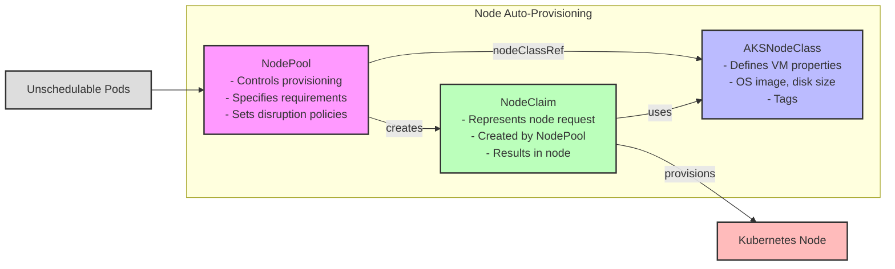
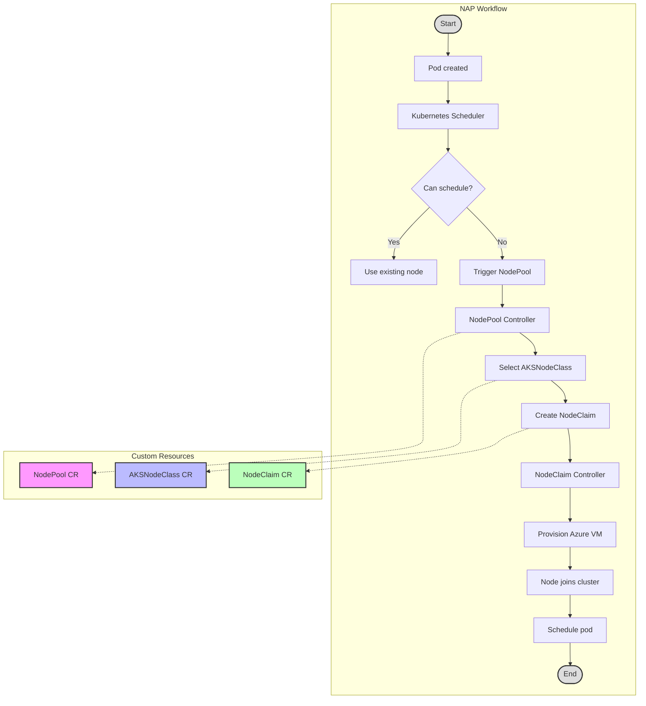
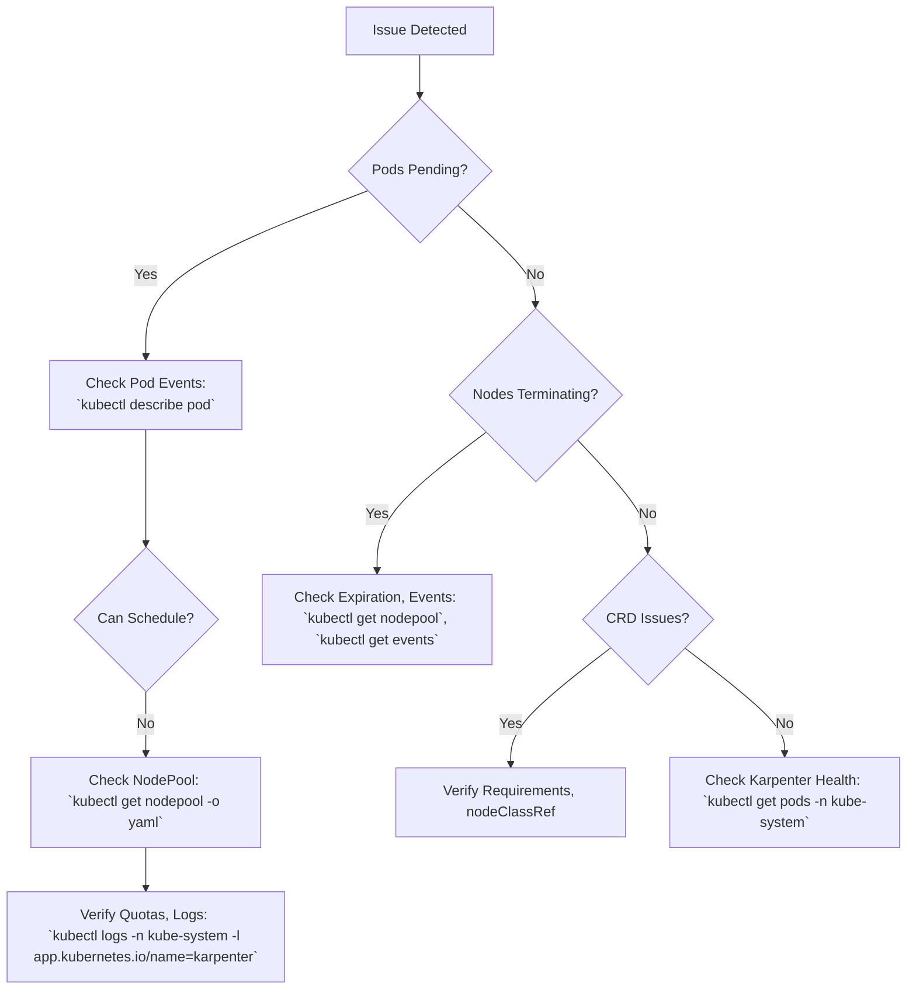

# Node Auto-Provisioning (NAP) in AKS

## Table of Contents

- [Node Auto-Provisioning (NAP) in AKS](#node-auto-provisioning-nap-in-aks)
  - [Table of Contents](#table-of-contents)
  - [Introduction](#introduction)
    - [What is Bin-Packing?](#what-is-bin-packing)
    - [Key Benefits](#key-benefits)
    - [Glossary](#glossary)
  - [Prerequisites](#prerequisites)
    - [Required Azure Resources and Tools](#required-azure-resources-and-tools)
    - [Installing the Latest AKS Preview CLI Extension](#installing-the-latest-aks-preview-cli-extension)
    - [Registering the NodeAutoProvisioningPreview Feature Flag](#registering-the-nodeautoprovisioningpreview-feature-flag)
    - [Verifying Registration Status](#verifying-registration-status)
    - [Network Requirements](#network-requirements)
  - [Quick Start](#quick-start)
    - [Creating an AKS Cluster with NAP](#creating-an-aks-cluster-with-nap)
    - [Connecting to the Cluster](#connecting-to-the-cluster)
    - [Installing Node Viewer for Monitoring](#installing-node-viewer-for-monitoring)
  - [Core Components](#core-components)
    - [CRDs in NAP](#crds-in-nap)
    - [Custom Resource Relationships](#custom-resource-relationships)
    - [NAP Workflow](#nap-workflow)
  - [Setup and Configuration](#setup-and-configuration)
    - [Node Provisioning Modes](#node-provisioning-modes)
    - [Checking if Cluster Autoscaler is Enabled](#checking-if-cluster-autoscaler-is-enabled)
      - [Method 1: Using Azure CLI](#method-1-using-azure-cli)
      - [Method 2: Using kubectl](#method-2-using-kubectl)
      - [Method 3: Check Azure Portal](#method-3-check-azure-portal)
    - [Migrating from Cluster Autoscaler to NAP](#migrating-from-cluster-autoscaler-to-nap)
    - [Creating Custom Resources](#creating-custom-resources)
      - [Custom AKSNodeClass Example](#custom-aksnodeclass-example)
      - [Custom NodePool Example](#custom-nodepool-example)
  - [Managing NAP](#managing-nap)
    - [Testing NAP](#testing-nap)
    - [Monitoring NAP](#monitoring-nap)
    - [Default vs. Custom NAP Configuration](#default-vs-custom-nap-configuration)
      - [When to Create Custom CRDs](#when-to-create-custom-crds)
      - [Overriding Default CRDs](#overriding-default-crds)
      - [Using Multiple AKSNodeClass and NodePool Resources](#using-multiple-aksnodeclass-and-nodepool-resources)
        - [Example Multi-NodePool Configuration](#example-multi-nodepool-configuration)
        - [Directing Workloads to Specific NodePools](#directing-workloads-to-specific-nodepools)
        - [Checking NodePool and AKSNodeClass Status](#checking-nodepool-and-aksnodeclass-status)
    - [Upgrading with NAP](#upgrading-with-nap)
      - [Cluster Upgrades](#cluster-upgrades)
      - [Node Image Upgrades](#node-image-upgrades)
  - [Advanced Features](#advanced-features)
    - [Advanced Consolidation Strategies](#advanced-consolidation-strategies)
      - [Single-Node Consolidation](#single-node-consolidation)
      - [Multi-Node Consolidation](#multi-node-consolidation)
      - [Consolidation Policies](#consolidation-policies)
      - [Disruption Budgets](#disruption-budgets)
    - [Scheduling Constraints and Disruption Controls](#scheduling-constraints-and-disruption-controls)
      - [Node Expiration](#node-expiration)
      - [Multiple Budget Policies](#multiple-budget-policies)
      - [Protecting Nodes from Disruption](#protecting-nodes-from-disruption)
      - [Respecting Pod Disruption Budgets](#respecting-pod-disruption-budgets)
    - [Drift Detection and Handling](#drift-detection-and-handling)
      - [What is Drift?](#what-is-drift)
      - [How NAP Identifies Drift](#how-nap-identifies-drift)
      - [Testing and Observing Drift](#testing-and-observing-drift)
      - [Monitoring Drift Events](#monitoring-drift-events)
    - [Zone-Aware Scheduling](#zone-aware-scheduling)
      - [Using Zone Labels and Requirements](#using-zone-labels-and-requirements)
      - [Spreading Workloads Across Zones](#spreading-workloads-across-zones)
  - [Best Practices](#best-practices)
    - [General Best Practices](#general-best-practices)
    - [Bin-Packing Optimization](#bin-packing-optimization)
    - [Consolidation Best Practices](#consolidation-best-practices)
    - [Upgrade Best Practices](#upgrade-best-practices)
    - [Zone Configuration Best Practices](#zone-configuration-best-practices)
  - [Troubleshooting NAP](#troubleshooting-nap)
    - [Node and Pod Provisioning Issues](#node-and-pod-provisioning-issues)
    - [Node Termination Issues](#node-termination-issues)
    - [Configuration Issues](#configuration-issues)
    - [Checking Karpenter Health](#checking-karpenter-health)
    - [Troubleshooting Flowchart](#troubleshooting-flowchart)
    - [Getting Help](#getting-help)
  - [Conclusion](#conclusion)
  - [Command Reference](#command-reference)
  - [Self-hosted Karpenter in AKS](#self-hosted-karpenter-in-aks)
    - [Key Differences from Managed NAP](#key-differences-from-managed-nap)
    - [When to Choose Self-hosted](#when-to-choose-self-hosted)
    - [Self-hosted Installation Overview](#self-hosted-installation-overview)

## Introduction

Node Auto-Provisioning (NAP) in Azure Kubernetes Service (AKS) is a managed feature powered by Karpenter that automatically provisions and scales nodes based on workload demands. Unlike the traditional Cluster Autoscaler, NAP provides faster node provisioning, better resource utilization through intelligent bin-packing, and simplified scaling operations. This guide covers setup, configuration, advanced features, and best practices for using NAP in AKS.

### What is Bin-Packing?

Bin-packing refers to the efficient allocation of containers (pods) onto nodes to maximize resource utilization. Effective bin-packing:
- Optimizes pod placement to reduce wasted CPU and memory.
- Minimizes the number of nodes needed by matching pod requirements to node capacity.
- Supports diverse workloads by provisioning appropriately sized nodes.

### Key Benefits

- **Faster Provisioning**: Nodes are created in seconds, compared to minutes with Cluster Autoscaler.
- **Efficient Resource Use**: Intelligent bin-packing reduces waste and optimizes costs.
- **Simplified Scaling**: Declarative configurations streamline cluster management.
- **Flexible Workload Support**: Provisions diverse node types based on workload needs.

### Glossary

- **Bin-Packing**: The process of efficiently allocating pods to nodes to maximize resource utilization.
- **AKSNodeClass**: A Custom Resource Definition (CRD) defining VM properties like OS image and disk size.
- **NodePool**: A CRD controlling node provisioning rules and referencing an AKSNodeClass.
- **NodeClaim**: A CRD representing a request for a new node with specific properties.
- **Karpenter**: An open-source node provisioning tool powering NAP in AKS.
- **Drift**: A mismatch between a node’s current state and its desired state defined in CRDs.

## Prerequisites

Before using NAP in AKS, ensure the following requirements are met. See [Creating an AKS Cluster with NAP](#creating-an-aks-cluster-with-nap) for setup steps.

### Required Azure Resources and Tools

- Active Azure subscription with contributor access.
- Azure CLI (version 2.50.0 or later recommended).
- `kubectl` configured to connect to your AKS cluster.
- Sufficient VM size quotas in your subscription.

### Installing the Latest AKS Preview CLI Extension

NAP requires the `aks-preview` CLI extension (version 0.5.170 or later):

```powershell
# Check if aks-preview extension is installed
$extension = az extension list --query "[?name=='aks-preview'].version" -o tsv

# Remove old version if found
if ($extension) {
    Write-Host "Removing existing aks-preview extension version: $extension"
    az extension remove --name aks-preview
}

# Install the latest aks-preview extension
az extension add --name aks-preview

# Verify the installed version
az extension show --name aks-preview --query version -o tsv
```

> **Note**: Check the [official Azure documentation](https://learn.microsoft.com/en-us/azure/aks/node-auto-provisioning) for the latest version requirements.

### Registering the NodeAutoProvisioningPreview Feature Flag

NAP is in preview and requires registering a feature flag:

```powershell
# Register the NAP feature flag
az feature register --namespace "Microsoft.ContainerService" --name "NodeAutoProvisioningPreview"

# Check registration status
az feature show --namespace "Microsoft.ContainerService" --name "NodeAutoProvisioningPreview"
```

Registration takes 5-10 minutes. Wait until the status shows `"state": "Registered"`.

### Verifying Registration Status

Confirm the feature flag is registered:

```powershell
# Verify the feature is registered
$status = az feature show --namespace "Microsoft.ContainerService" --name "NodeAutoProvisioningPreview" --query "properties.state" -o tsv
if ($status -eq "Registered") {
    Write-Host "NodeAutoProvisioningPreview feature is successfully registered."
} else {
    Write-Host "NodeAutoProvisioningPreview feature is not yet registered. Status: $status"
}
```

Refresh the provider registration after the feature is registered:

```powershell
az provider register --namespace Microsoft.ContainerService
```

### Network Requirements

NAP requires:
- Azure CNI with overlay networking mode.
- Cilium data plane.

Specify these during cluster creation:

```powershell
--network-plugin azure
--network-plugin-mode overlay
--network-dataplane cilium
```

## Quick Start

This section provides the minimal steps to set up an AKS cluster with NAP and start monitoring it. For advanced setup, see [Setup and Configuration](#setup-and-configuration).

### Creating an AKS Cluster with NAP

Create a resource group and AKS cluster with NAP enabled:

```powershell
# Create resource group
az group create -l eastus -n nap-rg

# Create AKS cluster with NAP
az aks create `
    -n nap `
    -g nap-rg `
    -c 2 `
    --node-provisioning-mode Auto `
    --network-plugin azure `
    --network-plugin-mode overlay `
    --network-dataplane cilium
```

### Connecting to the Cluster

Get credentials and verify connectivity:

```powershell
az aks get-credentials -g nap-rg -n nap --overwrite-existing
kubectl get nodes
```

### Installing Node Viewer for Monitoring

Node Viewer visualizes node resources. Install it based on your platform:

**For macOS**:

```bash
brew tap aws/tap
brew install aks-node-viewer
aks-node-viewer -v
```

**For Windows**:

```powershell
$installDir = "$env:USERPROFILE\bin"
$downloadUrl = "https://github.com/Azure/aks-node-viewer/releases/latest/download/aks-node-viewer_Windows_x86_64.zip"
$tempZip = "$env:TEMP\aks-node-viewer.zip"

if (!(Test-Path $installDir)) {
    New-Item -ItemType Directory -Path $installDir -Force
}

Invoke-WebRequest -Uri $downloadUrl -OutFile $tempZip
Expand-Archive -Path $tempZip -DestinationPath $installDir -Force

if ($env:PATH -notlike "*$installDir*") {
    [Environment]::SetEnvironmentVariable("PATH", "$env:PATH;$installDir", "User")
    $env:PATH = "$env:PATH;$installDir"
}

aks-node-viewer -v
```

Run Node Viewer:

```powershell
aks-node-viewer -resources cpu,memory -disable-pricing
```

## Core Components

NAP uses Custom Resource Definitions (CRDs) to manage node provisioning. This section explains the CRDs, their relationships, and the NAP workflow.

### CRDs in NAP

1. **AKSNodeClass**: Defines VM properties (e.g., OS image, disk size, tags).
2. **NodePool**: Configures node provisioning rules, referencing an AKSNodeClass.
3. **NodeClaim**: Represents a request for a node, created by the NodePool controller.

List CRDs and resources:

```powershell
kubectl get crd | grep -i karpenter
kubectl get nodepools
kubectl get aksnodeclass
kubectl get nodeclaim
```

### Custom Resource Relationships

This diagram shows how NAP components interact:



### NAP Workflow

This diagram illustrates how NAP provisions nodes:



## Setup and Configuration

This section covers node provisioning modes, migrating from Cluster Autoscaler, and creating custom resources. See [Quick Start](#quick-start) for initial setup.

### Node Provisioning Modes

AKS supports three node provisioning approaches:

| Mode | Description | Scaling Engine | Features | Management |
|------|-------------|----------------|----------|------------|
| **Auto (NAP)** | Dynamic provisioning with Karpenter | Karpenter | Fast scaling, better bin-packing, diverse node types | Managed by Azure |
| **Manual** | Traditional autoscaling with node pools | Cluster Autoscaler | Slower scaling, limited node types | Managed by Azure |
| **Self-hosted Karpenter** | Custom Karpenter installation | Karpenter | Full customization, more operational overhead | Customer-managed |

**Commands**:

```powershell
# Create cluster with NAP (Auto mode)
az aks create -n nap-cluster -g my-resource-group -c 2 --node-provisioning-mode Auto

# Create cluster with Cluster Autoscaler (Manual mode)
az aks create -n ca-cluster -g my-resource-group -c 2 --node-provisioning-mode Manual

# Check provisioning mode
az aks show -n $CLUSTER_NAME -g $RESOURCE_GROUP --query "nodeProvisioningMode" -o tsv
```

For self-hosted Karpenter, see [Self-hosted Karpenter in AKS](#self-hosted-karpenter-in-aks).

### Checking if Cluster Autoscaler is Enabled

Before enabling NAP, ensure Cluster Autoscaler is disabled, as they cannot coexist.

#### Method 1: Using Azure CLI

```powershell
$CLUSTER_NAME="your-cluster-name"
$RESOURCE_GROUP="your-resource-group"

az aks show -n $CLUSTER_NAME -g $RESOURCE_GROUP --query "agentPoolProfiles[].{Name:name, AutoScaling:enableAutoScaling}" -o table
```

If `AutoScaling` is `True`, Cluster Autoscaler is enabled.

#### Method 2: Using kubectl

```powershell
kubectl get pods -n kube-system | grep cluster-autoscaler
kubectl logs -n kube-system -l app=cluster-autoscaler
```

#### Method 3: Check Azure Portal

1. Navigate to your AKS cluster.
2. Go to "Node pools" and check if "Autoscale" is enabled.

### Migrating from Cluster Autoscaler to NAP

To switch to NAP:

1. Disable Cluster Autoscaler on all node pools.
2. Update the cluster to Auto mode.

```powershell
$NODEPOOLS=$(az aks nodepool list -g $RESOURCE_GROUP --cluster-name $CLUSTER_NAME --query "[].name" -o tsv)

foreach ($NODEPOOL in $NODEPOOLS) {
    az aks nodepool update -g $RESOURCE_GROUP --cluster-name $CLUSTER_NAME --name $NODEPOOL --disable-cluster-autoscaler
}

az aks update -g $RESOURCE_GROUP -n $CLUSTER_NAME --node-provisioning-mode Auto
```

> **Note**: This is disruptive. Plan carefully for production clusters.

### Creating Custom Resources

Custom AKSNodeClass and NodePool resources allow tailored node provisioning. See [Core Components](#core-components) for CRD details.

#### Custom AKSNodeClass Example

```yaml
apiVersion: karpenter.azure.com/v1alpha2
kind: AKSNodeClass
metadata:
  name: nap-aksnodeclass
spec:
  imageFamily: AzureLinux
  osDiskSizeGB: 128
  tags:
    env: prod
```

#### Custom NodePool Example

```yaml
apiVersion: karpenter.sh/v1beta1
kind: NodePool
metadata:
  name: nap-nodepool
spec:
  template:
    spec:
      nodeClassRef:
        name: nap-aksnodeclass
      requirements:
      - key: kubernetes.io/arch
        operator: In
        values: ["amd64"]
      - key: kubernetes.io/os
        operator: In
        values: ["linux"]
      - key: karpenter.sh/capacity-type
        operator: In
        values: ["on-demand"]
      - key: karpenter.azure.com/sku-family
        operator: In
        values: ["D"]
  disruption:
    consolidationPolicy: WhenUnderutilized
```

## Managing NAP

This section covers testing, monitoring, and managing NAP configurations and upgrades.

### Testing NAP

Deploy a workload to test node provisioning:

```powershell
kubectl apply -f - <<EOF
apiVersion: apps/v1
kind: Deployment
metadata:
  name: test-deploy
spec:
  replicas: 10
  selector:
    matchLabels:
      app: test
  template:
    metadata:
      labels:
        app: test
    spec:
      containers:
      - name: test
        image: nginx
        resources:
          requests:
            memory: "1Gi"
EOF

kubectl get pod -o wide
kubectl get node
kubectl scale deploy test-deploy --replicas 20
kubectl get events -A --field-selector source=karpenter -w
```

### Monitoring NAP

Monitor NAP using:

1. **Node Viewer**: `aks-node-viewer -resources cpu,memory -disable-pricing`
2. **Karpenter Events**: `kubectl get events -A --field-selector source=karpenter -w`
3. **Node Status**: `kubectl get node`

### Default vs. Custom NAP Configuration

NAP creates default NodePool and AKSNodeClass resources with sensible settings. Custom CRDs offer more control.

#### When to Create Custom CRDs

Use custom CRDs for:
- Specialized VM sizes or hardware (e.g., GPUs).
- Cost optimization (e.g., spot instances).
- Compliance needs (e.g., specific OS images).
- Multi-tenant scenarios or advanced scaling policies.

#### Overriding Default CRDs

View and override default CRDs:

```powershell
kubectl get nodepool default -o yaml
kubectl get aksnodeclass default -o yaml
kubectl apply -f custom-nodepool.yaml
kubectl apply -f custom-aksnodeclass.yaml
```

Custom CRDs coexist with defaults. Use weights to prioritize NodePools:

```yaml
apiVersion: karpenter.sh/v1beta1
kind: NodePool
metadata:
  name: high-priority-pool
spec:
  weight: 100
```

#### Using Multiple AKSNodeClass and NodePool Resources

Define multiple CRDs for diverse workloads:

```yaml
apiVersion: karpenter.azure.com/v1alpha2
kind: AKSNodeClass
metadata:
  name: compute-optimized
spec:
  imageFamily: AzureLinux
  osDiskSizeGB: 128
  tags:
    workload-type: compute
---
apiVersion: karpenter.sh/v1beta1
kind: NodePool
metadata:
  name: compute-pool
spec:
  template:
    spec:
      nodeClassRef:
        name: compute-optimized
      requirements:
      - key: karpenter.azure.com/sku-family
        operator: In
        values: ["F"]
      - key: kubernetes.io/os
        operator: In
        values: ["linux"]
      - key: karpenter.sh/capacity-type
        operator: In
        values: ["on-demand"]
  disruption:
    consolidationPolicy: WhenUnderutilized
```

##### Directing Workloads to Specific NodePools

Use annotations or node affinity:

```yaml
apiVersion: apps/v1
kind: Deployment
metadata:
  name: batch-processing-app
spec:
  template:
    metadata:
      annotations:
        karpenter.sh/nodepool: compute-pool
    spec:
      containers:
      - name: batch-processor
        image: my-batch-app:latest
```

**Node Affinity Example**:

```yaml
apiVersion: apps/v1
kind: Deployment
metadata:
  name: memory-intensive-app
spec:
  template:
    spec:
      affinity:
        nodeAffinity:
          requiredDuringSchedulingIgnoredDuringExecution:
            nodeSelectorTerms:
            - matchExpressions:
              - key: karpenter.azure.com/sku-family
                operator: In
                values: ["E"]
      containers:
      - name: memory-app
        image: my-memory-app:latest
```

##### Checking NodePool and AKSNodeClass Status

```powershell
kubectl get nodepool
kubectl get nodes --show-labels | findstr "karpenter.sh/nodepool"
kubectl get nodeclaim -o custom-columns=NAME:.metadata.name,NODEPOOL:.spec.nodeClaim.nodePoolRef.name
kubectl get nodeclaim -o custom-columns=NAME:.metadata.name,NODECLASSREF:.spec.nodeClassRef.name
```

### Upgrading with NAP

#### Cluster Upgrades

- **Control Plane**: NAP handles node provisioning during upgrades. Ensure sufficient capacity.
- **Node Image Upgrades**: Update AKSNodeClass with new image versions; NAP replaces nodes gradually.

#### Node Image Upgrades

```yaml
apiVersion: karpenter.azure.com/v1alpha2
kind: AKSNodeClass
metadata:
  name: default
spec:
  imageFamily: AzureLinux
```

## Advanced Features

This section covers advanced NAP configurations for optimization and resilience.

### Advanced Consolidation Strategies

Consolidation optimizes resource use by removing underutilized nodes.

#### Single-Node Consolidation

```yaml
apiVersion: karpenter.sh/v1beta1
kind: NodePool
metadata:
  name: single-node-consolidation
spec:
  disruption:
    consolidationPolicy: WhenEmptyOrUnderutilized
    consolidateAfter: 1m
  template:
    spec:
      expireAfter: Never
      requirements:
      - key: kubernetes.io/os
        operator: In
        values: ["linux"]
```

#### Multi-Node Consolidation

```yaml
apiVersion: karpenter.sh/v1beta1
kind: NodePool
metadata:
  name: multi-node-consolidation
spec:
  disruption:
    consolidationPolicy: WhenEmptyOrUnderutilized
    consolidateAfter: 0s
  limits:
    cpu: "100"
  template:
    spec:
      requirements:
      - key: karpenter.azure.com/sku-cpu
        operator: Lt
        values: ["5"]
```

#### Consolidation Policies

- **WhenEmpty**: Consolidate empty nodes (excluding DaemonSets).
- **WhenUnderutilized**: Consolidate underutilized nodes.
- **WhenEmptyOrUnderutilized**: Combine both for aggressive optimization.

```yaml
apiVersion: karpenter.sh/v1beta1
kind: NodePool
metadata:
  name: balanced-consolidation
spec:
  disruption:
    consolidationPolicy: WhenUnderutilized
    consolidateAfter: 30s
```

#### Disruption Budgets

```yaml
apiVersion: karpenter.sh/v1beta1
kind: NodePool
metadata:
  name: controlled-disruption
spec:
  disruption:
    consolidationPolicy: WhenEmptyOrUnderutilized
    consolidateAfter: 30s
    budgets:
    - nodes: "40%"
```

### Scheduling Constraints and Disruption Controls

#### Node Expiration

```yaml
apiVersion: karpenter.sh/v1beta1
kind: NodePool
metadata:
  name: time-limited-nodes
spec:
  template:
    spec:
      expireAfter: 48h
```

#### Multiple Budget Policies

```yaml
apiVersion: karpenter.sh/v1beta1
kind: NodePool
metadata:
  name: multi-budget-nodepool
spec:
  disruption:
    budgets:
    - nodes: "40%"
    - nodes: "2"
    - schedule: "* * * * *"
      nodes: "0"
```

#### Protecting Nodes from Disruption

```powershell
kubectl annotate node nodename karpenter.sh/do-not-disrupt="true"
kubectl annotate node nodename karpenter.sh/do-not-disrupt-
```

#### Respecting Pod Disruption Budgets

```yaml
apiVersion: policy/v1
kind: PodDisruptionBudget
metadata:
  name: app-pdb
spec:
  minAvailable: 2
  selector:
    matchLabels:
      app: critical-service
```

### Drift Detection and Handling

#### What is Drift?

Drift occurs when a node’s state doesn’t match its AKSNodeClass or NodePool configuration (e.g., OS image changes).

#### How NAP Identifies Drift

NAP uses a hash (`karpenter.azure.com/aksnodeclass-hash`) to detect drift:

```powershell
kubectl get nodes -o jsonpath='{.items[*].metadata.annotations.karpenter\.azure\.com/aksnodeclass-hash}'
```

#### Testing and Observing Drift

Update AKSNodeClass to trigger drift:

```yaml
apiVersion: karpenter.azure.com/v1alpha2
kind: AKSNodeClass
metadata:
  name: default
spec:
  imageFamily: AzureLinux
```

#### Monitoring Drift Events

```powershell
kubectl get events -A --field-selector reason=Drift
```

### Zone-Aware Scheduling

#### Using Zone Labels and Requirements

```yaml
apiVersion: karpenter.sh/v1beta1
kind: NodePool
metadata:
  name: multi-zone
spec:
  template:
    spec:
      requirements:
      - key: topology.kubernetes.io/zone
        operator: In
        values: ["eastus-1", "eastus-2", "eastus-3"]
```

#### Spreading Workloads Across Zones

```yaml
apiVersion: apps/v1
kind: Deployment
metadata:
  name: zone-aware-app
spec:
  replicas: 9
  template:
    spec:
      topologySpreadConstraints:
      - maxSkew: 1
        topologyKey: topology.kubernetes.io/zone
        whenUnsatisfiable: DoNotSchedule
        labelSelector:
          matchLabels:
            app: zone-aware-app
```

## Best Practices

### General Best Practices

- Set accurate resource requests for workloads.
- Use custom NodePools for specific requirements.
- Monitor scaling events (`kubectl get events -A --field-selector source=karpenter -w`).
- Use proper tagging for resource organization.

### Bin-Packing Optimization

NAP improves bin-packing by:
- **Just-in-Time Provisioning**: Creates nodes matching workload needs.
- **Flexible Node Selection**: Supports diverse VM types.
- **Intelligent Consolidation**: Removes underutilized nodes.

**Example**:

```
Cluster Autoscaler:
Node 1: [Pod A: 1.5 CPU, 4GB] [Pod B: 1 CPU, 2GB] = 62.5% CPU, 75% memory
Node 2: [Pod C: 0.5 CPU, 1GB] [Pod D: 0.5 CPU, 1GB] = 25% CPU, 25% memory

NAP:
Node 1: [Pod A: 1.5 CPU, 4GB] [Pod B: 1 CPU, 2GB] [Pod C: 0.5 CPU, 1GB] [Pod D: 0.5 CPU, 1GB] = 87.5% CPU, 100% memory
```

### Consolidation Best Practices

- Use `WhenEmpty` for critical workloads, `WhenEmptyOrUnderutilized` for cost optimization.
- Set `consolidateAfter` to avoid thrashing (e.g., `30s` or `5m`).
- Use disruption budgets to limit impact.
- Monitor consolidation events: `kubectl get events -A --field-selector reason=Consolidating`.

### Upgrade Best Practices

- Use Pod Disruption Budgets (PDBs) for availability.
- Plan for sufficient capacity during upgrades.
- Monitor upgrades: `kubectl get events -A --field-selector source=karpenter`.
- Test upgrades in non-production environments.

### Zone Configuration Best Practices

- Specify multiple availability zones.
- Use topology spread constraints for even distribution.
- Test failover scenarios for resilience.

## Troubleshooting NAP

### Node and Pod Provisioning Issues

- **Pods Stuck in Pending**:
  - Check pod events: `kubectl describe pod <pod-name>`.
  - Verify NodePool requirements: `kubectl get nodepool -o yaml`.
  - Check Azure quotas and Karpenter logs: `kubectl logs -n kube-system -l app.kubernetes.io/name=karpenter`.

- **Node Provisioning Failures**:
  - Verify Azure API limits, subnet IPs, and VM SKU availability.

### Node Termination Issues

- Check expiration settings: `kubectl get nodepool -o jsonpath='{.items[*].spec.template.spec.expireAfter}'`.
- Look for consolidation or drift events: `kubectl get events -A --field-selector reason=Consolidating,reason=Drift`.

### Configuration Issues

- Ensure valid NodePool requirements and `nodeClassRef`.
- Check for conflicting requirements.

### Checking Karpenter Health

```powershell
kubectl get pods -n kube-system -l app.kubernetes.io/name=karpenter
kubectl get svc -n kube-system -l app.kubernetes.io/name=karpenter
kubectl get crd | grep karpenter
```

### Troubleshooting Flowchart



### Getting Help

- **Azure Support**: For managed NAP issues.
- **GitHub**: [Karpenter Azure](https://github.com/Azure/karpenter-provider-azure/issues).
- **Community**: [AKS GitHub](https://github.com/Azure/AKS/issues), [Kubernetes Slack](https://kubernetes.slack.com/).

## Conclusion

NAP in AKS, powered by Karpenter, enhances node provisioning with faster scaling, better bin-packing, and simplified management. Custom CRDs provide granular control, while features like consolidation and zone-aware scheduling optimize performance and resilience. Follow best practices and monitor events to ensure efficient operation.

## Command Reference

| Task | Command |
|------|---------|
| Create AKS cluster with NAP | `az aks create -n nap -g nap-rg -c 2 --node-provisioning-mode Auto` |
| Check provisioning mode | `az aks show -n $CLUSTER_NAME -g $RESOURCE_GROUP --query "nodeProvisioningMode"` |
| Check Cluster Autoscaler | `az aks show -n $CLUSTER_NAME -g $RESOURCE_GROUP --query "agentPoolProfiles[].{Name:name, AutoScaling:enableAutoScaling}"` |
| List NodePools | `kubectl get nodepool` |
| Monitor Karpenter events | `kubectl get events -A --field-selector source=karpenter -w` |
| Verify feature registration | `az feature show --namespace "Microsoft.ContainerService" --name "NodeAutoProvisioningPreview"` |
| Check node labels | `kubectl get nodes --show-labels` |

## Self-hosted Karpenter in AKS

### Key Differences from Managed NAP

| Feature | Managed NAP | Self-hosted Karpenter |
|---------|-------------|----------------------|
| Installation | Enabled via `--node-provisioning-mode Auto` | Manual via Helm |
| Management | Azure-managed | Customer-managed |
| Flexibility | Opinionated defaults | Full customization |

### When to Choose Self-hosted

- Need advanced Karpenter features not in managed NAP.
- Require specific customizations or existing Karpenter workflows.

### Self-hosted Installation Overview

1. Create AKS cluster with workload identity.
2. Configure managed identity and RBAC.
3. Install Karpenter via Helm.
4. Create CRDs manually.

See [Karpenter Azure GitHub](https://github.com/Azure/karpenter-provider-azure) for details.